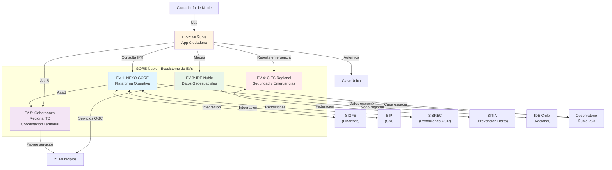

# Anexo B: Arquitectura de Entidades de Valor

ID: PTD-ANEXO-B-ARQUITECTURA-EVS-01
Version: 1.0.0
Status: Published
Parent-Document: plan_td_gore_nuble_2026-2028.md
Creation-Date: 2025-10-06
Ref-STS-Guide: GUIDE-STS-MASTER-01
Ref-Framework: ASTA-KORE-V2.0

---

## Introducción: El Concepto de Entidad de Valor en ASTA-Kore

Fnd: Marco ASTA-Kore, Manifiesto Estratégico.

Una **Entidad de Valor (EV)** es la unidad fundamental de diseño y gestión en el marco ASTA-Kore. No es simplemente un "proyecto" o un "sistema", sino un **sistema sociotécnico completo** —personas, procesos y tecnología diseñados como un todo integrado— que cumple cuatro criterios no negociables:

1. **Propósito Explícito:** La EV existe para crear valor público medible y contribuir a objetivos estratégicos declarados.
2. **Fronteras Contractuales:** Sus interacciones con otras EVs y sistemas externos están definidas mediante contratos explícitos (APIs, acuerdos de datos).
3. **Composición Sociotécnica:** Integra capacidades humanas y tecnológicas de forma sinérgica.
4. **Desempeño Observable:** Su salud operacional y su efectividad de valor son medibles mediante métricas (OKRs, KPIs técnicos).

El Plan TD se materializa en **5 Entidades de Valor principales**. Este anexo documenta la arquitectura detallada de cada una mediante el **Canvas de EV**, especifica sus **Contratos Conversacionales** (interfaces) y mapea sus **dependencias e integraciones**.

---

## B.1. Canvas de Entidad de Valor: EV-1 NEXO GORE

ID: PTD-EV1-NEXO-GORE-CANVAS-01

### Sección 1: Identidad y Propósito

**Nombre:** NEXO GORE — Plataforma Operativa Interna
**Alias/Código:** EV-1

**Propósito (El "Porqué"):**
Integrar y orquestar el ciclo de vida completo de Intervenciones Públicas Regionales (IPR) —proyectos y programas— sobre una base de datos normalizada, con IA embebida para automatización inteligente, pre-auditoría de cumplimiento y generación de inteligencia de negocio en tiempo real.

**Contribución a OKRs Anuales:**

- OE-1 (Cumplimiento Normativo): Provee expediente electrónico, firma electrónica, trazabilidad → KR-1.2.
- OE-2 (Eficiencia Operativa): Automatiza flujos, reduce ciclo IPR → KR-2.1, KR-2.2.
- OE-2 (Calidad Gestión): Habilita visibilidad en tiempo real de cartera → KR-2.3.

**Contribución a Ñuble 250:**

- Habilita **todos los trazos** al ser el sistema de gestión de la inversión regional.
- Impacto directo en Observatorio Ñuble 250 (provee datos de ejecución de IPR).

### Sección 2: Actores y Usuarios

**Usuarios Primarios (Internos):**

- División de Presupuesto e Inversión Regional (DIPIR): Gestión de cartera de proyectos, seguimiento físico-financiero.
- División de Administración y Finanzas (DAF): Gestión financiera, rendiciones de cuentas, contabilidad.
- División de Planificación y Desarrollo Regional (DIPLADE): Formulación de IPR, evaluación de pertinencia estratégica.
- Divisiones Sectoriales (DIDESOH, DIFOI, DIT): Propuesta y seguimiento técnico de IPR sectoriales.
- Administradora Regional y Gobernador: Tableros ejecutivos de decisión.

**Usuarios Secundarios:**

- Unidad de Control Interno: Auditoría de legalidad y trazabilidad.
- Asesoría Jurídica: Co-producción de convenios y actos administrativos.
- Unidades Técnicas Ejecutoras Externas: Consulta de estado de IPR, carga de rendiciones (vía interfaz específica).

**Stakeholders Externos:**

- Municipalidades: Postulación a fondos (FRIL), consulta de estado de proyectos.
- Servicios Públicos: Postulación a convenios, rendición de transferencias.
- CGR: Auditoría de expedientes y rendiciones.
- MDSF: Integración con BIP (Sistema Nacional de Inversiones).
- DIPRES: Reporte de ejecución presupuestaria.

### Sección 3: Propuesta de Valor Diferenciada

**Para DIPIR:**
"Un sistema de comando y control para su cartera de inversión: visibilidad en tiempo real de cada proyecto, alertas predictivas sobre retrasos, análisis de riesgos, reportes automáticos al CORE. Fin de las planillas dispersas."

**Para DAF:**
"Un escudo de cumplimiento ante CGR: pre-auditoría automatizada de rendiciones, generación de actos administrativos conformes a plantillas legales, trazabilidad completa de cada peso transferido. Reducción drástica de observaciones."

**Para DIPLADE:**
"Inteligencia estratégica para la planificación: correlación de inversión con impacto territorial, identificación de brechas de cobertura, análisis de coherencia de IPR con ERD."

**Para Unidades Ejecutoras Externas (Municipios, Servicios):**
"Simplicidad y claridad: plataforma única para postular, consultar estado, rendir cuentas. Asistente de IA que guía paso a paso, pre-valida documentos, reduce rechazos."

### Sección 4: Capacidades y Módulos Principales

**Módulo 1: Gestión del Ciclo de Vida de IPR**

- Postulación y registro de IPR (wizard guiado).
- Evaluación de admisibilidad y pertinencia (workflow configurable).
- Gestión de aprobaciones (CORE, evaluaciones externas MDSF/DIPRES).
- Formalización (generación de resoluciones, convenios).
- Seguimiento físico-financiero integrado con BIP y SIGFE.
- Cierre y evaluación ex-post.

**Módulo 2: Gestión Financiera y Presupuestaria**

- Registro presupuestario unificado (integración con SIGFE).
- Gestión de modificaciones presupuestarias (workflow + generación de actos).
- Certificados de Disponibilidad Presupuestaria (CDP) automatizados.
- Conciliación financiera IPR vs presupuesto.

**Módulo 3: Rendición de Cuentas Electrónica**

- Integración bidireccional con SISREC de CGR.
- Pre-auditoría de rendiciones mediante IA (validación de documentos vs Res. 30 CGR).
- Workflow de revisión (Referente Técnico → DAF → aprobación).
- Generación de expediente de rendición digital.

**Módulo 4: Generación Automatizada de Actos Administrativos**

- Biblioteca de plantillas legales (resoluciones, convenios, decretos).
- Copiloto Jurídico de IA para completar plantillas según datos de la IPR.
- Workflow de visaciones (cadena de V°B°).
- Integración con FirmaGob para firma electrónica avanzada.
- Trazabilidad de tramitación (envío a DIPRES/CGR para Toma de Razón).

**Módulo 5: Repositorio Único de Conocimiento (RUC)**

- Catálogo versionado de >60 artefactos de conocimiento STS (dominios GN y TDE).
- Pipeline de curación de conocimiento (sourcing, staging, audit, publishing, registration, maintenance).
- Base de datos vectorial para RAG (Retrieval-Augmented Generation) de asistentes de IA.
- Integración con sistema de archivos versionado (Git).

**Módulo 6: Observatorio de Gestión (Business Intelligence)**

Purp: Transformar datos operacionales de NEXO GORE en inteligencia ejecutiva accionable para la toma de decisiones estratégicas.

Componentes:

- **Dashboards Ejecutivos por División:**
  - DIPIR: Cartera de inversión 360° (estado, avance físico-financiero, alertas predictivas de retraso, análisis de riesgo por proyecto).
  - DAF: Panel financiero (ejecución presupuestaria en tiempo real, proyección de deuda flotante, tasa de observaciones CGR, estado de rendiciones por ejecutor).
  - DIPLADE: Panel estratégico (correlación de IPR con ERD y Ñuble 250, mapas de impacto territorial, identificación de brechas de cobertura).
  - Gobernador/Admin. Regional: Dashboard ejecutivo unificado (KPIs estratégicos, estado de OKRs, salud de sistemas críticos).

- **Reportes Automatizados:**
  - Mensuales: Informe de ejecución presupuestaria (para DIPRES), estado de cartera de inversión (para CTD).
  - Trimestrales: Informe de avance para CORE (integra datos físicos y financieros), reporte CVC (progreso de OKRs de cada EV).
  - Anuales: Memoria de inversión regional (para publicación), evaluación de cumplimiento de OKRs Anuales.

- **Vista Pública Integrada en Observatorio Ñuble 250:**
  - Módulo "Ñuble 360 - Transformación Digital" accesible desde Observatorio Ñuble 250.
  - Datos publicados: Cartera de IPR (versión anonimizada), KPIs estratégicos del Plan TD, Fichas SDA de sistemas de IA, actas de decisiones del CTD (con reserva de información sensible).
  - API pública: Endpoints REST para consumo de datos abiertos por investigadores, academia, ciudadanía.

- **Inteligencia Conversacional (IA sobre BI):**
  - Integración de asistente "Analista Estratégico" que permite consultar dashboards en lenguaje natural.
  - Ejemplo: "¿Cuántos proyectos de salud están retrasados en la provincia de Diguillín?" → El asistente consulta el data warehouse y responde con datos actualizados.

Mech: Arquitectura de datos:

- **Data Warehouse:** Base de datos analítica optimizada para consultas complejas (esquema estrella o copo de nieve).
- **ETL Automatizado:** Pipelines diarios que extraen datos de sistemas fuente (NEXO módulos 1-3, SIGFE, BIP), transforman y cargan al DW.
- **Herramienta de BI:** Metabase (open-source), Power BI o Tableau (según evaluación de costos y soberanía de datos).

**Módulo 7: Servicios Cognitivos (Asistentes de IA Especializados)**

Purp: Proveer la capa de servicios de IA que automatizan, asisten y aumentan procesos y capacidades humanas en todo el ciclo de gestión de IPR.

Asistentes Ya Operativos (Capitalización de Activos Existentes):

- **Jano (Copiloto Jurídico):** Co-producción de convenios, resoluciones, análisis de legalidad, simulación de auditoría CGR.
- **Formuevaluador (Copiloto de Formulación):** Guía en selección de vía de financiamiento, elaboración de proyectos/programas, validación de completitud.

Asistentes a Desarrollar (Nuevos, H2-H3):

- **Pre-Auditor de Rendiciones:** Validación automática de documentos de respaldo vs Res. 30 CGR (modalidad HOTL: pre-valida todo, DAF revisa muestra + rechazos).
- **Analista Predictivo de Cartera:** Detección temprana de proyectos en riesgo de retraso basado en patrones históricos y señales de alerta (ej. licitación no adjudicada en plazo, baja ejecución financiera).
- **Asistente de Postulación Externa:** Integrado a portal web de postulación, guía a ciudadanos y organizaciones en llenado de formularios (modalidad conversacional).

### Sección 5: Modelo Operativo y Equipo

**Equipo Responsable:**

- **Dueño de Producto (Product Owner):** Jefe de DIPIR (lidera priorización desde perspectiva de inversión).
- **Co-Dueño:** Jefe de DAF (lidera desde perspectiva financiera-administrativa).
- **Líder Técnico:** Coordinador TD / Oficina ODIA (arquitectura, desarrollo, operación).
- **Equipo de Desarrollo:** 2-3 ingenieros de software (internos o contratados vía honorarios).
- **Equipo de Conocimiento:** 1-2 curadores de conocimiento (refactorización STS, mantenimiento RUC).
- **Referentes de División:** 1 funcionario por división como enlace y validador de requisitos.

**Modelo de Financiamiento:**

- Fase Desarrollo (H2, meses 6-18): Formulado como Proyecto SNI (Subt. 31) para desarrollo de activo intangible (software).
- Fase Operación (H3, mes 18+): Formulado como Programa de Ejecución Directa vía Glosa 06 (Subt. 24) para costos recurrentes (equipo, mantención, licencias).

**Cadencia Operativa:**

- Sprints de 2 semanas (metodología ágil).
- Demos quincenales a stakeholders.
- Retrospectiva mensual del equipo.
- **CVC Trimestral:** Rendición ante CTD de progreso de OKRs, demo de valor, decisión de inversión siguiente trimestre.

### Sección 6: Interfaces y Dependencias

**Dependencias de Entrada (Qué consume):**

- Datos de SIGFE (presupuesto, ejecución financiera) → mediante API o integración ETL.
- Datos de BIP (proyectos SNI, RS, avance físico) → mediante API BIP.
- Datos de Chileindica (ARI, PROPIR) → importación periódica.
- Datos de SISREC (rendiciones) → integración bidireccional.
- Conocimiento institucional → curado y almacenado en RUC.

**Servicios que Provee (Qué expone):**

- API REST "Cartera de Inversión 360°": Consulta de IPR por filtros (estado, comuna, monto, sector).
- API REST "Estado de IPR": Consulta pública del estado de una IPR específica (para Mi Ñuble y portal web).
- API de Eventos: Publica eventos de negocio (IPR aprobada, convenio firmado, proyecto cerrado) para consumo por Observatorio.
- Datos para Observatorio Ñuble 250: Datasets periódicos (cartera, ejecución, rendiciones).

**Integraciones con Plataformas Nacionales:**

- FirmaGob: Para firma electrónica avanzada de actos administrativos.
- DocDigital: Para envío de comunicaciones oficiales inter-institucionales.
- ClaveÚnica: Para autenticación de usuarios externos (si se habilita portal de postulación).
- Red de Interoperabilidad: Publicación de servicio "Cartera de Inversión GORE Ñuble" en Catálogo (cuando Red esté operativa post-PISEE).

### Sección 7: Métricas de Desempeño

**OKRs Trimestrales (Ejemplo Q1-2027, Fase Piloto):**

- Objetivo: Validar el valor operativo del módulo IPR con un piloto controlado en DIPIR.
- KR-1: Gestionar 20 proyectos FRIL completos (de postulación a convenio firmado) usando NEXO GORE.
- KR-2: Reducir tiempo promedio de ciclo de estas 20 IPR a <60 días (vs línea base >90 días en sistema manual).
- KR-3: Alcanzar satisfacción de usuarios piloto (DIPIR, DAF) >= 4.0/5.0 en encuesta de usabilidad.

**KPIs Técnicos de Salud del Sistema:**

- Disponibilidad (Uptime): Meta >=99% (máx. 7.2 hrs downtime/mes).
- Latencia API: P95 <500ms para consultas de cartera.
- Tasa de errores: <0.1% de transacciones.
- Tiempo de respuesta de asistentes IA: P95 <10 segundos.

### Sección 8: Riesgos y Estrategia de Mitigación

| Riesgo | Probabilidad | Impacto | Mitigación |
|:---|:---:|:---:|:---|
| **Resistencia de DAF/DIPIR a cambiar procesos actuales** | Alta | Crítico | - Enfoque en piloto voluntario, no imposición.<br>- Demostrar valor con quick wins (generación automática de convenios).<br>- Involucrar a Jefes de División como co-dueños. |
| **Complejidad de integración con SIGFE/BIP** | Media | Alto | - Fase 1: Integración read-only (consulta, no escritura).<br>- Priorizar valor independiente de integración completa.<br>- Considerar APIs no oficiales o ETL si APIs oficiales no disponibles. |
| **Conflicto con Gesdoc (resistencia de stakeholders)** | Alta | Alto | - Estrategia de "absorción estratégica" (ver Anexo G.2).<br>- Posicionar NEXO GORE como evolución, no competidor.<br>- Ofrecer integración: Gesdoc como fuente de datos de NEXO. |
| **Pérdida de knowledge (Factor Prometeo)** | Media | Crítico | - Programa intensivo de transferencia de conocimiento.<br>- Documentación exhaustiva del framework.<br>- Conformación de Equipo Campeón (4-6 funcionarios). |

---

## B.2. Canvas de Entidad de Valor: EV-2 Mi Ñuble

ID: PTD-EV2-MI-NUBLE-CANVAS-01

### Sección 1: Identidad y Propósito

**Nombre:** Mi Ñuble — Ecosistema Ciudadano
**Alias/Código:** EV-2

**Propósito:**
Proveer el canal digital unificado y oficial del Gobierno Regional de Ñuble para que la ciudadanía acceda 24/7 a servicios, información, oportunidades de fomento y mecanismos de participación y seguridad, materializando el principio de gobierno centrado en las personas.

**Contribución a OKRs Anuales:**

- OE-3 (Experiencia Ciudadana): Canal principal para servicios digitales → KR-3.1, KR-3.2, KR-3.3.
- OE-1 (Cumplimiento): Implementa autenticación ClaveÚnica → KR-1.1 indirectamente.

**Contribución a Ñuble 250:**

- **Trazo Morado (Mente, Cuerpo y Alma):** Facilita acceso a información de salud, cultura, deporte.
- **Trazo Amarillo (Ciudades y Valles):** Canal de participación ciudadana en Cabildos.
- **Todos los trazos:** Consulta de proyectos por trazo, geolocalización de inversión.

### Sección 2: Actores y Usuarios

**Usuarios Primarios:**

- Ciudadanía general de Ñuble (población objetivo: 512.000 habitantes).
- Segmento prioritario: Adultos de 18-65 años con smartphone (estimado ~60%, 307.000 personas).

**Usuarios Secundarios:**

- Organizaciones comunitarias (dirigentes sociales, juntas de vecinos).
- Sector productivo (agricultores, emprendedores) que acceden a información de fomento.
- Estudiantes e investigadores que consultan datos abiertos.

**Stakeholders Internos:**

- Jefatura de Comunicaciones: Principal sponsor interno, usa la app como canal oficial.
- DIDESOH: Provee contenido de fondos concursables 8% FNDR.
- DIPLADE: Provee contenido de planificación y proyectos.
- Oficina ODIA: Desarrollo y operación técnica.

### Sección 3: Propuesta de Valor

**Para Ciudadanos:**
"Tu GORE en el bolsillo: accede a servicios sin filas, consulta inversiones en tu comuna, postula a fondos con un asistente que te guía, reporta emergencias directamente a las autoridades, participa en las decisiones de tu región. Simple, rápido, 24/7."

**Para Organizaciones Comunitarias:**
"Simplificamos la burocracia: postula al 8% FNDR conversando con un asistente experto, consulta el estado de tu proyecto en tiempo real, recibe notificaciones de oportunidades de financiamiento relevantes para tu organización."

**Para el GORE (ROI Institucional):**
"Reducción de carga operativa: disminución de consultas telefónicas repetitivas, automatización de información frecuente, canal directo de comunicación con la ciudadanía, mejora de imagen institucional (gobierno moderno y accesible)."

### Sección 4: Módulos y Funcionalidades

**Módulo 1: Mi GORE (Home/Dashboard Ciudadano)**

- Personalización por comuna y perfil.
- Noticias y comunicados del GORE.
- Acceso rápido a módulos principales.

**Módulo 2: Trámites y Oportunidades**

- **Sub-módulo Fondos Concursables:**
  - Asistente conversacional "Copiloto de Fomento" (experto en 8% FNDR, FRIL, FRPD).
  - Wizard de postulación simplificado.
  - Consulta de estado de postulación.
- **Sub-módulo Mis Proyectos:**
  - Consulta de IPR en ejecución en la comuna del usuario (consumiendo API de NEXO GORE).
  - Filtros por sector (salud, educación, infraestructura).

**Módulo 3: Mi Seguridad**

- Reporte de emergencias con geolocalización y adjuntos (foto/video).
- Integración con sistema de triage de CIES.
- Consulta de estado de reporte.
- Recepción de alertas tempranas (incendios, eventos volcánicos, déficit hídrico) segmentadas por ubicación.

**Módulo 4: Observatorio Ciudadano**

- Vista simplificada del Observatorio Ñuble 250.
- Mapas interactivos de inversión por comuna.
- Gráficos de avance de proyectos emblemáticos.

**Módulo 5: Participación y Feedback**

- Consultas ciudadanas digitales.
- Feedback sobre servicios del GORE.
- Notificaciones de Cabildos y eventos de Ñuble 250.

### Sección 5: Tecnología y Arquitectura

**Stack Tecnológico (Referencial):**

- **Frontend Móvil:** React Native (iOS + Android nativo desde una base de código).
- **Frontend Web:** React + Next.js (PWA para acceso desde navegador).
- **Backend:** Arquitectura de microservicios (Node.js/Python) sobre contenedores (Kubernetes).
- **Base de Datos:** PostgreSQL (datos estructurados), MongoDB (datos de sesiones de IA).
- **Asistentes de IA:** Gemini Pro (contrato institucional del GORE según informe), embeddings en base vectorial (Pinecone o ChromaDB).
- **Autenticación:** ClaveÚnica (OAuth 2.0/OpenID Connect).
- **Notificaciones Push:** Firebase Cloud Messaging.
- **Mapa:** Integración con IDE Ñuble (servicios WMS) y/o Mapbox/OpenStreetMap.

**Hosting:**

- Cloud pública (según política Cloud First): Google Cloud Platform o AWS.
- Evaluación de hosting nacional para soberanía de datos según evolución normativa.

**Requisitos No-Funcionales:**

- **Rendimiento:** Carga inicial <3 seg en red 4G.
- **Disponibilidad:** Uptime >=99.5% (máx. 3.6 hrs downtime/mes).
- **Seguridad:** Comunicación cifrada (TLS 1.3), datos sensibles cifrados en reposo.
- **Accesibilidad:** WCAG 2.1 nivel AA.
- **Offline-first:** Funcionalidades críticas (consulta, reporte emergencia) deben funcionar con conectividad intermitente.

### Sección 6: Equipo y Modelo Operativo

**Equipo Responsable:**

- **Product Owner:** Jefa de Comunicaciones (define prioridades desde necesidad ciudadana y comunicacional).
- **Líder Técnico:** Coordinador TD (arquitectura, coordinación con proveedores).
- **Equipo de Desarrollo:** Proveedor externo seleccionado vía Ley 19.886 (desarrollo inicial) + equipo interno (evolución y mantención).
- **Diseñador UX/UI:** Interno o contratado (asegura usabilidad y accesibilidad).
- **Curador de Contenidos:** Funcionario de Comunicaciones (mantiene información actualizada).

**Modelo de Financiamiento:**

- Desarrollo (H2-H3, 12-30 meses): Proyecto SNI (Subt. 31/33), requiere RS de MDSF.
- Operación (H3, mes 30+): Programa vía Glosa 06 (Subt. 24) para costos recurrentes (hosting, mantención, evolución).

### Sección 7: Interfaces y Contratos

**Consume de:**

- API NEXO GORE: Cartera de inversión, estado de IPR.
- API IDE Ñuble: Servicios de mapas (WMS, WFS).
- API CIES: Estado de reportes de emergencia, alertas.
- ClaveÚnica: Autenticación de usuarios.

**Expone:**

- API Pública: Información no sensible de proyectos (para posible integración con apps de terceros en futuro).

### Sección 8: Métricas y OKRs

**OKRs Trimestrales (Ejemplo Q3-2027, Fase de Adopción):**

- Objetivo: Consolidar Mi Ñuble como el canal preferido de los ciudadanos para interactuar con el GORE.
- KR-1: Alcanzar 40.000 descargas de la app (13% de población objetivo).
- KR-2: Lograr que el 60% de usuarios que descargan usen la app al menos 2 veces/mes (engagement).
- KR-3: Procesar 500 postulaciones al 8% FNDR a través del asistente (50% del total esperado).

**KPIs Técnicos:**

- Tasa de retención (usuarios activos después de 30 días): Meta >40%.
- Calificación en tiendas: Meta >=4.0/5.0.
- Tiempo de respuesta del asistente: P95 <8 seg.

---

## B.3. Canvas de Entidad de Valor: EV-3 IDE Ñuble

ID: PTD-EV3-IDE-NUBLE-CANVAS-01

### Sección 1: Identidad y Propósito

**Nombre:** IDE Ñuble — Infraestructura de Datos Espaciales de Ñuble
**Alias/Código:** EV-3

**Propósito:**
Actuar como el nodo regional certificado de la Infraestructura de Datos Geoespaciales de Chile (IDE Chile), proveyendo datos geoespaciales de alta calidad, estandarizados y accesibles para decisiones de planificación territorial, gestión de riesgos, inversión pública y desarrollo económico en la región.

**Contribución a OKRs Anuales:**

- OE-1 (Cumplimiento): Cumple mandato DS N°28 (SNIT/IDE Chile).
- OE-2 (Eficiencia): Provee base de datos geoespacial certificada, elimina duplicación de esfuerzos de captura de datos territoriales.
- OE-4 (Liderazgo Regional): Provee servicios OGC a municipios, posiciona al GORE como custodio de datos territoriales.

**Contribución a Ñuble 250:**

- **Trazo Azul (Costa):** Cartografía de borde costero, amenazas de tsunami.
- **Trazo Blanco (Cordillera):** Mapeo de ecosistemas de montaña, riesgos volcánicos.
- **Trazo Amarillo (Ciudades y Valles):** Datos para planificación urbana, planes reguladores.
- **Observatorio Ñuble 250:** Proveedor de capa geoespacial para visualización de inversión.

### Sección 2: Usuarios y Stakeholders

**Usuarios Internos GORE:**

- DIPLADE: Usuario principal, usa IDE para elaboración de PROT, ZUBC, ERD.
- DIPIR: Georreferenciación de cartera de inversión.
- Divisiones Sectoriales: Datos territoriales para diseño de proyectos.

**Usuarios Externos Institucionales:**

- 21 Municipios: Cartografía base para planes reguladores comunales, gestión de emergencias.
- Servicios Públicos (SERVIU, MOP, CONAF, DGA): Intercambio de datos geoespaciales.
- SENAPRED Regional: Cartografía de riesgos para planes de emergencia.

**Usuarios Externos No Gubernamentales:**

- Academia (UBB, otras universidades): Investigación y análisis territorial.
- Consultoras y empresas: Uso de datos abiertos para estudios y proyectos privados.
- Ciudadanía: Consulta de información territorial pública.

### Sección 3: Capacidades y Componentes

**Componente 1: Plataforma Geonodo**

- Catálogo de metadatos geoespaciales (ISO 19115).
- Publicador de servicios OGC (WMS, WFS, CSW).
- Portal web de consulta y descarga de datos.

**Componente 2: Datasets Base (Prioridad H1)**

1. Límites administrativos (región, provincias, comunas).
2. Red vial regional (rutas, caminos, estado de pavimentación).
3. Hidrografía (ríos, cuencas, APR).
4. Riesgos naturales (zonas de inundación, exposición a incendios forestales, amenaza volcánica, tsunami).
5. Infraestructura crítica (hospitales, escuelas, cuarteles).

**Componente 3: Datasets Temáticos (Prioridad H2-H3)**
6. Catastro de inversión pública (proyectos georreferenciados de FNDR).
7. Uso de suelo y cobertura vegetal.
8. Zonas de interés patrimonial y turístico.
9. Datos socioeconómicos por zona censal.

**Componente 4: Servicios Web Geoespaciales**

- WMS (Web Map Service): Visualización de capas en aplicaciones externas.
- WFS (Web Feature Service): Descarga de datos vectoriales.
- CSW (Catalog Service for the Web): Búsqueda de metadatos por sistemas externos.

### Sección 4: Gobernanza de Datos Geoespaciales

Fnd: Normas ISO/TC 211 (Información Geográfica), DS N°28.

**Roles:**

- **Coordinador Regional IDE Chile:** Designación formal del Jefe de DIPLADE (o funcionario delegado).
- **Custodios de Datos:** Funcionarios responsables de la calidad y actualización de cada dataset.
- **Comité Técnico Geoespacial:** Instancia de coordinación entre GORE, municipios y servicios públicos regionales para gobernanza de IDE Ñuble (se reúne semestralmente).

**Estándares Obligatorios:**

- Metadatos: ISO 19115 (contenido), ISO 19139 (codificación XML).
- Calidad: ISO 19157 (evaluación de calidad de datos geoespaciales).
- Servicios: OGC WMS 1.3, WFS 2.0, CSW 2.0.2.

**Política de Publicación:**

- Datos públicos: Acceso abierto sin restricciones (licencia CC BY 4.0 o equivalente).
- Datos reservados: Acceso restringido mediante autenticación y log de accesos.
- Datos sensibles: No se publican en IDE; se accede mediante solicitud formal y convenio.

### Sección 5: Equipo y Financiamiento

**Equipo Responsable:**

- **Dueño:** Jefe de DIPLADE (define prioridades de datasets y usos).
- **Coordinador Técnico:** Profesional SIG de DIPLADE (administra Geonodo, supervisa calidad de datos).
- **Curadores de Datos:** 1 funcionario por dataset crítico (responsable de actualización).
- **Soporte Técnico:** Oficina ODIA (infraestructura, servidores, integración con Observatorio).

**Financiamiento:**

- Operación (H1-H3): Programa vía Glosa 06, ejecución directa GORE (Subt. 24).
- Adquisición de datos especializados (ej. imágenes satelitales): Proyectos específicos según necesidad.

### Sección 6: Métricas

**OKRs Trimestrales (Ejemplo Q2-2026, Fase Inicial):**

- Objetivo: Establecer IDE Ñuble como nodo regional operativo de IDE Chile.
- KR-1: Publicar 5 datasets base con metadatos ISO 19115 completos.
- KR-2: Habilitar 3 servicios OGC (1 WMS, 1 WFS, 1 CSW) funcionales.
- KR-3: Lograr que 2 municipios consuman servicios WMS de IDE Ñuble en sus sistemas.

**KPIs Técnicos:**

- Número de datasets publicados: Meta año 1 >=10, año 3 >=25.
- Disponibilidad de servicios OGC: >=99%.
- Descargas de datos: Meta año 3 >=500 descargas/mes.

---

## B.4. Canvas de Entidad de Valor: EV-4 CIES Regional

ID: PTD-EV4-CIES-CANVAS-01

### Sección 1: Identidad y Propósito

**Nombre:** CIES Regional — Centro Integrado de Emergencia y Seguridad de Ñuble, Aumentado
**Alias/Código:** EV-4

**Propósito:**
Integrar las capacidades de video-vigilancia, gestión de emergencias y coordinación de seguridad ciudadana del GORE con los sistemas nacionales SITIA (Subsecretaría de Prevención del Delito) y SINAPRED, proveyendo a las instituciones de seguridad y a la ciudadanía una red regional de teleprotección y respuesta rápida aumentada con IA.

**Contribución a OKRs Anuales:**

- OE-3 (Experiencia Ciudadana): Módulo Mi Seguridad mejora percepción de cercanía y respuesta del GORE.
- OE-4 (Liderazgo Regional): Modelo de integración CIES-SITIA replicable para municipios.

**Contribución a Ñuble 250:**

- **Trazo Rojo (Conectividad Integral):** Seguridad en rutas mediante videovigilancia.
- **Trazo Morado (Mente, Cuerpo y Alma):** Seguridad ciudadana como componente de calidad de vida.
- **Trazo Blanco (Cordillera) y otros:** Gestión de emergencias en zonas de riesgo.

### Sección 2: Usuarios y Actores

**Usuarios Operativos:**

- SENAPRED Ñuble: Coordinación de emergencias.
- Carabineros de Chile (16ª Zona): Acceso a red de cámaras, inteligencia de video.
- PDI Ñuble: Inteligencia criminal.
- Bomberos de Ñuble: Alertas de incendios.
- Municipios (Seguridad Municipal): Monitoreo de espacios públicos.

**Usuarios Finales:**

- Ciudadanía: Reporta emergencias vía Mi Ñuble, recibe alertas.

**Stakeholders Nacionales:**

- Subsecretaría de Prevención del Delito: Provee plataforma SITIA, modelos de IA de analítica de video.
- SENAPRED Nacional: Integración con plataforma nacional de emergencias.
- ANCI: Supervisión de ciberseguridad (CIES es infraestructura crítica).

### Sección 3: Arquitectura de Integración CIES ↔ SITIA

**Componentes del CIES Actual (Pre-Integración):**

- Red de 209 cámaras de vigilancia en espacios públicos de la región.
- Centro de monitoreo en GORE.
- Convenios con Carabineros y municipios para acceso a imágenes.

**Componentes de SITIA (Nacional):**

- Plataforma de federación de cámaras.
- Modelos de IA para:
  - Detección y reconocimiento de patentes (LPR).
  - Detección de eventos (aglomeraciones, vehículos abandonados).
  - Analítica de video (mapas de calor, conteo de personas).
- Almacenamiento centralizado y buscable de video.

**Arquitectura de Integración Propuesta:**

- **Modelo de Federación:** CIES mantiene control de su infraestructura (cámaras, servidores de video), pero conecta con SITIA mediante API estándar.
- **Flujo de Video:** Streaming en tiempo real de cámaras seleccionadas hacia SITIA (protocolo RTSP/WebRTC).
- **Flujo de Metadatos:** Eventos detectados por IA de SITIA son enviados de vuelta al CIES vía webhook.
- **Control de Acceso:** SITIA provee interfaz para que operadores de GORE, Carabineros y PDI autorizados accedan a video y analítica.

**Protocolo de Privacidad:**

- Reconocimiento de patentes: Solo para vehículos con pedido de búsqueda activo o alerta de robo.
- Analítica de video: Anonimizada (sin reconocimiento facial de personas).
- Almacenamiento: Video se retiene según protocolo (ej. 30 días), luego se elimina automáticamente salvo evidencia de incidente.

### Sección 4: Métricas y OKRs

**OKRs Trimestrales (Ejemplo Q4-2026, Fase Post-Integración):**

- Objetivo: Consolidar la operación conjunta CIES-SITIA con beneficio medible para seguridad regional.
- KR-1: Integrar 100 cámaras (48% del total) a SITIA operativamente.
- KR-2: Detectar automáticamente (vía IA) al menos 50 eventos relevantes (patentes de interés, aglomeraciones) validados por operadores.
- KR-3: Reducir tiempo mediano de derivación de reporte ciudadano (Mi Seguridad) a institución competente a <5 minutos.

**KPIs Operativos:**

- Disponibilidad del sistema: >=99.9% (sistema crítico).
- Tasa de falsos positivos de IA: <20% (validación humana).
- Cobertura de cámaras operativas: >=95%.

---

## B.5. Canvas de Entidad de Valor: EV-5 Gobernanza Regional TD

ID: PTD-EV5-GOBERNANZA-TD-CANVAS-01

### Sección 1: Identidad y Propósito

**Nombre:** Gobernanza Regional TD — Liderazgo y Coordinación Territorial de la Transformación Digital
**Alias/Código:** EV-5

**Propósito:**
Ejercer el mandato legal del GORE de asesoría técnica y coordinación a los 21 municipios de Ñuble en su proceso de Transformación Digital del Estado, actuando como habilitador de capacidades, nodo de estandarización y proveedor de servicios compartidos para reducir brechas territoriales y fomentar un ecosistema digital regional coherente.

**Contribución a OKRs Anuales:**

- OE-4 (Liderazgo Regional): EV específicamente diseñada para este objetivo → KR-4.1, KR-4.2, KR-4.3.
- OE-1 (Cumplimiento): Acelera cumplimiento territorial de Ley 21.180.

**Contribución a Ñuble 250:**

- **Transversal a todos los trazos:** Habilita la gestión digital de proyectos municipales en cada trazo.
- **Trazo Celeste (Ecometrópolis):** Coordinación digital Chillán-Chillán Viejo.

### Sección 2: Actores

**Usuarios/Beneficiarios:**

- 21 Municipalidades de Ñuble.
- Servicios Públicos Regionales (SEREMI, Direcciones Regionales).

**Stakeholders:**

- SGD: Coordinación nacional, acceso a plataformas transversales.
- SUBDERE: Apoyo técnico para municipios.
- Red de CTDs de GOREs: Intercambio de experiencias.

### Sección 3: Mecanismos y Servicios

**Mecanismo 1: Mesa Regional de Transformación Digital**

- Nat: Instancia formal de coordinación trimestral.
- Comp: Coordinador TD del GORE (preside), Coordinadores TD municipales (si existen), Alcaldes o representantes técnicos municipales, SEREMI pertinentes.
- Purp: Acordar estándares, compartir buenas prácticas, co-diseñar soluciones, priorizar proyectos de colaboración.
- Proc: Sesión trimestral de 3 horas, acta formal con acuerdos vinculantes.

**Servicio 1: Asistentes como Servicio (AaaS)**

- Def: Modelo multi-tenant donde municipios pueden "suscribirse" a versiones personalizadas de asistentes del GORE.
- Ejemplo: Asistente de Rendiciones adaptado para rendición municipal de fondos GORE.
- Modelo: Uso gratuito para municipios (financiado por GORE vía Glosa 06 letra c).

**Servicio 2: Capacitación y Mentoría**

- Talleres trimestrales sobre TDE, uso de plataformas nacionales (ClaveÚnica, DocDigital, PISEE/Nueva Red).
- Asesoría técnica para formulación de proyectos de inversión en TD municipal.

**Servicio 3: Acceso a IDE Ñuble**

- Provisión gratuita de servicios OGC y cartografía base.

### Sección 4: Métricas y OKRs

**OKRs Anuales 2026 (Ejemplo):**

- Objetivo: Consolidar la Mesa Regional TD como instancia efectiva de coordinación territorial.
- KR-1: Realizar 4 sesiones de la Mesa con participación de >=18 municipios (86%) en cada una.
- KR-2: Lograr que 12 municipios (57%) firmen Convenio de Colaboración para adopción de al menos 1 servicio compartido GORE.
- KR-3: Capacitar a >=25 funcionarios municipales en TDE y uso de plataformas nacionales.

---

## B.6. Mapa de Dependencias e Integraciones entre EVs

ID: PTD-EV-MAPA-DEPENDENCIAS-01

### Matriz de Dependencias

| EV Consumidor | EV Proveedor | Servicio/Dato Consumido | Criticidad | Tipo de Integración |
|:---|:---|:---|:---|:---|
| **Mi Ñuble** | NEXO GORE | API Cartera Inversión, Estado de IPR | Alta | REST API (síncrona) |
| **Mi Ñuble** | IDE Ñuble | Servicios de mapas (WMS) | Media | Servicio OGC (síncrono) |
| **Mi Ñuble** | CIES Regional | API de reportes de emergencia | Alta | REST API (asíncrona) |
| **NEXO GORE** | IDE Ñuble | Georreferenciación de IPR | Baja | Servicio WFS (síncrono) |
| **Observatorio Ñuble 250** | NEXO GORE | Datos de ejecución de inversión | Crítica | ETL diario + API |
| **Observatorio Ñuble 250** | IDE Ñuble | Capa geoespacial | Media | Servicio WMS |
| **Gobernanza Regional TD** | NEXO GORE, Mi Ñuble, IDE Ñuble | Acceso a servicios para provisión a municipios | Media | Modelo AaaS |

### Diagrama de Contexto Simplificado (Mermaid)



---

## B.7. Estrategia de Integración con Plataformas Nacionales

ID: PTD-EV-INTEGRACION-NACIONAL-01

Fnd: Norma Técnica de Interoperabilidad (DS N°12/2023).

Req: Toda EV que maneje datos de potencial interés inter-institucional debe diseñarse con capacidad de integrarse a la Red de Interoperabilidad del Estado.

### Hoja de Ruta de Interoperabilidad

**Fase 1 (H1, meses 1-6): Preparación**

- Act: Inventariar datasets del GORE con potencial de interoperabilidad (ej. cartera de inversión, beneficiarios de programas sociales, datos geoespaciales).
- Act: Clasificar datos según Ley 19.628 y Ley 21.719 (personales, sensibles, públicos).
- Act: Contactar a SGD para acceso al Gestor de Acuerdos de la Red de Interoperabilidad.
- Act: Preparar a equipo técnico (capacitación en estándares de interoperabilidad).

**Fase 2 (H2, meses 6-18): Prueba de Concepto (PoC)**

- Act: Seleccionar 1 dataset piloto de bajo riesgo para publicar en Catálogo de Servicios de Interoperabilidad.
  - Candidato: "Cartera de Proyectos FNDR" (información pública, alta demanda de otros organismos).
- Act: Desarrollar servicio de interoperabilidad conforme a estándares de la Red.
- Act: Tramitar Acuerdo de Interoperabilidad con al menos 1 organismo consumidor (ej. SUBDERE para reporte de inversión regional).
- Act: Ejecutar PoC técnica y validar funcionamiento.

**Fase 3 (H2-H3, meses 12-36): Escalado**

- Act: Publicar 3-5 servicios adicionales en Catálogo.
- Act: Consumir servicios de otros organismos (ej. validación de RUT con Registro Civil, consulta de beneficiarios sociales con MDSF).
- Act: Capacitar a funcionarios de DIPIR y DAF en uso de Gestor de Autorizaciones para datos sensibles.

### Plataformas Nacionales Prioritarias para Integración

| Plataforma | Propósito de Integración | EV que Integra | Prioridad | Hito |
|:---|:---|:---|:---|:---|
| **ClaveÚnica** | Autenticación de ciudadanos | Mi Ñuble, Portal de Postulación de NEXO (si se habilita) | Crítica | H2 (mes 12) |
| **FirmaGob** | Firma electrónica avanzada de actos adm. | NEXO GORE (módulo de actos administrativos) | Crítica | H1 (mes 3) |
| **DocDigital** | Comunicaciones oficiales electrónicas | NEXO GORE (envío de oficios a municipios, servicios) | Alta | H1 (mes 6) |
| **SISREC** | Rendición electrónica de cuentas | NEXO GORE (módulo de rendiciones) | Crítica | H2 (mes 9) |
| **Red de Interoperabilidad** | Intercambio de datos inter-institucional | NEXO GORE, IDE Ñuble | Alta | H2 (PoC mes 12, producción mes 18) |
| **Notificador** | Notificaciones al DDU | NEXO GORE (notificaciones de resoluciones de IPR) | Media | H3 (mes 24) |

---

## B.8. Contratos Conversacionales: Especificación de Interfaces Clave

ID: PTD-EV-CONTRATOS-01

Fnd: Concepto de Contratos Conversacionales de ASTA-Kore.

Def: Un Contrato Conversacional es un acuerdo explícito que define cómo dos sistemas o EVs interactúan. Especifica: qué datos se intercambian, en qué formato, con qué SLO (Service Level Objective), qué errores pueden ocurrir y cómo se manejan.

### Contrato 1: API "Cartera de Inversión 360°" (NEXO GORE → Observatorio, Mi Ñuble)

**Nombre del Servicio:** `CarteraInversion_API`
**Proveedor:** NEXO GORE
**Consumidores:** Observatorio Ñuble 250, Mi Ñuble, Gobernanza Regional TD (para provisión a municipios).

**Endpoint Principal:** `GET /api/v1/ipr`

**Parámetros de Consulta:**

- `estado`: Filtro por estado (idea, perfil, diseño, ejecución, cerrado).
- `comuna`: Filtro por código de comuna.
- `sector`: Filtro por sector (salud, educación, infraestructura, etc.).
- `trazo_nuble250`: Filtro por trazo de Ñuble 250.
- `anno`: Filtro por año de ejecución.

**Respuesta (JSON):**

```json
{
  "total": 150,
  "ipr": [
    {
      "id": "IPR-2026-001",
      "nombre": "Construcción CESFAM Quirihue",
      "tipo": "Proyecto",
      "via_financiamiento": "SNI",
      "fuente": "FNDR",
      "codigo_bip": "40003456-0",
      "monto_total": 2500000000,
      "estado": "Ejecución",
      "avance_fisico_pct": 35,
      "avance_financiero_pct": 28,
      "comuna": "Quirihue",
      "sector": "Salud",
      "trazo_nuble250": "Morado",
      "fecha_inicio": "2026-03-15",
      "fecha_termino_estimada": "2027-06-30",
      "unidad_ejecutora": "SERVIU Ñuble",
      "referente_tecnico_gore": "Juan Pérez (DIDESOH)"
    }
  ]
}
```

**SLOs:**

- Disponibilidad: >=99% (máx. 7.2 hrs downtime/mes).
- Latencia: P95 <500ms.
- Tasa de errores: <0.5%.
- Frescura de datos: Actualización diaria (sincronización nocturna con fuentes).

**Manejo de Errores:**

- 200: OK.
- 400: Bad Request (parámetros inválidos).
- 404: Not Found (IPR no existe).
- 500: Internal Server Error (se loguea, se escala a equipo técnico).
- 503: Service Unavailable (sistema en mantención, cliente debe reintentar con backoff).

**Autenticación:**

- API pública (read-only) para Observatorio y Mi Ñuble: Sin autenticación (datos públicos).
- API completa (con datos sensibles o write): OAuth 2.0 con scopes definidos.

---

### Contrato 2: Servicio WMS "Mapa Base Ñuble" (IDE Ñuble → Mi Ñuble, Observatorio)

**Nombre del Servicio:** `MapaBaseNuble_WMS`
**Proveedor:** IDE Ñuble (Geonodo)
**Consumidores:** Mi Ñuble (módulo de mapas), Observatorio Ñuble 250, sistemas municipales.

**Endpoint:** `https://ide.gorenuble.cl/geoserver/wms`

**Parámetros OGC WMS 1.3.0:**

- `SERVICE=WMS`
- `REQUEST=GetMap`
- `VERSION=1.3.0`
- `LAYERS`: Capas disponibles (ej. `nuble:comunas`, `nuble:red_vial`, `nuble:riesgos_incendio`).
- `CRS`: Sistema de referencia (ej. `EPSG:4326` WGS84, `EPSG:32719` UTM Zona 19S).
- `BBOX`: Bounding box de área de interés.
- `WIDTH`, `HEIGHT`: Dimensiones de imagen.
- `FORMAT`: Formato de salida (image/png, image/jpeg).

**SLOs:**

- Disponibilidad: >=99%.
- Latencia para tile de 256x256px: P95 <1 segundo.
- Capacidad: Soportar >=100 peticiones concurrentes.

**Capas Iniciales (H1):**

1. `nuble:limites_administrativos` (región, provincias, comunas).
2. `nuble:red_vial` (rutas, caminos).
3. `nuble:hidrografia` (ríos, cuencas).
4. `nuble:riesgos_naturales` (compuesto: incendios, tsunami, volcanes).

**Metadatos:**

- Cada capa tiene registro de metadatos ISO 19115 completo en catálogo CSW.
- Metadatos incluyen: responsable del dato, fecha de actualización, precisión, restricciones de uso.

---

### Contrato 3: API "Reporte de Emergencia" (Mi Ñuble → CIES Regional)

**Nombre del Servicio:** `ReporteEmergencia_API`
**Proveedor:** CIES Regional (Sistema de Triage)
**Consumidor:** Mi Ñuble (módulo Mi Seguridad)

**Endpoint:** `POST /api/v1/emergencias/reportar`

**Payload de Entrada (JSON):**

```json
{
  "tipo_emergencia": "incendio_forestal",
  "descripcion": "Humo visible en sector El Roble",
  "ubicacion": {
    "latitud": -36.6065,
    "longitud": -72.1034,
    "precision_metros": 50,
    "direccion_referencial": "Camino a El Roble, km 5"
  },
  "reportante": {
    "run": "12345678-9",
    "nombre": "María González",
    "telefono": "+56912345678"
  },
  "adjuntos": [
    {
      "tipo": "foto",
      "url": "https://storage.minuble.cl/reportes/foto123.jpg"
    }
  ],
  "timestamp": "2026-06-15T14:35:00Z"
}
```

**Respuesta (JSON):**

```json
{
  "folio": "EMG-2026-001234",
  "estado": "recibido",
  "mensaje": "Su reporte ha sido recibido y derivado a Bomberos de Quirihue. Tiempo estimado de contacto: 5 minutos.",
  "institucion_derivada": "Bomberos Quirihue",
  "timestamp_derivacion": "2026-06-15T14:36:15Z"
}
```

**SLOs:**

- Latencia: P95 <2 segundos (urgencia crítica).
- Disponibilidad: >=99.9% (sistema crítico de seguridad).
- Tiempo de derivación a institución competente: P50 <5 minutos (KPI de negocio).

**Privacidad:**

- Datos del reportante se almacenan cifrados.
- Solo instituciones autorizadas ven identidad completa del reportante.
- Ciudadanía puede consultar estado de su reporte usando folio sin autenticarse.

---

## B.9. Estrategia de Sucesión e Integración de Gesdoc

ID: PTD-EV-GESDOC-ESTRATEGIA-01

Ctx: Abordaje del conflicto táctico identificado en diagnóstico.
Ref: Análisis detallado en Anexo G.2.

### Principio Rector: Integración, no Confrontación

La mesa de análisis determinó que una confrontación directa con Gesdoc sería políticamente costosa y estratégicamente innecesaria. Se adopta una **estrategia de absorción colaborativa**: Gesdoc se reconoce como una iniciativa valiosa que abordó una necesidad real (agilizar FRIL), pero que debe evolucionar hacia un modelo integrado para evitar la proliferación de silos.

### Hoja de Ruta de 3 Fases

**Fase 1 (H1, meses 1-6): Coexistencia e Integración como Fuente de Datos**

- Act: NEXO GORE desarrolla un conector de datos (API o ETL) para importar información de Gesdoc.
- Obj: Los datos de proyectos FRIL en Gesdoc se sincronizan automáticamente con NEXO GORE, apareciendo en el Observatorio y en reportes unificados.
- Res: Gesdoc continúa operando para su proceso (FRIL), pero su información ya no es un silo.
- Narrativa: "No venimos a reemplazar a Gesdoc, sino a potenciarlo. Lo conectamos al ecosistema para que su valiosa información sea parte de la visión integrada."

**Fase 2 (H2, meses 6-18): Migración Funcional Gradual**

- Act: Se mapean y rediseñan los flujos de trabajo de Gesdoc en NEXO GORE.
- Act: Se habilita en NEXO GORE la capacidad de gestionar proyectos FRIL de punta a punta.
- Act: Se ofrece a los usuarios de Gesdoc (DIPIR) la opción de migrar voluntariamente a NEXO GORE.
- Obj: Migración basada en valor demostrado, no en imposición.

**Fase 3 (H3, meses 18-30): Decomisionamiento Controlado**

- Cond: Si (y solo si) NEXO GORE ha demostrado capacidad superior y >=80% de flujos FRIL se gestionan en NEXO:
  - Act: Migración de datos históricos de Gesdoc a NEXO GORE.
  - Act: Decomisionamiento gradual de Gesdoc.
  - Act: Reasignación de licencias Odoo o re-propósito para otro uso (si es viable).
- Narrativa: "Gesdoc cumplió su misión como pionero. NEXO GORE es su sucesor natural y su evolución estratégica."

### Beneficios del Enfoque

Para stakeholders de Gesdoc:

- Reconocimiento de su contribución (fueron los primeros en digitalizar).
- Salida honorable (no es un fracaso, es una evolución natural).
- Tiempo para adaptación (18-30 meses de transición).

Para el GORE:

- Minimiza conflicto político interno.
- Permite capitalizar la inversión ya realizada en Gesdoc (datos migrados, no perdidos).
- Habilita enfoque en valor, no en "guerras de herramientas".

---

## B.10. Plan de Transferencia de Capacidades y Formación de Equipo Campeón

ID: PTD-EV-TRANSFERENCIA-CAPACIDADES-01

### Objetivo: Mitigar el "Factor Prometeo"

Ctx: El mayor riesgo institucional identificado es la dependencia de conocimiento tácito en una sola persona.

Obj: Externalizar todo el conocimiento crítico y formar un equipo sucesor capaz de operar y evolucionar las capacidades de IA y TD de forma autónoma.

### Programa de Transferencia (36 meses)

**Horizonte 1 (H1, meses 1-6): Identificación y Documentación**

- Act: Identificar candidatos para el Equipo Campeón (4-6 funcionarios con perfil técnico y motivación).
  - Criterios: Formación en ingeniería/informática, capacidad de aprendizaje rápido, compromiso institucional.
  - Fuentes: Funcionarios de DIT, DIPLADE, DAF con habilidades técnicas.
- Act: Documentar exhaustivamente el framework de ingeniería de IA y conocimiento (Anexo D.4 del plan previo).
  - Artefactos: Guías, manuales, plantillas, ejemplos de código comentado.

**Horizonte 2 (H2, meses 6-18): Mentoría y Pilotos Supervisados**

- Act: Programa de mentoría intensivo (6 meses):
  - Semanas 1-4: Formación teórica en framework (STS, ADP, ALM, KHM).
  - Semanas 5-12: Desarrollo supervisado de un asistente de IA de baja complejidad (ej. Asistente de Consultas FAQ).
  - Semanas 13-24: Pair programming con arquitecto original en desarrollo de módulo real de NEXO GORE.
- Act: Asignación de responsabilidades crecientes:
  - Equipo Campeón asume mantenimiento de asistentes existentes.
  - Equipo Campeón lidera desarrollo de 1 módulo nuevo de NEXO GORE bajo supervisión.

**Horizonte 3 (H3, meses 18-36): Autonomía y Consolidación**

- Act: Transición completa:
  - Mes 24: Equipo Campeón asume operación de 100% de asistentes en producción.
  - Mes 30: Equipo Campeón lidera desarrollo de nueva EV o módulo sin supervisión del arquitecto original.
  - Mes 36: Equipo Campeón presenta en CVC como responsables autónomos.
- Act: Formalización institucional:
  - Propuesta de creación de Oficina Digital e IA (ODIA) como unidad permanente.
  - Equipo Campeón se convierte en dotación base de ODIA.

### Métricas de Éxito de la Transferencia

- Número de funcionarios certificados en framework: Meta >=4 hacia mes 24.
- Número de asistentes operados autónomamente por Equipo Campeón: Meta 100% hacia mes 30.
- Evaluación de competencias del Equipo Campeón: Meta >=4.0/5.0 en evaluación técnica hacia mes 36.
- Disponibilidad de documentación: 100% de procesos críticos documentados en manuales hacia mes 18.

---

**Fin del Anexo B**

Este anexo ha documentado la arquitectura detallada de las 5 Entidades de Valor del Plan TD mediante Canvas formales, ha especificado sus Contratos Conversacionales (interfaces) y ha mapeado sus dependencias e integraciones, tanto internas como con plataformas nacionales.

Ref: Los protocolos de evaluación de riesgos específicos para IA, las Fichas SDA y el catálogo de asistentes existentes se detallan en el Anexo C.
