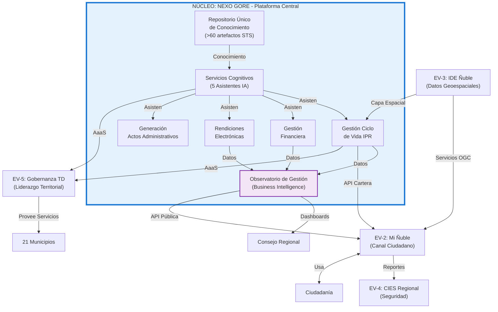

# Plan de Transformación Digital del Gobierno Regional de Ñuble

## Período 2026-2028

**Gobierno Regional de Ñuble**  
**Octubre 2025**

**Destinatarios:**

- Gobernador Regional: Óscar Crisóstomo Llanos
- Administradora Regional: Claudia Cabrera Torres
- Jefe de Gabinete: Alejandro Aguilera Zambrano
- Jefes de División del Gobierno Regional de Ñuble
- Consejo Regional de Ñuble

**Elaborado por:**  
Félix Sanhueza Luna

## Índice

**SECCIÓN I: FUNDAMENTOS DEL PLAN**

1. Análisis y Síntesis Estratégica
2. Contexto y Mandato de Transformación
3. Visión y Principios Rectores

**SECCIÓN II: DISEÑO ESTRATÉGICO**
4. Objetivos Estratégicos y Alcance
5. Arquitectura de Capacidades Institucionales
6. Modelo de Gobernanza y Toma de Decisiones

**SECCIÓN III: IMPLEMENTACIÓN Y SOSTENIBILIDAD**
7. Hoja de Ruta y Fases de Implementación
8. Financiamiento y Modelo Presupuestario
9. Medición de Impacto y Transparencia

**SECCIÓN IV: DECISIÓN SOLICITADA**
10. Aprobación y Mandato de Ejecución

**ANEXOS TÉCNICOS (Resúmenes Ejecutivos)**

- Anexo A: Marco de Gobernanza Detallado
- Anexo B: Arquitectura de Entidades de Valor
- Anexo C: Marco de Inteligencia Artificial Responsable
- Anexo D: Plan de Implementación Operativo
- Anexo E: Gestión de Datos como Activo Estratégico

## SECCIÓN I: FUNDAMENTOS DEL PLAN

### 1. Análisis y Síntesis Estratégica

#### 1.1. Propósito del Análisis

Este Plan de Transformación Digital del Gobierno Regional de Ñuble para el período 2026-2028 es el resultado de un análisis estratégico exhaustivo realizado por una Mesa Técnica conformada por tres perspectivas expertas complementarias: normativa (marco de la Transformación Digital del Estado), metodológica (arquitectura socio-técnica adaptativa ASTA-Kore) e institucional (estructura y dinámica de los Gobiernos Regionales de Chile).

El análisis técnico identificó que el desafío de la transformación digital del GORE Ñuble no es un problema aislado de tecnología, sino un desafío sistémico que requiere abordar simultáneamente tres dimensiones: el cumplimiento del mandato legal de modernización del Estado, la coherencia metodológica del diseño organizacional y la viabilidad política-institucional de la ejecución.

#### 1.2. Diagnóstico Integrado: Tres Perspectivas Convergentes

Se analizó el contexto del GORE desde tres ángulos complementarios, identificando que cada perspectiva revela facetas distintas de un mismo problema estructural:

##### Desde la Perspectiva Normativa

El análisis del marco regulatorio de la Transformación Digital del Estado evidencia una brecha crítica entre el mandato legal y la capacidad operativa actual del GORE Ñuble. La Ley 21.180 sobre Transformación Digital del Estado establece una obligación vinculante: todos los procedimientos administrativos deben tramitarse electrónicamente hacia el 31 de diciembre de 2027. Este no es un objetivo aspiracional sino un plazo legal con consecuencias de cumplimiento.

El diagnóstico cuantificado mediante el Catálogo de Procedimientos Administrativos y Tramitaciones (CPAT) del año 2024 revela que el 50% de los procedimientos declarados por el GORE se encuentran en Nivel 0 de digitalización (totalmente analógicos), mientras que solo el 21% alcanza el Nivel 5 (totalmente digitalizados con expediente electrónico e interoperabilidad). A nivel territorial, la situación es aún más crítica: de los 15 municipios de Ñuble con datos disponibles, solo el 3,7% de sus trámites están completamente digitalizados.

Adicionalmente, el marco normativo emergente —la Ley 21.719 sobre Protección de Datos Personales y el proyecto de Ley que regula los sistemas de inteligencia artificial— impone nuevas obligaciones de responsabilidad proactiva, transparencia algorítmica y seguridad desde el diseño que el GORE debe anticipar e integrar en su modelo operativo.

##### Desde la Perspectiva Institucional

El análisis de la estructura y dinámica organizacional del GORE revela que la fragmentación digital no es un problema técnico aislado, sino una consecuencia lógica del diseño institucional vigente. La Ley 21.074 de Fortalecimiento de la Regionalización estableció una estructura de divisiones sectoriales autónomas (Presupuesto, Administración y Finanzas, Planificación, divisiones programáticas), cada una responsable de funciones específicas del mandato del GORE. Esta autonomía funcional, sin una capa explícita de integración tecnológica y de datos, ha generado "silos" operativos donde cada división tiende a operar con sus propias herramientas y repositorios de información.

Más crítico aún, se identificó un vacío de liderazgo formal en el proceso de Transformación Digital: no existe un Comité de Transformación Digital constituido, con un Coordinador de TD designado con escasa actividad según lo exige el artículo 15 de la Norma Técnica de Calidad y Funcionamiento de Plataformas Electrónicas, ni una hoja de ruta institucional aprobada. Este proceso "descabezado" genera tres riesgos inmediatos: incumplimiento normativo verificable ante Contraloría, inversiones tecnológicas descoordinadas que acumulan deuda técnica, y vulnerabilidad en ciberseguridad ante las obligaciones de la Ley 21.663 Marco de Ciberseguridad.

##### Desde la Perspectiva Sistémica y Metodológica

El análisis arquitectónico basado en el marco ASTA-Kore identifica que el GORE opera con Entidades de Valor implícitas —cada división es funcionalmente una entidad con propósito y procesos propios— pero sin contratos conversacionales formales entre ellas. No existe un modelo de datos compartido, no hay interfaces de programación (APIs) estandarizadas, y la gobernanza de las dependencias entre sistemas es informal.

Esta ausencia de una capa de integración explícita no solo genera ineficiencia operativa, sino que imposibilita la evolución hacia un modelo de gobierno basado en datos e inteligencia artificial, donde la interoperabilidad y la calidad de los datos son prerrequisitos fundamentales. La gestión del conocimiento institucional es informal, residente en personas en lugar de en sistemas robustos y versionados, creando un riesgo de pérdida ante rotación de personal.

#### 1.3. Identificación de la Oportunidad Estratégica Única

A pesar de las brechas identificadas, el análisis técnico reveló un hallazgo fundamental que transforma la naturaleza de este plan: el Gobierno Regional de Ñuble ya posee un **ecosistema de capacidades estratégicas sin precedentes** en el sistema de gobiernos regionales de Chile.

Este ecosistema no es una propuesta teórica sino una **realidad operativa y probada**, organizada en cuatro capas sinérgicas que constituyen un activo institucional de alto valor:

##### Primera Capa: Flota de Asistentes de Inteligencia Artificial en Producción

El GORE Ñuble opera actualmente con cinco agentes especializados de inteligencia artificial, cada uno con propósito definido, base de conocimiento estructurada y usuarios reales:

- **Formuevaluador** (Formulación y Evaluación de IPR): Copiloto para formuladores que guía en la selección de vías de financiamiento y en la elaboración técnica de proyectos y programas. Evidencia de valor: más de 1.500 consultas atendidas durante el concurso del 8% del Fondo Nacional de Desarrollo Regional en el período 2024-2025, con feedback cualitativo muy positivo de postulantes.

- **Comunicon** (Comunicaciones Institucionales): Asesor en estrategia comunicacional y redacción de documentos oficiales. Usuario principal: equipo de comunicaciones, quien lo utiliza diariamente como herramienta fundamental de su gestión.

- **Digitrans** (Transformación Digital del Estado): Experto en el marco regulatorio completo de la TDE —Ley 21.180, seis Normas Técnicas, Estrategia de Gobierno Digital 2030, legislación emergente sobre IA y protección de datos—. Colaboró activamente como consultor en el diseño de este plan.

- **Goreólogo** (Experto Institucional GORE): Consultor de conocimiento profundo sobre la estructura del Estado chileno, las competencias de los gobiernos regionales, el ciclo presupuestario, la gestión de inversión pública y el contexto específico de la región de Ñuble. Utilizado para onboarding de funcionarios nuevos y consultas institucionales complejas.

- **Jano** (Asesor Jurídico y de Conformidad): Copiloto jurídico que emula el prisma de fiscalización de la Contraloría General de la República. Analiza legalidad de actos administrativos, co-produce borradores de resoluciones y convenios, e identifica proactivamente riesgos de observación. Estado: Prototipo funcional en fase de testeo por usuarios finales.

##### Segunda Capa: Marco Metodológico ASTA-Kore como Innovación Emergente

Un hallazgo crítico del análisis es que el GORE Ñuble no solo utiliza herramientas de inteligencia artificial, sino que ha **creado su propio marco metodológico para gestionarlas de forma coherente y gobernable**. ASTA-Kore (Arquitectura Socio-Técnica Adaptativa) no es un framework genérico aplicado al GORE; es el resultado de un proceso de investigación-acción de dieciocho meses donde el GORE Ñuble actuó como laboratorio de diseño organizacional por el autor de este plan.

Cada principio, artefacto y protocolo del marco fue forjado respondiendo a problemas reales de la gestión pública regional: la complejidad del ciclo de inversión, la necesidad de coherencia entre estrategia y ejecución, la parsimonia cognitiva ante sobrecarga de información, y la gobernanza basada en evidencia. Este marco incluye conceptos como la Matriz de Coherencia (que descompone la realidad organizacional en diseño y operación, en tres niveles de resolución), el concepto de Entidad de Valor como unidad de gestión sociotécnica, el Ciclo de Valor y Capacidad como ritual de gobernanza, y el sistema de Contratos Conversacionales para interoperabilidad.

El valor estratégico de ASTA-Kore es doble: para el GORE, provee un sistema operativo organizacional coherente que permite navegar la complejidad con parsimonia; para Chile, representa un activo intelectual que puede exportarse a otros gobiernos regionales y organismos públicos complejos como bien público digital, posicionando a Ñuble no solo como adoptante de mejores prácticas sino como innovador y creador.

##### Tercera Capa: Repositorio de Conocimiento Institucional

El GORE ha construido un inventario de más de sesenta artefactos de conocimiento curados en formato STS (Structured Telegraphic Style), un estándar que permite la codificación de conocimiento experto de forma parseable por inteligencia artificial con alta fidelidad. Este repositorio, ubicado en [/01_entidades_de_valor/ev-000-conocimiento/](https://github.com/felix-antonio-sl/plan-td-gore-nuble/tree/main/01_entidades_de_valor/ev-000-conocimiento), se organiza en dos dominios principales: Gobernanza Ñuble (sesenta artefactos sobre estructura del Estado, marco legal de GORE, gestión presupuestaria, ciclo de IPR, rendiciones, contexto de Ñuble) y Transformación Digital del Estado (veinticuatro artefactos sobre Ley 21.180, Normas Técnicas, estrategias nacionales).

Este conocimiento no es documentación informal dispersa, sino un activo institucional versionado mediante control de versiones (Git), catalogado mediante índices maestros que permiten su descubrimiento sistemático, y estructurado de forma que puede alimentar el entrenamiento de nuevos asistentes de inteligencia artificial en días en lugar de meses. Representa la externalización de conocimiento tácito que históricamente residía solo en las cabezas de funcionarios expertos, convirtiéndose en memoria organizacional explícita y permanente.

##### Cuarta Capa: Plataformas Operativas Validadas

El ecosistema incluye prototipos y sistemas ya entregados que validan la capacidad de desarrollo y colaboración interinstitucional: la Plataforma RRD (basada en Odoo) entregada y en operación en SENAPRED regional para gestión de emergencias, el Chat GORE Ciudadano en fase de testeo con capacidad de atención 24/7, y prototipos de integración con sistemas nacionales como SIGFE, BIP y SISREC.

#### 1.4. Síntesis del Análisis: De la Fragmentación a la Oportunidad

La convergencia de las tres perspectivas de análisis —normativa, institucional y metodológica— conduce a una síntesis estratégica clara: el GORE Ñuble enfrenta simultáneamente un mandato legal de modernización con plazo definido (Ley 21.180, diciembre 2027), brechas operativas significativas (fragmentación, vacío de liderazgo), y la posesión de un ecosistema único de capacidades de inteligencia artificial ya probadas en producción.

Esta aparente paradoja —brechas graves coexistiendo con capacidades avanzadas— se explica por la naturaleza informal y precaria de dichas capacidades. El ecosistema existe, funciona y genera valor medible (1.500+ ciudadanos atendidos, funcionarios usando asistentes diariamente), pero opera al margen de la estructura formal del GORE, dependiente de iniciativa individual y sin presupuesto ni equipo institucionalizado.

La conclusión estratégica fundamental es que **este plan no propone crear un programa de transformación digital desde cero, sino capitalizar, formalizar e industrializar un ecosistema de capacidades que ya opera pero que debe transitar de la informalidad a la institucionalización para garantizar su sostenibilidad y permitir su escalamiento**.

La decisión estratégica que se presenta a la Alta Dirección es clara: formalizar este ecosistema único como un activo permanente del Gobierno Regional y un posible bien exportable a nivel nacional, o permitir que se evapore por falta de institucionalización. El riesgo no es invertir en experimentar con nuevas tecnologías; el riesgo es no invertir en consolidar capacidades que ya están probadas y generando valor, permitiendo que un activo estratégico se pierda por inercia administrativa.

#### 1.5. Decisiones Fundamentales del Diseño del Plan

El análisis técnico condujo a cinco decisiones estratégicas fundamentales que estructuran este plan:

##### Decisión 1: Diagnóstico Triple Integrado

Se adoptó un enfoque de diagnóstico que integra las tres perspectivas identificadas —normativa, institucional y sistémica— para proveer una comprensión completa del estado actual y los desafíos. Esto evita diagnósticos parciales que solo identifican síntomas técnicos sin comprender causas organizacionales, o que proponen soluciones tecnológicas sin considerar restricciones normativas.

##### Decisión 2: Estrategia de Capitalización sobre Creación

Se determinó que el plan debe partir del reconocimiento explícito de las capacidades existentes —la flota de asistentes operativos, el marco ASTA-Kore creado localmente, el repositorio de conocimiento curado— y orientarse a su capitalización, no a la creación de nuevas capacidades desde cero. Esto implica que el presupuesto solicitado no es para "experimentar" sino para proteger, formalizar y escalar activos que ya generan valor medible.

##### Decisión 3: Relación Complementaria con Ñuble 250

Se estableció que el Plan de Transformación Digital es paralelo y complementario a la agenda estratégica Ñuble 250, no subordinado. Mientras Ñuble 250 define el "qué" del desarrollo regional (los nueve trazos temáticos desde la Costa Azul hasta el Bienestar Morado), el Plan TD define el "cómo" operativo: las capacidades digitales, de datos y de inteligencia artificial que hacen posible ejecutar, medir y acelerar cada trazo. La relación es de habilitación complementaria.

##### Decisión 4: Modelo Temporal de Tres Ejes Ortogonales

Se adoptó una estructura temporal que combina tres dimensiones: horizontes de inversión paralelos (H1: quick wins 0-6 meses, H2: pilotos 6-18 meses, H3: industrialización 18-36 meses) que operan simultáneamente balanceados trimestralmente; ciclos de compromiso presupuestario anuales alineados al ciclo del GORE; y rituales de gobernanza trimestrales (Ciclo de Valor y Capacidad) como mecanismo de decisión continua basada en evidencia.

##### Decisión 5: Arquitectura Centro-Periferia con NEXO GORE como Núcleo

Se determinó que el plan se materializa en cinco Entidades de Valor organizadas en una arquitectura centro-periferia: NEXO GORE como plataforma nuclear que integra el negocio central del GORE (gestión de IPR), aloja el repositorio de conocimiento, genera inteligencia de negocio y provee servicios de datos; y cuatro Entidades de Valor periféricas (Mi Ñuble, IDE Ñuble, CIES Regional, Gobernanza Regional TD) que extienden las capacidades del núcleo hacia dominios específicos: ciudadanía, territorio, seguridad y coordinación municipal.

### 2. Contexto y Mandato de Transformación

#### 2.1. El Imperativo Legal: Ley 21.180 y Plazo 2027

La Ley 21.180 sobre Transformación Digital del Estado, promulgada en 2019 y con implementación gradual hasta 2027, establece que todos los procedimientos administrativos de los órganos de la Administración del Estado deben expresarse a través de medios electrónicos. El Gobierno Regional de Ñuble, como órgano de la Administración del Estado según el artículo 2 de la Ley 19.175 Orgánica Constitucional sobre Gobierno y Administración Regional, está plenamente sujeto a este mandato.

La ley no es una recomendación de mejora continua sino una obligación legal vinculante que exige el cumplimiento de seis Normas Técnicas que regulan aspectos críticos de la modernización: Seguridad de la Información y Ciberseguridad (Decreto Supremo N°7 de 2023), Autenticación mediante mecanismos oficiales como ClaveÚnica (DS N°9), Interoperabilidad con la Red del Estado (DS N°12), gestión de Documentos y Expedientes Electrónicos (DS N°10), Notificaciones digitales (DS N°8), y Calidad y Funcionamiento de Plataformas (DS N°11).

Adicionalmente, la Estrategia de Gobierno Digital 2030 de la Secretaría de Gobierno Digital establece principios rectores que todos los organismos públicos deben adoptar progresivamente: digital por diseño (integrar tecnología desde el origen de políticas y servicios), centrado en las personas (priorizar experiencia de usuario), gobierno integrado (colaboración e interoperabilidad), impulsado por los datos (valorar datos como activo estratégico), abierto por defecto (transparencia y participación), y proactivo (anticipar necesidades ciudadanas).

#### 2.2. Diagnóstico de Brechas: El Estado Actual del GORE Ñuble

El diagnóstico cuantitativo basado en el CPAT 2024, complementado con el informe de consultoría externa sobre el estado inicial de la transformación digital en el GORE, y el análisis interno de capacidades, revela tres brechas estructurales que este plan viene a cerrar:

##### Brecha 1: Fragmentación Digital y Baja Madurez Institucional

La medición objetiva del nivel de digitalización mediante el CPAT evidencia un rezago significativo. El cincuenta por ciento de los procedimientos administrativos declarados por el GORE se encuentran en Nivel 0, lo que significa que son completamente analógicos, operan con documentos en papel, y carecen de trazabilidad electrónica. Solo el veintiuno por ciento alcanza el Nivel 5, que implica digitalización completa con expediente electrónico, interoperabilidad con otros organismos y uso de firma electrónica avanzada.

A nivel territorial, la situación es más crítica: de los quince municipios con datos en el CPAT 2024, solo el 3,7% de sus trámites están en Nivel 5. Existe además una heterogeneidad problemática: un diecisiete por ciento de trámites municipales utiliza mecanismos de autenticación propios en lugar del estándar nacional ClaveÚnica, lo que genera una experiencia ciudadana fragmentada y contraviene el principio de gobierno integrado de la Estrategia GD 2030.

##### Brecha 2: Silos de Información y Ausencia de Integración

Cada división del GORE opera con sus propias herramientas y repositorios de datos, generando silos de información que impiden tener una "fuente única de verdad" para datos críticos. No existe, por ejemplo, un sistema unificado que integre la información de la cartera de inversión (que reside en el Banco Integrado de Proyectos y en planillas dispersas de DIPIR), el estado presupuestario (fragmentado entre SIGFE y registros locales de DAF), y el avance de las rendiciones de cuentas (manejadas en SISREC pero sin conexión con la gestión de proyectos).

Esta fragmentación no es solo una ineficiencia operativa; es una barrera fundamental para la toma de decisiones estratégicas basadas en evidencia. Un Gobernador Regional o un Consejero Regional que desee conocer el estado real de la inversión pública en una comuna específica debe solicitar información a múltiples divisiones, esperar consolidaciones manuales, y confiar en que los datos de distintas fuentes sean consistentes entre sí. La gestión del conocimiento institucional es informal, residente en personas y no en sistemas, lo que genera vulnerabilidad ante rotación de funcionarios.

##### Brecha 3: Vacío de Liderazgo Formal en Transformación Digital

El proceso de Transformación Digital del Estado en el GORE Ñuble carece de gobernanza formal: no existe un Comité de Transformación Digital constituido mediante resolución exenta, un Coordinador de Transformación Digital inactivo conforme al artículo 15 de la Norma Técnica de Calidad (obligación legal), y no se ha aprobado institucionalmente una hoja de ruta con objetivos medibles y asignación de responsabilidades.

Este vacío de liderazgo genera tres riesgos institucionales críticos e inmediatos:

Primero, riesgo de incumplimiento normativo: el avance hacia el cumplimiento del mandato legal de la Ley 21.180 ante el plazo de diciembre de 2027 ocurre de forma reactiva y descoordinada, sin una visión estratégica que asegure que cada iniciativa tecnológica contribuye de forma coherente al objetivo de "cero papel".

Segundo, riesgo de inversiones tecnológicas descoordinadas: la ausencia de un liderazgo que evalúe y apruebe iniciativas tecnológicas desde una perspectiva integral permite la aprobación de soluciones tácticas que, aunque resuelven problemas puntuales, crean silos de información y acumulan deuda técnica que será costosa de integrar o reemplazar en el futuro. El caso de la plataforma "Gesdoc" es ilustrativo: una solución basada en Odoo, en marcha blanca, que digitaliza un proceso específico (proyectos FRIL) pero que, por diseño, no es interoperable con el resto de la gestión del GORE, perpetuando la fragmentación que el plan busca resolver.

Tercero, riesgo de vulnerabilidad en ciberseguridad: la gestión de ciberseguridad sin un liderazgo formal que designe roles (Oficial de Seguridad de la Información según DS N°7, coordinación con la Agencia Nacional de Ciberseguridad según Ley 21.663) y establezca una Política de Seguridad de la Información institucional es una invitación a incidentes que pueden comprometer datos sensibles de ciudadanos o paralizar servicios críticos.

#### 2.3. Los Costos de la Inacción: Escenario Tendencial

Mantener el curso actual —operación fragmentada, sin liderazgo formal, con soluciones tácticas descoordinadas— implica costos crecientes en cuatro dimensiones:

**Costo Normativo:** Incumplimiento legal verificable ante la Contraloría General de la República por no adherir a estándares obligatorios de las Normas Técnicas hacia el plazo 2027, con potenciales observaciones formales que afectan la gestión institucional.

**Costo Operativo:** Perpetuación de ineficiencias: procesos manuales lentos que generan tiempos de ciclo de inversión excesivos (actualmente superior a seis meses desde postulación hasta aprobación presupuestaria), duplicación de esfuerzos de captura de datos, y alta tasa de errores por falta de trazabilidad y validaciones automatizadas en rendiciones de cuentas.

**Costo Estratégico:** Acumulación de deuda técnica por adopción de soluciones no interoperables que serán costosas de integrar o reemplazar cuando el cumplimiento normativo las haga insostenibles. La decisión de "no decidir" sobre un modelo de arquitectura integral es, en realidad, la decisión implícita de aceptar la fragmentación permanente.

**Costo Reputacional:** Erosión de confianza ciudadana por no cumplir expectativas de un gobierno regional moderno, ágil, transparente y accesible digitalmente. La brecha entre las expectativas ciudadanas —amplificadas por la experiencia de servicios digitales del sector privado— y la realidad de servicios públicos analógicos y lentos, genera frustración y deterioro de la percepción institucional.

#### 2.4. La Oportunidad: Capitalizar un Ecosistema de Capacidades Único en Chile

A pesar de las brechas identificadas, el GORE Ñuble posee un ecosistema de capacidades estratégicas sin precedentes en el sistema de gobiernos regionales de Chile. Este ecosistema, descrito en detalle en la sección anterior (1.3), representa una ventaja competitiva única que ningún otro GORE ha desarrollado: opera con cinco asistentes de inteligencia artificial especializados en producción, creó su propio marco metodológico (ASTA-Kore) en dieciocho meses de investigación aplicada, y ha externalizado más de sesenta documentos de conocimiento institucional en un formato estructurado consumible por IA.

La oportunidad estratégica reside en que el GORE no debe invertir en las fases más riesgosas y costosas de la innovación —concepción, experimentación, validación inicial— porque esas fases ya fueron completadas de manera informal. La flota de asistentes ya validó que la inteligencia artificial puede generar valor en el contexto de la gestión pública regional; el marco ASTA-Kore ya probó que es posible gestionar la complejidad organizacional con parsimonia y coherencia; el repositorio de conocimiento ya demostró que la memoria institucional puede ser un activo explícito y no solo tácito.

La inversión que este plan solicita es para la fase de **industrialización y escalamiento**: formalizar la gobernanza mediante la constitución del Comité de Transformación Digital, institucionalizar el conocimiento mediante documentación exhaustiva y formación de un equipo sucesor, consolidar la arquitectura mediante la construcción de la plataforma NEXO GORE que integra y escala las capacidades probadas, y extender el valor a toda la región mediante la provisión de servicios compartidos a los veintiún municipios.

Esta es una inversión de capitalización de activos existentes, no de experimentación con promesas inciertas. El retorno de inversión es predecible porque las capacidades ya están probadas en producción.

### 3. Visión y Principios Rectores

#### 3.1. Visión: Un Gobierno Regional Aumentado

La visión rectora de este plan se sintetiza en el concepto del **Gobierno Regional Aumentado**: una institución donde la tecnología y la inteligencia artificial no reemplazan a los funcionarios sino que potencian sus capacidades para servir mejor. Es un GORE que anticipa los riesgos del territorio mediante análisis predictivo, que comprende las necesidades de cada comuna mediante inteligencia de datos, y que actúa con rapidez para simplificar la vida de los ciudadanos y acelerar el desarrollo regional mediante automatización de procesos de bajo valor y liberación de capacidad humana para trabajo estratégico.

Esta visión se sustenta en tres pilares operativos:

**Gobierno Proactivo:** Transitar de un modelo de gestión reactivo —que responde a problemas ya manifestados— hacia uno proactivo que utiliza el análisis de datos históricos, patrones de ejecución y señales tempranas para anticipar necesidades ciudadanas, identificar riesgos de retraso en proyectos de inversión y optimizar la asignación de recursos públicos. La inteligencia artificial permite procesar volúmenes de información que superan la capacidad humana, detectando correlaciones y tendencias que informan decisiones estratégicas.

**Gobierno Integrado:** Romper los silos de información y procesos que caracterizan la operación actual, creando una experiencia coherente tanto para funcionarios (un solo sistema de gestión de IPR, una sola fuente de verdad de datos, interfaces claras entre divisiones) como para ciudadanos (un solo canal digital para interactuar con el GORE, información consistente independiente del punto de contacto, principio de "una sola vez" donde el ciudadano no debe entregar la misma información múltiples veces).

**Gobierno Basado en Evidencia:** Anclar cada decisión de inversión pública, cada evaluación de políticas regionales y cada acción de gobierno en datos certificados de calidad, métricas transparentes y públicas, y aprendizaje continuo capturado mediante retrospectivas formales. Transitar de una gestión basada en intuición, experiencia no sistematizada o presión política de corto plazo, hacia una gestión donde la evidencia cuantitativa y cualitativa es el insumo primario de la toma de decisiones.

#### 3.2. Relación con Ñuble 250: El Sistema Nervioso Digital del Desarrollo Regional

La agenda estratégica Ñuble 250, lanzada por el Gobernador Regional Óscar Crisóstomo como la hoja de ruta de desarrollo territorial hacia 2028, organiza la visión de futuro de la región en nueve trazos temáticos que abarcan desde el desarrollo del borde costero (Trazo Azul) hasta el bienestar integral (Trazo Morado), pasando por conectividad, movilidad, energía limpia y ciudades resilientes.

El Plan de Transformación Digital no se subordina a Ñuble 250 ni compite con ella; es su complemento operativo indispensable. La relación es de habilitación: cada trazo de Ñuble 250 se beneficia de las capacidades digitales, de datos y de inteligencia artificial que este plan desarrolla. Por ejemplo:

- La Infraestructura de Datos Espaciales (IDE Ñuble) provee los datos geoespaciales certificados necesarios para la planificación territorial de los Trazos Blanco (Cordillera), Azul (Costa) y Amarillo (Ciudades y Valles).

- La plataforma NEXO GORE agiliza la gestión de la cartera completa de inversión que financia los "pulsos" (proyectos detonantes) de cada trazo, reduciendo tiempos de ciclo y mejorando la trazabilidad.

- La aplicación ciudadana Mi Ñuble es el canal de participación digital para los Cabildos de Ñuble 250 y la plataforma de consulta del Observatorio Ñuble 250.

- El módulo de Business Intelligence de NEXO GORE genera la inteligencia ejecutiva que permite medir el avance de cada trazo en tiempo real, correlacionar inversión con impacto territorial, y tomar decisiones informadas de priorización.

La narrativa unificadora para la Alta Dirección es clara y directa: **El Plan de Transformación Digital es el sistema nervioso digital que hace posible la visión de Ñuble 250.**

#### 3.3. Principios Rectores del Plan

El diseño y la ejecución del plan se rigen por diez principios no negociables, derivados del marco ASTA-Kore, la Estrategia de Gobierno Digital 2030 y los principios internacionales de Inteligencia Artificial Centrada en el Humano:

##### Principio 1: Inteligencia Artificial Centrada en el Humano

Fundamento: Recomendación UNESCO sobre Ética de la IA (2021), Principios de AI for Human-Centered Design.

La inteligencia artificial en el GORE existe para aumentar las capacidades humanas, no para reemplazarlas. Todo sistema de IA se diseña como una simbiosis humano-máquina donde cada componente aporta lo que hace mejor: la IA ejecuta tareas repetitivas, analiza grandes volúmenes de datos, busca patrones, realiza pre-validaciones y genera borradores; el humano aporta juicio estratégico, empatía, creatividad, responsabilidad ética y toma la decisión final en asuntos críticos.

Se establecen tres modalidades obligatorias de colaboración humano-IA según el nivel de riesgo: Humano-en-el-Bucle (HITL) para decisiones de Alto Riesgo donde la IA recomienda y el humano decide; Humano-sobre-el-Bucle (HOTL) para procesos de alto volumen donde la IA ejecuta automáticamente pero el humano supervisa y puede intervenir ante anomalías; y Humano-fuera-del-Bucle solo para tareas de Riesgo Bajo sin impacto en derechos fundamentales. Queda absolutamente prohibido el despliegue de decisiones completamente automatizadas sin posibilidad de revisión humana en asuntos que afecten derechos fundamentales o acceso a servicios esenciales.

##### Principio 2: Automatización Inteligente como Liberación

La automatización se aplica estratégicamente no para reducir dotación de funcionarios sino para liberar a las personas de tareas de bajo valor cognitivo —repetitivas, administrativas, mecánicas— y permitirles enfocarse en trabajo de alto valor humano que solo ellos pueden aportar: análisis estratégico, innovación, atención empática a ciudadanos, construcción de relaciones de confianza con el territorio, y diseño de políticas públicas pertinentes.

Toda propuesta de automatización debe responder a tres preguntas de validación: ¿La automatización genera capacidad libre que se reinvierte en trabajo de mayor valor, o solo busca reducir personal? ¿Existe supervisión humana adecuada y mecanismos de escalamiento para detectar y corregir errores? ¿El balance entre eficiencia ganada y calidad/empatía mantenida es positivo? El éxito de la automatización se mide no solo en horas ahorradas sino en aumento de capacidad institucional: funcionarios empoderados con herramientas inteligentes que les permiten servir mejor, y ciudadanos que perciben un gobierno más rápido sin sacrificar la calidad de atención.

##### Principio 3: Parsimonia y Foco

Concentrar recursos institucionales —presupuesto, capacidad de desarrollo, atención del liderazgo— en pocas apuestas de alto valor estratégico, en lugar de dispersarlos en múltiples frentes simultáneos que diluyen el impacto y generan sobrecarga organizacional. Este plan se organiza en cinco Entidades de Valor principales, no en decenas de proyectos inconexos, permitiendo que cada iniciativa reciba la inversión y el seguimiento necesarios para su éxito.

##### Principio 4: Coherencia Estructural

Toda iniciativa del plan debe tener claridad sobre su diseño estructural (qué es, cómo se compone, qué interfaces expone hacia otros sistemas) y su modelo operativo (cómo se ejecuta, cómo se mide su desempeño, cómo aprende y evoluciona). El uso obligatorio de artefactos formales —Canvas de Entidad de Valor para diseño, OKRs (Objectives and Key Results) para metas medibles, rituales de Ciclo de Valor y Capacidad para gobernanza— asegura esta coherencia.

##### Principio 5: Gobernanza Basada en Evidencia

Las decisiones de inversión no se toman una sola vez al aprobar un plan inicial, sino que se reevalúan trimestralmente según el valor demostrado mediante evidencia objetiva: progreso de OKRs medidos con métricas cuantitativas, demostraciones de software funcionando, feedback cualitativo de usuarios, y evaluación de la salud técnica de los sistemas. El Ciclo de Valor y Capacidad (CVC) es el ritual trimestral donde cada Entidad de Valor justifica su inversión con evidencia, y el Comité de Transformación Digital toma decisiones explícitas y documentadas de continuar, pivotar, expandir o cerrar iniciativas. Esto permite que el plan sea adaptativo: si una hipótesis de valor resulta incorrecta, se ajusta sin inercia.

##### Principio 6: Digital por Diseño y Centrado en las Personas

Toda solución digital debe diseñarse desde su concepción considerando la experiencia del usuario final —ciudadano o funcionario—, no como un control posterior. Esto implica investigación de usuarios, diseño de interfaces (UX/UI) con pruebas de usabilidad, cumplimiento de estándares de accesibilidad universal (WCAG 2.1 nivel AA) para personas con discapacidad, uso de lenguaje claro y empático según la Guía de Voz y Tono para servicios digitales del Estado, y coherencia omnicanal (la experiencia debe ser consistente entre web, móvil y atención presencial).

##### Principio 7: Gobierno Integrado e Interoperable

Toda Entidad de Valor que maneje datos de potencial interés inter-institucional debe diseñarse con capacidad de integrarse a la Red de Interoperabilidad del Estado mediante APIs que cumplan los estándares de la Norma Técnica de Interoperabilidad (DS N°12). Esto permite que datos generados en el GORE (por ejemplo, beneficiarios de programas sociales, cartera de inversión regional) puedan ser consumidos por otros organismos del Estado mediante acuerdos formales, evitando que ciudadanos o instituciones deban solicitar y entregar la misma información múltiples veces.

##### Principio 8: Auditabilidad y Transparencia por Diseño

Todo proceso debe ser trazable para permitir auditorías internas y externas de la Contraloría, y todo sistema de inteligencia artificial que afecte derechos o acceso a servicios debe contar con una Ficha de Transparencia de Sistemas de Decisión Automatizada (Ficha SDA) pública que explique en lenguaje claro su propósito, funcionamiento y gobernanza, cumpliendo proactivamente las Recomendaciones del Consejo para la Transparencia sobre Transparencia Algorítmica. La auditabilidad no es un control posterior que se agrega al final, sino un atributo de calidad integrado desde el diseño: logs de decisiones, versionamiento de modelos de IA, expedientes electrónicos completos, trazabilidad de cadenas de aprobación.

##### Principio 9: Seguridad desde el Diseño

La ciberseguridad no es un control posterior sino un atributo de calidad integrado desde la concepción de todo sistema, proceso o servicio digital. Esto implica aplicar el marco NIST de cinco funciones (Identificar, Proteger, Detectar, Responder, Recuperar) establecido en la Norma Técnica de Seguridad (DS N°7), realizar threat modeling durante el diseño de arquitectura, aplicar principios de secure coding durante el desarrollo, implementar cifrado by default para datos sensibles, adoptar el principio de mínimo privilegio para control de accesos, y diseñar planes de continuidad operacional y recuperación ante desastres para servicios críticos.

##### Principio 10: Sostenibilidad y Transferencia de Conocimiento

Ninguna capacidad crítica del GORE puede depender de una sola persona. Todo conocimiento tácito que reside en la experiencia individual de funcionarios expertos debe externalizarse como activo institucional mediante documentación exhaustiva en repositorios versionados, código fuente comentado y mantenido en control de versiones, protocolos operativos escritos, y formación de equipos sucesores mediante mentoría estructurada. Este principio es la respuesta directa al riesgo identificado como "Factor Prometeo": la dependencia actual del ecosistema de IA respecto del conocimiento de su arquitecto original debe mitigarse mediante un programa intensivo de transferencia de capacidades hacia un Equipo Campeón de cuatro a seis funcionarios que asumirán progresivamente la operación y evolución autónoma de las plataformas.

### 4. Objetivos Estratégicos y Alcance

#### 4.1. Alcance Dual del Plan

El Plan de Transformación Digital opera en dos frentes complementarios y sinérgicos que reflejan el mandato dual del Gobierno Regional establecido en la Ley 19.175:

##### Alcance 1: Transformación Digital del GORE (TD-GORE, Modernización Institucional)

Objetivo: Modernizar la gestión interna del Gobierno Regional para convertirlo en una organización ágil, eficiente, basada en datos, que cumple plenamente con el mandato legal de la Transformación Digital del Estado y que opera con los más altos estándares de transparencia, seguridad y calidad de servicio.

Destinatarios: Funcionarios de las divisiones del GORE, autoridades (Gobernador, Administrador Regional, Consejo Regional), procesos internos de gestión de inversión, presupuesto, rendiciones y actos administrativos.

##### Alcance 2: Liderazgo de la Transformación Digital Regional (TD-Regional, Coordinación Territorial)

Objetivo: Ejercer el rol de coordinación, asesoría técnica y provisión de capacidades digitales a los veintiún municipios de Ñuble y a los servicios públicos regionales, conforme a la función de asesoría a municipalidades establecida en el artículo 16 letra j de la Ley 19.175, posicionando al GORE como habilitador de capacidades y como nodo de estandarización territorial que reduce brechas y fomenta un ecosistema digital regional coherente.

Destinatarios: Municipalidades de las veintiuna comunas de Ñuble, servicios públicos regionales (SEREMI, Direcciones Regionales), ciudadanía de la región.

#### 4.2. Objetivos Estratégicos Trienales (OKRs Anuales)

El plan declara cuatro Objetivos Estratégicos medibles mediante Resultados Clave (Key Results) cuantitativos, que orientan la inversión y permiten evaluar el éxito del plan de forma objetiva:

##### Objetivo Estratégico 1: Cumplimiento Normativo y Modernización Institucional

Alcanzar el cumplimiento pleno de la Ley 21.180 sobre Transformación Digital del Estado y sus seis Normas Técnicas hacia diciembre de 2027, posicionando al GORE Ñuble en el nivel de madurez digital superior del sistema de gobiernos regionales de Chile.

Resultados Clave:

- KR 1.1: Incrementar el nivel de madurez digital (medido por CPAT) del GORE desde el 50% de procedimientos en Nivel 0 actual, a menos del 20% en Nivel 0 y más del 50% en Nivel 3 o superior hacia diciembre de 2027.
- KR 1.2: Lograr que el 100% de los procedimientos administrativos del GORE se gestionen en expediente electrónico con firma electrónica avanzada hacia diciembre de 2027.
- KR 1.3: Integrar exitosamente al menos tres servicios de datos del GORE con la Red de Interoperabilidad del Estado hacia diciembre de 2027.

##### Objetivo Estratégico 2: Eficiencia Operativa y Calidad de la Gestión

Reducir significativamente los tiempos de ciclo de los procesos críticos, aumentar la trazabilidad y mejorar la calidad de la inversión pública mediante automatización inteligente, pre-auditoría de cumplimiento y generación de inteligencia de negocio en tiempo real.

Resultados Clave:

- KR 2.1: Reducir el tiempo promedio del ciclo de vida de una Intervención Pública Regional (desde postulación hasta aprobación presupuestaria y firma de convenio) desde más de seis meses actuales a menos de noventa días hacia diciembre de 2027.
- KR 2.2: Reducir la tasa de observaciones de la Contraloría General de la República en rendiciones de cuentas en un 40% hacia diciembre de 2027 (línea base a establecer en mes 1 mediante análisis histórico).
- KR 2.3: Lograr que el 100% de la cartera de inversión FNDR sea visible en tiempo real en el Observatorio Ñuble 250 con datos certificados de avance físico y financiero hacia diciembre de 2026.

##### Objetivo Estratégico 3: Experiencia Ciudadana y Participación Digital

Mejorar radicalmente el acceso de la ciudadanía de Ñuble a servicios, información y mecanismos de participación del GORE mediante un canal digital unificado, accesible 24/7 y con asistentes de inteligencia artificial que simplifiquen la interacción.

Resultados Clave:

- KR 3.1: Lanzar la aplicación Mi Ñuble y alcanzar una tasa de adopción del 20% o superior de la población objetivo (adultos con smartphone, estimados en 307.000 personas) hacia diciembre de 2027, lo que representa 61.400 usuarios activos.
- KR 3.2: Reducir en un 50% las consultas telefónicas y presenciales repetitivas al GORE mediante automatización con asistentes de IA que respondan las preguntas frecuentes de forma instantánea y consistente hacia diciembre de 2027.
- KR 3.3: Alcanzar una calificación de satisfacción ciudadana (CSAT) promedio igual o superior a 4.0 sobre 5.0 en los servicios digitales del GORE hacia diciembre de 2027.

##### Objetivo Estratégico 4: Liderazgo Regional y Equidad Territorial

Posicionar al GORE como habilitador de capacidades digitales para los veintiún municipios de Ñuble, reduciendo brechas territoriales y fomentando la adopción de estándares comunes que mejoren la experiencia ciudadana y faciliten la coordinación inter-institucional.

Resultados Clave:

- KR 4.1: Lograr que al menos quince municipios (71% del total) adopten ClaveÚnica como mecanismo único de autenticación de ciudadanos en sus servicios digitales, eliminando la heterogeneidad actual hacia diciembre de 2027.
- KR 4.2: Proveer acceso efectivo a al menos tres servicios digitales compartidos del GORE (asistentes de IA, dashboards de inversión comunal, servicios geoespaciales) a diez o más municipios hacia diciembre de 2027.
- KR 4.3: Ejecutar doce sesiones de la Mesa Regional de Transformación Digital (una trimestral durante tres años) con participación activa de dieciocho o más municipios en cada sesión hacia diciembre de 2027.

## SECCIÓN II: DISEÑO ESTRATÉGICO

### 5. Arquitectura de Capacidades Institucionales

#### 5.1. El Concepto de Entidad de Valor

El marco ASTA-Kore introduce un concepto fundamental para el diseño y gestión de sistemas complejos: la Entidad de Valor. Una Entidad de Valor es un sistema sociotécnico —integración deliberada de personas, procesos y tecnología diseñados como un todo coherente— que cumple cuatro criterios no negociables:

Primero, **propósito explícito**: la Entidad de Valor existe para crear valor público medible y contribuir directamente a objetivos estratégicos declarados formalmente mediante OKRs. No es un componente técnico aislado sino un vehículo de valor con intencionalidad clara.

Segundo, **fronteras contractuales**: sus interacciones con otras Entidades de Valor o sistemas externos no son informales o implícitas, sino acuerdos explícitos documentados como contratos (interfaces de programación con niveles de servicio definidos, acuerdos de calidad de datos, protocolos de colaboración).

Tercero, **composición sociotécnica**: reconoce que el valor surge de la simbiosis entre capacidades humanas (juicio, empatía, creatividad) y capacidades tecnológicas (procesamiento, automatización, análisis a escala). No es solo software ni solo estructura organizacional, sino la integración deliberada de ambos.

Cuarto, **desempeño observable**: su salud operacional (disponibilidad del sistema, tasa de errores, latencia de servicios) y su efectividad de valor (cumplimiento de OKRs, satisfacción de usuarios, impacto en ciudadanía) son medibles mediante métricas definidas y monitoreadas continuamente.

Este plan se materializa en cinco Entidades de Valor organizadas en una arquitectura centro-periferia, donde NEXO GORE actúa como plataforma nuclear que integra el negocio central del GORE y provee servicios a cuatro Entidades de Valor periféricas que extienden sus capacidades hacia dominios específicos.

#### 5.2. Arquitectura Centro-Periferia: NEXO GORE como Núcleo del Ecosistema

El diseño arquitectónico del plan establece una jerarquía clara donde NEXO GORE no es "una más" de las cinco plataformas, sino la **plataforma central del ecosistema** del cual las otras cuatro dependen o con el cual se integran de forma fundamental.

#### 5.3. EV Nuclear: NEXO GORE — La Plataforma Central del GORE Aumentado

##### Razones de su Centralidad

NEXO GORE ocupa la posición nuclear del ecosistema por cinco razones estratégicas y técnicas fundamentales:

Primero, **integra el negocio central del GORE**: gestiona el ciclo de vida completo de las Intervenciones Públicas Regionales —proyectos y programas—, que constituyen el "giro" principal de un Gobierno Regional conforme a su mandato legal de decidir y ejecutar la inversión regional (artículo 16 letra f, Ley 19.175).

Segundo, **provee servicios de datos a todas las otras Entidades de Valor**: Mi Ñuble consume la API de Cartera de Inversión para su módulo de Observatorio Ciudadano; el Observatorio Ñuble 250 se alimenta de datos de ejecución física y financiera generados por NEXO; Gobernanza Regional TD utiliza servicios de NEXO (datos, asistentes, plantillas) para proveerlos a municipios.

Tercero, **aloja el Repositorio Único de Conocimiento**: todos los asistentes de inteligencia artificial del ecosistema —los que operan en NEXO, los que se integran en Mi Ñuble, los que se proveen a municipios— consumen conocimiento del RUC que reside físicamente en la infraestructura de NEXO GORE.

Cuarto, **genera inteligencia ejecutiva mediante Business Intelligence**: el módulo de Observatorio de Gestión transforma los datos operacionales del GORE (IPR, presupuesto, rendiciones) en dashboards ejecutivos para cada división, reportes automatizados para organismos de control, y una vista pública integrada al Observatorio Ñuble 250, habilitando la gobernanza basada en evidencia.

Quinto, **es la fuente única de verdad**: no existe "otra" plataforma que maneje IPR, presupuesto, rendiciones o actos administrativos en paralelo. NEXO GORE es el sistema canónico que elimina la duplicación y asegura la consistencia de datos.

##### Siete Módulos de NEXO GORE

La plataforma NEXO GORE se compone de siete módulos integrados, cada uno con funcionalidad especializada pero operando sobre una base de datos unificada:

##### Módulo 1: Gestión del Ciclo de Vida de IPR

Gestiona el flujo completo de una Intervención Pública Regional desde su postulación inicial hasta su cierre y evaluación ex-post: wizard guiado de postulación, evaluación de admisibilidad y pertinencia estratégica mediante workflow configurable, gestión de aprobaciones del Consejo Regional y evaluaciones externas del Ministerio de Desarrollo Social o DIPRES, formalización mediante generación automatizada de resoluciones y convenios, seguimiento físico-financiero integrado con el Banco Integrado de Proyectos (BIP) y SIGFE, y cierre formal con captura de lecciones aprendidas.

##### Módulo 2: Gestión Financiera y Presupuestaria

Provee un registro presupuestario unificado con integración bidireccional con SIGFE (Sistema de Información para la Gestión Financiera del Estado), gestión de modificaciones presupuestarias mediante workflows que generan automáticamente los actos administrativos requeridos (resoluciones, decretos), emisión automatizada de Certificados de Disponibilidad Presupuestaria, y conciliación financiera continua entre la ejecución de IPR y el presupuesto asignado.

##### Módulo 3: Rendición de Cuentas Electrónica

Integración bidireccional con SISREC (Sistema de Rendición Electrónica de Cuentas de la Contraloría), pre-auditoría de rendiciones mediante inteligencia artificial que valida documentos de respaldo contra la Resolución 30 de 2015 de CGR, workflow de revisión con roles definidos (Referente Técnico → DAF → aprobación final), y generación del expediente de rendición digital completo y trazable para auditorías.

##### Módulo 4: Generación Automatizada de Actos Administrativos

Biblioteca de plantillas legales validadas (resoluciones de aprobación de IPR, convenios de transferencia, decretos de modificación presupuestaria), copiloto jurídico de inteligencia artificial (asistente Jano) que completa plantillas según datos estructurados de la IPR, workflow de cadena de visaciones (V°B° de asesoría jurídica, jefaturas, Administrador Regional), integración con FirmaGob para firma electrónica avanzada, y trazabilidad completa de tramitación incluyendo envío a DIPRES y CGR para Toma de Razón.

##### Módulo 5: Repositorio Único de Conocimiento (RUC)

Catálogo versionado de más de sesenta artefactos de conocimiento en formato STS que cubren dominios de Gobernanza Ñuble y Transformación Digital del Estado, pipeline de curación de conocimiento de seis fases (sourcing, staging, audit, publishing, registration, maintenance), base de datos vectorial para búsqueda semántica (embeddings) que alimenta la técnica de Retrieval-Augmented Generation de asistentes de IA, e integración con sistema de archivos versionado mediante Git que asegura trazabilidad de cambios y capacidad de rollback.

##### Módulo 6: Observatorio de Gestión (Business Intelligence)

Este módulo es el cerebro analítico del GORE, transformando datos operacionales en inteligencia ejecutiva accionable:

- **Dashboards Ejecutivos por División:** DIPIR accede a una vista de Cartera de Inversión 360° con estado de cada proyecto, avance físico-financiero, alertas predictivas de proyectos en riesgo de retraso basadas en patrones históricos, y análisis de riesgo; DAF tiene un panel financiero con ejecución presupuestaria en tiempo real, proyección automática de deuda flotante, tasa de observaciones de CGR por tipo de rendición, y estado de rendiciones pendientes por ejecutor; DIPLADE cuenta con un panel estratégico que correlaciona IPR con la Estrategia Regional de Desarrollo y los trazos de Ñuble 250, genera mapas de impacto territorial e identifica brechas de cobertura sectorial o comunal; el Gobernador Regional y la Administradora acceden a un dashboard ejecutivo unificado con los KPIs estratégicos del plan, estado de cumplimiento de OKRs Anuales, y salud operacional de sistemas críticos.

- **Reportes Automatizados:** Generación programada de informes en tres periodicidades: mensuales para el reporte de ejecución presupuestaria a DIPRES y el estado de cartera al CTD; trimestrales para el informe de avance físico-financiero al Consejo Regional y el reporte de CVC con progreso de OKRs de cada Entidad de Valor; anuales para la Memoria de Inversión Regional de publicación ciudadana y la evaluación de cumplimiento de OKRs Anuales.

- **Vista Pública Integrada en Observatorio Ñuble 250:** Un módulo denominado "Ñuble 360 - Transformación Digital" accesible desde el Observatorio Ñuble 250 existente que publica datos de la cartera de IPR en versión anonimizada, los KPIs estratégicos del Plan TD actualizados mensualmente, las Fichas de Transparencia de Sistemas de Decisión Automatizada de todos los sistemas de IA en producción, y las actas de decisiones del Comité de Transformación Digital con reserva de información sensible según Ley 20.285.

- **Inteligencia Conversacional (IA sobre BI):** Integración de un asistente denominado "Analista Estratégico" que permite consultar los dashboards en lenguaje natural, por ejemplo: "¿Cuántos proyectos de salud están con retraso superior a treinta días en la provincia de Diguillín?" El asistente consulta el data warehouse en tiempo real y responde con datos actualizados y contextualizados.

##### Módulo 7: Servicios Cognitivos (Asistentes de Inteligencia Artificial)

Provee la capa de servicios de IA que automatizan, asisten y aumentan procesos y capacidades humanas. Incluye cinco asistentes ya operativos que se capitalizan e institucionalizan (Jano para asistencia jurídica, Formuevaluador para formulación de IPR) y tres asistentes a desarrollar en horizontes H2 y H3 (Pre-Auditor de Rendiciones con modalidad Humano-sobre-el-Bucle, Analista Predictivo de Cartera, Asistente de Postulación Externa integrado al portal ciudadano).

##### Propuesta de Valor Integrada de NEXO GORE

Para el Jefe de la División de Presupuesto e Inversión Regional: "Un sistema de comando y control para su cartera de inversión: visibilidad en tiempo real de cada proyecto, alertas predictivas sobre retrasos, análisis de riesgos por IPR, reportes automáticos al CORE. Fin de las planillas dispersas y los consolidados manuales."

Para el Jefe de la División de Administración y Finanzas: "Un escudo de cumplimiento ante la Contraloría: pre-auditoría automatizada de rendiciones que identifica errores antes de que se conviertan en observaciones, generación de actos administrativos conformes a plantillas legales validadas, trazabilidad completa de cada peso transferido con expediente digital."

Para el Jefe de División de Planificación: "Inteligencia estratégica para la planificación territorial: correlación de la inversión pública con el impacto en indicadores de desarrollo regional, identificación de brechas de cobertura sectorial o comunal, análisis de coherencia de IPR con la Estrategia Regional de Desarrollo mediante dashboards interactivos."

Para el Gobernador Regional y el Consejo Regional: "Transparencia total y gobernanza en tiempo real: un observatorio público donde cada peso invertido es trazable, cada proyecto es visible, cada decisión es fundamentada en evidencia. Rendición de cuentas permanente sin costo adicional de generación manual de informes."

#### 5.4. Entidades de Valor Periféricas: Extensión de Capacidades del Núcleo

##### EV-2: Mi Ñuble — La Interfaz Ciudadana de NEXO GORE

Mi Ñuble es la aplicación móvil y portal web que actúa como canal digital unificado y oficial del GORE para la ciudadanía. Su posicionamiento es de **interfaz ciudadana del núcleo**: traduce la potencia operativa de NEXO GORE en una experiencia simple, accesible y disponible 24/7 en dispositivos móviles.

La dependencia con NEXO es fundamental: Mi Ñuble consume la API de Cartera de Inversión para permitir a ciudadanos consultar en tiempo real los proyectos de inversión en su comuna, consume la API de Estado de Postulación para que organizaciones comunitarias rastreen sus postulaciones a fondos concursables, y accede a los servicios de inteligencia artificial alojados en NEXO (Formuevaluador como copiloto de postulación, chatbot de consultas generales).

Los cinco módulos principales de Mi Ñuble son: Mi GORE (panel ciudadano personalizado por comuna), Trámites y Oportunidades (postulación simplificada a concursos del 8% FNDR y FRIL con asistente conversacional), Observatorio de Inversión (consulta de proyectos con filtros y mapas), Mi Seguridad (reporte geolocalizado de emergencias integrado con CIES Regional), y Participación Ciudadana (consultas digitales, feedback sobre servicios, notificaciones de Cabildos de Ñuble 250).

La meta de adopción es ambiciosa pero alcanzable: veinte por ciento de la población objetivo (adultos con smartphone) hacia diciembre de 2027, lo que representa 61.400 usuarios activos. La evidencia de demanda ciudadana existe: el asistente del 8% FNDR atendió más de 1.500 consultas durante una sola convocatoria, validando que existe apetito por canales digitales que simplifiquen la burocracia.

##### EV-3: IDE Ñuble — El Proveedor de Contexto Geoespacial

La Infraestructura de Datos Espaciales de Ñuble actúa como el nodo regional certificado de la IDE Chile, cumpliendo el mandato del Decreto Supremo N°28 que obliga al GORE a designar un Coordinador Regional y liderar la gobernanza de información geográfica de la región.

La relación con NEXO GORE es simbiótica y bidireccional: IDE Ñuble provee servicios de georreferenciación a NEXO para que cada IPR tenga coordenadas y polígono de intervención, permitiendo análisis espacial (¿qué comunas tienen baja inversión en salud? ¿hay superposición territorial entre proyectos?); por su parte, NEXO consume servicios estándar OGC (Web Map Service, Web Feature Service) de IDE Ñuble para visualizar la inversión en mapas dentro de los dashboards del módulo de Business Intelligence.

Los usuarios principales de IDE Ñuble trascienden el GORE: DIPLADE la utiliza como base de datos geoespacial certificada para elaborar el Plan Regional de Ordenamiento Territorial y otros instrumentos de planificación; los veintiún municipios acceden a cartografía base y servicios para sus propios sistemas de información territorial; el sector privado, academia y consultoras consumen datos abiertos sobre territorio, infraestructura y riesgos naturales para análisis y proyectos.

##### EV-4: CIES Regional — Seguridad Aumentada como Dominio Crítico

El Centro Integrado de Emergencia y Seguridad es una Entidad de Valor de dominio crítico que integra las capacidades de video-vigilancia (red actual de 209 cámaras en espacios públicos), gestión de emergencias y coordinación de seguridad ciudadana del GORE con los sistemas nacionales SITIA (Subsecretaría de Prevención del Delito) y SINAPRED (Sistema Nacional de Prevención y Respuesta ante Desastres).

Por la naturaleza sensible de los datos de seguridad, CIES opera con relativa autonomía técnica, pero se integra selectivamente al ecosistema NEXO: alimenta datos agregados y anonimizados de incidentes al módulo de Business Intelligence para dashboards de seguridad regional, y provee una API de reportes ciudadanos de emergencia que se consume desde el módulo "Mi Seguridad" de la aplicación Mi Ñuble.

##### EV-5: Gobernanza Regional TD — El Brazo Territorial de NEXO

Gobernanza Regional TD no es una plataforma tecnológica sino una función de coordinación institucional que materializa el liderazgo del GORE en la Transformación Digital de los veintiún municipios de Ñuble. Su mecanismo principal es la Mesa Regional de Transformación Digital, un ritual trimestral formal donde el GORE, municipios y servicios públicos regionales acuerdan estándares comunes, comparten buenas prácticas y priorizan proyectos de colaboración.

La dependencia total con NEXO GORE es evidente: todos los servicios que Gobernanza Regional TD "provee" a municipios en realidad residen y se operan desde la plataforma central. El modelo de Asistentes como Servicio (AaaS) permite a municipios acceder a instancias multi-tenant de Formuevaluador, Jano y Goreólogo que operan sobre el RUC de NEXO; los datos de inversión que se comparten con municipios se consultan vía la API de Cartera de NEXO; las plantillas de procesos y buenas prácticas que se difunden se extraen de los flujos automatizados de NEXO.

Gobernanza Regional TD es el vehículo de coordinación político-institucional y el marco de formalización mediante convenios, pero el valor tangible proviene del acceso a las capacidades tecnológicas del núcleo NEXO GORE.

### 6. Modelo de Gobernanza y Toma de Decisiones

#### 6.1. Estructura de Gobernanza: Dos Niveles Complementarios

La gobernanza del Plan de Transformación Digital se estructura en dos niveles formales, constituidos mediante Resolución Exenta del Gobernador Regional, que aseguran tanto la alineación estratégica como el control técnico-ético de las iniciativas:

##### Nivel 1: Comité de Transformación Digital (CTD)

El Comité de Transformación Digital es la máxima autoridad de gobernanza del plan. Su composición asegura representación de todas las divisiones y visión integrada de la institución:

- Administrador/a Regional del Gobierno Regional de Ñuble (Presidente del Comité)
- Jefes de las seis Divisiones (DAF, DIPIR, DIPLADE, DIDESOH, DIFOI, DIT)
- Coordinador de Transformación Digital / Líder de Oficina Digital e IA (Secretario Técnico)
- Jefe de Unidad de Control (participación como observador)
- Invitados según materia a tratar: Encargado de Seguridad de la Información, Encargado de Protección de Datos, Asesor Jurídico

El mandato del CTD incluye: aprobar la cartera anual y trimestral de iniciativas de transformación digital y su priorización; tomar decisiones de inversión basadas en evidencia mediante el ritual del Ciclo de Valor y Capacidad trimestral; resolver conflictos de prioridades o dependencias entre Entidades de Valor o divisiones; asegurar el cumplimiento de los seis Gates de cumplimiento normativo antes del despliegue de soluciones; aprobar las políticas institucionales en materia de datos, inteligencia artificial, ciberseguridad e interoperabilidad; y evaluar y aprobar modificaciones al Plan Maestro basadas en aprendizaje y cambios de contexto.

La cadencia del CTD es mensual en sesiones ordinarias, con posibilidad de sesiones extraordinarias convocadas por su Presidente o por solicitud de al menos tres miembros. Las decisiones se adoptan por mayoría simple, con voto dirimente del Presidente en caso de empate. De cada sesión se levanta un acta formal que constituye documento público sujeto a las normas de transparencia activa, con reserva de aquellas materias sensibles según Ley 20.285.

##### Nivel 2: Subcomité de Inteligencia Artificial y Ética Digital

El Subcomité de IA es el órgano técnico y ético especializado, dependiente del CTD, responsable de la evaluación y supervisión de todos los sistemas de inteligencia artificial del GORE. Su composición garantiza expertise técnico y visión ética:

- Coordinador de Transformación Digital (Presidente)
- Encargado de Protección de Datos Personales
- Encargado de Seguridad de la Información
- Representante de Asesoría Jurídica
- Experto externo en ética digital o IA (academia o sociedad civil, rol consultivo sin voto)

El mandato del Subcomité incluye: evaluar toda iniciativa de IA antes de su despliegue aplicando un marco de clasificación de riesgo (Inaceptable, Alto, Limitado, Bajo) y determinando los controles requeridos; aprobar y validar las Fichas de Transparencia de Sistemas de Decisión Automatizada antes de su publicación obligatoria; supervisar el cumplimiento de las políticas de uso responsable de IA, protección de datos y mitigación de sesgos algorítmicos; mantener y gestionar el Registro Institucional de Incidentes de IA, estableciendo protocolos de reporte, escalamiento y resolución; y proponer actualizaciones a políticas y protocolos según evolución normativa y tecnológica.

La cadencia del Subcomité es quincenal, permitiendo evaluación ágil de solicitudes de despliegue de nuevos sistemas sin convertirse en cuello de botella. Sus decisiones se adoptan por consenso, y si no se alcanza, la materia se eleva al CTD para resolución en siguiente sesión.

#### 6.2. El Ritual CVC: Ciclo de Valor y Capacidad

El Ciclo de Valor y Capacidad es el protocolo central de gobernanza basada en evidencia del marco ASTA-Kore. Es un ritual trimestral de sesenta minutos donde cada Entidad de Valor rinde cuentas ante el Comité de Transformación Digital presentando evidencia objetiva del valor generado durante el trimestre, y solicita la renovación o ajuste de su inversión para el siguiente período.

La agenda del CVC es estructurada y no negociable para asegurar enfoque y eficiencia:

##### Segmento 1 (15 minutos): Progreso de OKRs Trimestrales

El equipo responsable de la EV presenta las métricas de sus Resultados Clave trimestrales, comparándolas con las metas establecidas al inicio del trimestre. La presentación es cuantitativa: gráficos de evolución, porcentajes de cumplimiento, análisis de causas de desviaciones. No son narrativas cualitativas o justificaciones, sino datos objetivos.

##### Segmento 2 (15 minutos): Demostración de Valor

Demo en vivo del software o servicio funcionando. Esto no es una presentación con diapositivas sobre lo que "va a hacer" el sistema, sino una demostración real de funcionalidad operativa. Por ejemplo: si es NEXO GORE, mostrar en pantalla cómo se genera automáticamente un borrador de convenio; si es Mi Ñuble, mostrar la app instalada respondiendo una consulta ciudadana mediante el asistente.

##### Segmento 3 (10 minutos): Salud del Sistema y del Equipo

Presentación de KPIs técnicos de salud operacional: uptime (disponibilidad del sistema), latencia de servicios, tasa de errores, bugs críticos abiertos. Adicionalmente, evaluación del estado del equipo: capacidad disponible, moral del equipo, riesgos de rotación de personal clave.

##### Segmento 4 (20 minutos): Próxima Apuesta de Valor y Decisión de Inversión

El equipo propone los OKRs para el siguiente trimestre —la hipótesis de valor que buscan validar— y solicita la inversión de recursos (presupuesto, equipo, prioridad de desarrollo). El CTD, basado en la evidencia presentada en los tres segmentos anteriores, toma una decisión explícita entre cuatro opciones y la documenta formalmente en el acta:

- **Continuar:** Aprobar la inversión solicitada para el siguiente trimestre según el plan propuesto. La EV ha demostrado avance satisfactorio.
- **Pivotar:** Aprobar la inversión pero con ajuste de enfoque, alcance o prioridades basado en aprendizaje del trimestre anterior. La EV tiene valor pero debe corregir rumbo.
- **Expandir:** Aumentar la inversión por encima de lo planificado debido a evidencia de valor superior al esperado o a oportunidades emergentes que justifican aceleración.
- **Reducir o Cerrar:** Disminuir significativamente o terminar la inversión en la EV debido a bajo desempeño persistente, cambio de prioridades estratégicas, o validación de que la hipótesis de valor era incorrecta.

Este ritual garantiza que la inversión fluya dinámicamente hacia donde genera más valor, no hacia donde había un plan inicial inmutable. Es gobernanza adaptativa que permite aprender y ajustar sin la inercia de compromisos plurianuales rígidos.

#### 6.3. Matriz de Responsabilidades (RACI)

Para asegurar claridad operativa y evitar ambigüedad sobre quién decide, quién ejecuta y quién debe ser consultado, se establece una Matriz RACI (Responsible, Accountable, Consulted, Informed) que formaliza responsabilidades para las decisiones críticas:

| Decisión / Tarea | Gobernador / CORE | Admin. Regional | Oficina ODIA | Jefes de División | Asesoría Jurídica | CISO / DPO |
|:---|:---:|:---:|:---:|:---:|:---:|:---:|
| **Aprobación del Plan Maestro** | A | I | R | C | C | I |
| **Constitución del CTD** | I | A | R | I | C | I |
| **Aprobación de OKRs Anuales** | A | I | R | C | I | I |
| **Decisiones en CVC Trimestral** | I | A | R | C | I | I |
| **Aprobación de Despliegue de IA** | I | I | R | A | C | C (Subcomité) |
| **Aprobación Inversiones >500 UTM** | A (CORE) | C | R | C | C | I |

Leyenda: A=Aprobador (Accountable, responsable final), R=Responsable (Responsible, quien ejecuta), C=Consultado (debe ser consultado antes de decidir), I=Informado (debe ser informado de la decisión).

#### 6.4. Gates de Cumplimiento Normativo

Toda iniciativa tecnológica del plan debe superar seis "Gates" de cumplimiento antes de su despliegue en producción. Estos Gates actúan como puntos de control que aseguran que el principio de "auditabilidad por diseño" se cumple, y que cumplimiento normativo, seguridad y calidad no son controles posteriores sino atributos integrados desde el origen:

| Gate | Criterio de Aprobación | Verificador |
|:---|:---|:---|
| **G1: Pertinencia Estratégica** | Alineamiento con al menos un OKR Anual y contribución identificada a Ñuble 250 | CTD |
| **G2: Cumplimiento TDE** | Adherencia a Normas Técnicas de Ley 21.180 aplicables | Oficina ODIA |
| **G3: IA Responsable** | Ficha SDA aprobada y publicada (si el sistema incluye IA) | Subcomité IA |
| **G4: Protección de Datos** | EIPD aprobada si aplica, cumplimiento Ley 21.719 | DPO |
| **G5: Ciberseguridad** | Evaluación de seguridad aprobada por CISO | CISO |
| **G6: Adquisiciones** | Proceso EVALTIC aprobado si aplica, cumplimiento Ley 19.886 | DAF / DIPIR |

Ninguna solución pasa a producción sin evidencia documental de haber superado los seis Gates, asegurando que cada despliegue es legal, seguro, ético y alineado estratégicamente.

## SECCIÓN III: IMPLEMENTACIÓN Y SOSTENIBILIDAD

### 7. Hoja de Ruta y Fases de Implementación

#### 7.1. Modelo de Tres Horizontes Paralelos

El plan adopta una estrategia de inversión balanceada en tres horizontes que operan simultáneamente, no secuencialmente. Esta decisión responde a la necesidad de generar valor en el corto plazo (quick wins que construyen capital político y confianza), validar modelos operativos en el mediano plazo mediante pilotos controlados, y consolidar capacidades industrializadas en el largo plazo, todo de forma concurrente:

##### Horizonte 1 (H1): Gobernar y Ganar Rápido (0-6 meses)

Objetivo: Instalar la gobernanza formal, ejecutar victorias rápidas que demuestren valor tangible, y construir el capital político necesario para sostener la inversión en horizontes posteriores.

Hitos críticos del Horizonte 1:

**Mes 1 - Instalación de Gobernanza:**

- Constitución formal del CTD y Subcomité IA mediante Resolución Exenta.
- Primera sesión del CTD: aprobación formal del Plan Maestro y OKRs Anuales.
- Publicación de la primera Ficha SDA del asistente Formuevaluador en el sitio de Transparencia Activa.

**Mes 2 - Quick Wins Técnicos:**

- Despliegue de IDE Ñuble v0.1 con plataforma Geonodo operativa y tres datasets base publicados (límites administrativos, red vial, riesgos naturales).
- Firma del Convenio de Colaboración entre el GORE y la Subsecretaría de Prevención del Delito para integración CIES-SITIA.
- Lanzamiento del asistente Jano institucionalizado (Copiloto Jurídico) en versión enfocada en co-producción de convenios de transferencia.

**Mes 3 - Primer Ritual de Gobernanza:**

- Primer Ciclo de Valor y Capacidad: rendición de avance de las cinco Entidades de Valor (aunque sea preliminar para H1), toma de decisiones de inversión para Q2, validación de que el ritual funciona.
- Publicación de la Política de Gobierno de Datos del GORE Ñuble aprobada por el CTD.
- Prueba de Concepto (PoC) técnica exitosa de integración de red de cámaras del CIES con plataforma SITIA.

**Mes 6 - Consolidación del Horizonte 1:**

- IDE Ñuble con cinco o más datasets publicados y al menos dos municipios consumiendo servicios OGC en sus sistemas.
- Chat GORE Ciudadano (versión web) en beta pública, accesible desde el sitio web del GORE.
- Segundo CVC: evaluación de cumplimiento de hitos de H1, aprobación de prioridades y presupuesto para H2.

##### Horizonte 2 (H2): Pilotos Controlados y Escalado (6-18 meses)

Objetivo: Validar modelos operativos completos mediante pilotos de alto valor en condiciones reales, demostrar retorno de inversión medible, y escalar capacidades probadas hacia uso institucional amplio.

Hitos críticos del Horizonte 2:

**Mes 9:**

- Piloto del módulo de gestión de IPR de NEXO GORE con la División de Presupuesto e Inversión Regional, gestionando diez proyectos FRIL completos (de postulación a convenio firmado y primer Estado de Pago).
- Lanzamiento de la aplicación Mi Ñuble en tiendas de iOS (App Store) y Android (Google Play) con módulos Mi GORE y Mi Seguridad operativos.

**Mes 12:**

- Piloto del Pre-Auditor de Rendiciones (asistente de IA con modalidad HOTL) con la División de Administración y Finanzas, procesando veinte rendiciones reales de distintos ejecutores y midiendo tasa de detección de errores.
- IDE Ñuble certificada como nodo regional oficial de IDE Chile por la Infraestructura de Datos Geoespaciales de Chile.
- Integración CIES ↔ SITIA operativa en producción con cien cámaras federadas y Procedimientos Operativos Estándar (SOPs) aplicados rutinariamente.

**Mes 18:**

- NEXO GORE gestionando el 50% de la cartera de inversión nueva (proyectos y programas del año en curso), validando escalabilidad del sistema.
- Mi Ñuble con tasa de adopción del 5% de la población objetivo y calificación CSAT superior a 3.8/5.0.
- Mesa Regional de TD con participación de diez o más municipios, cinco de los cuales ya utilizan servicios compartidos del GORE (asistentes o datos).

##### Horizonte 3 (H3): Industrialización y Transferencia (18-36 meses)

Objetivo: Consolidar las capacidades como activos institucionales permanentes, transferir completamente el conocimiento al Equipo Campeón para eliminar dependencia del arquitecto original, y alcanzar escala regional completa.

Hitos críticos del Horizonte 3:

**Mes 24:**

- NEXO GORE gestionando el 80% de la cartera total de inversión del GORE.
- Equipo Campeón de cuatro a seis funcionarios certificados internamente mediante evaluación formal de competencias, asumiendo la operación autónoma de asistentes de IA.
- Mi Ñuble con adopción del 15% de la población y módulo de Participación Ciudadana activo (consultas digitales, votaciones).

**Mes 30:**

- Modelo de Asistentes como Servicio (AaaS) plenamente operativo con ocho o más municipios suscritos a servicios compartidos del GORE.
- Auditorías externas independientes de IA, Ciberseguridad y Cumplimiento TDE superadas exitosamente, validando la calidad y seguridad del ecosistema.

**Mes 36:**

- NEXO GORE gestionando el 100% de las IPR nuevas (todas las iniciativas de inversión del año en curso ingresan y se tramitan en el sistema).
- Mi Ñuble con adopción del 20% de la población objetivo e integración con la futura Carpeta Ciudadana nacional (plataforma de la Secretaría de Gobierno Digital).
- Presentación formal al Gobernador Regional y Consejo Regional de la propuesta de creación de la Oficina Digital e IA (ODIA) como unidad permanente del organigrama del GORE con presupuesto institucionalizado en Subtítulo 21/22 (funcionamiento).

#### 7.2. Quick Wins Críticos: Primeros 90 Días

Para construir confianza institucional rápidamente y generar momentum que sostenga el plan en fases posteriores, se han identificado cinco victorias rápidas a ejecutar en las primeras doce semanas:

| Semana | Victoria Rápida | Beneficiario Directo | Impacto Estratégico |
|:---|:---|:---|:---|
| **Semana 2** | Constitución formal del CTD | Administradora Regional | Orden, gobernanza clara, liderazgo visible |
| **Semana 4** | Primera Ficha SDA publicada | Jefe de Gabinete | Transparencia, cumplimiento proactivo CPLT |
| **Semana 6** | IDE Ñuble v0.1 operativa | DIPLADE | Cumplimiento mandato DS N°28 |
| **Semana 8** | Copiloto Jurídico desplegado | DAF, Asesoría Jurídica | Agiliza generación de convenios |
| **Semana 12** | Primer CVC exitoso | Gobernador, CTD | Gobernanza basada en evidencia funcionando |

Cada quick win está diseñado para abordar una preocupación específica de un stakeholder clave y demostrar valor antes de solicitar grandes inversiones.

### 8. Financiamiento y Modelo Presupuestario

#### 8.1. Fuentes de Financiamiento por Entidad de Valor

El plan se financia mediante el uso estratégico de los instrumentos de financiamiento del GORE establecidos en el marco legal vigente. Cada Entidad de Valor se formula técnicamente según la vía de financiamiento que mejor corresponde a su naturaleza (proyecto de inversión vs programa de ejecución directa vs transferencia a terceros):

| Entidad de Valor | Naturaleza | Vía de Financiamiento | Fuente de Recursos | Requisito de Evaluación |
|:---|:---|:---|:---|:---|
| **NEXO GORE** | Programa de ejecución directa GORE (operación), Proyecto IDI (desarrollo inicial) | Glosa 06 (PPR) + SNI | FNDR Subtítulo 24 + 31 | RF de DIPRES/SES + RS de MDSF |
| **Mi Ñuble** | Proyecto de inversión (desarrollo app) + Programa (operación) | SNI + Glosa 06 | FNDR Subtítulo 31/33 + 24 | RS + RF |
| **IDE Ñuble** | Programa de ejecución directa GORE | Glosa 06 | FNDR Subtítulo 24 | RF de DIPRES/SES |
| **CIES Regional** | Convenio sectorial + Proyecto de infraestructura | Convenio + SNI | Aporte sectorial + FNDR Subtítulo 33 | Convenio marco + RS |
| **Gobernanza Regional TD** | Programa de transferencias a municipios | Glosa 06 letra c) | FNDR Subtítulo 24 | Evaluación interna GORE (ITF) |

Adicionalmente, se propone la formulación de un **Programa Habilitante de Gobernanza TD-IA**, un Programa Público Regional paraguas de ejecución directa del GORE que financia los costos transversales del plan: el equipo de la Oficina Digital e IA (Coordinador TD más dos a tres ingenieros), la infraestructura tecnológica compartida (servidores cloud, bases de datos, almacenamiento, licencias de software), los servicios de ciberseguridad y observabilidad centralizados, y el programa de capacitación de funcionarios. Este programa se formula mediante la Glosa 06 de la Ley de Presupuestos, requiere evaluación ex-ante de DIPRES/SES para obtener Recomendación Favorable, y permite utilizar hasta el 5% de su monto para gastos de administración del propio GORE.

#### 8.2. Presupuesto Trianual Estimado

La estimación presupuestaria preliminar para el trienio 2026-2028, sujeta a formulación técnica detallada y aprobación del Consejo Regional, es la siguiente:

| Año | Programa Habilitante | Desarrollo de EVs | Infraestructura Tecnológica | Capacitación | Total Estimado |
|:---|---:|---:|---:|---:|---:|
| **2026** | $80.000.000 | $120.000.000 | $50.000.000 | $20.000.000 | **$270.000.000** |
| **2027** | $100.000.000 | $180.000.000 | $40.000.000 | $30.000.000 | **$350.000.000** |
| **2028** | $120.000.000 | $150.000.000 | $40.000.000 | $35.000.000 | **$345.000.000** |
| **Total 3 años** | $300.000.000 | $450.000.000 | $130.000.000 | $85.000.000 | **$965.000.000** |

##### Contexto Presupuestario

El presupuesto de inversión FNDR del Gobierno Regional de Ñuble para el año 2024 fue de aproximadamente $64.000 millones. La inversión trianual propuesta de $965 millones representa aproximadamente el 1,5% del presupuesto de inversión anual promedio, un porcentaje razonable y estratégicamente justificado para un eje habilitador de toda la gestión institucional como lo es la modernización digital.

Esta inversión no compite con la inversión sectorial en salud, educación, infraestructura o desarrollo social; es una inversión que **potencia la eficiencia y efectividad de toda inversión sectorial** al proveer sistemas que agilizan procesos, reducen errores, generan inteligencia para priorización y transparentan el uso de recursos públicos.

##### Distribución por Fuente de Financiamiento

| Fuente | Año 2026 | Año 2027 | Año 2028 | Total Trianual | Porcentaje |
|:---|---:|---:|---:|---:|---:|
| FNDR - Subtítulo 24 (Programas) | $90.000.000 | $130.000.000 | $195.000.000 | $415.000.000 | 43% |
| FNDR - Subtítulo 31/33 (Proyectos) | $120.000.000 | $180.000.000 | $100.000.000 | $400.000.000 | 41% |
| Convenios Sectoriales | $10.000.000 | $20.000.000 | $20.000.000 | $50.000.000 | 5% |
| FRPD (Productividad) | $50.000.000 | $20.000.000 | $30.000.000 | $100.000.000 | 10% |
| **TOTAL** | **$270.000.000** | **$350.000.000** | **$345.000.000** | **$965.000.000** | 100% |

#### 8.3. Criterios de Priorización de Inversión

El Comité de Transformación Digital aplicará cinco criterios formales para asignar recursos entre Entidades de Valor en cada Ciclo de Valor y Capacidad trimestral, asegurando que la inversión fluye hacia donde genera mayor valor público:

1. **Valor Público Demostrado:** Evidencia cuantitativa de impacto medible en ciudadanos (mejora de servicios, reducción de trámites, satisfacción) o eficiencia institucional (reducción de tiempos, eliminación de errores, ahorro de recursos).

2. **Cumplimiento Normativo:** Prioridad máxima a iniciativas que mitigan riesgo de incumplimiento de obligaciones legales vinculantes (Ley 21.180, Normas Técnicas, Ley 21.719).

3. **Viabilidad de Ejecución:** Evaluación realista de la capacidad del equipo responsable, madurez técnica de la solución propuesta, y existencia de dependencias externas gestionables.

4. **Alineación Estratégica:** Contribución directa y medible a los OKRs Anuales del plan y a los objetivos de la agenda Ñuble 250.

5. **Sostenibilidad Financiera:** Claridad sobre el costo operacional proyectado para los tres años posteriores al desarrollo inicial, identificación de fuentes de financiamiento recurrente, y plan de optimización de costos en el tiempo.

### 9. Medición de Impacto y Transparencia

#### 9.1. Sistema de Indicadores Clave de Desempeño (KPIs Estratégicos)

El plan se medirá mediante siete KPIs estratégicos agrupados en cuatro dimensiones, publicados mensualmente en el Observatorio Ñuble 360 para transparencia total:

##### Dimensión 1: Cumplimiento y Modernización Institucional

- **KPI-1: Nivel de Madurez Digital (CPAT):** Porcentaje de procedimientos administrativos del GORE en Nivel 3 o superior de digitalización. Línea Base: 21% (2024). Meta 2027: >=50%.

- **KPI-2: Cumplimiento de Normas Técnicas:** Porcentaje de las seis Normas Técnicas de la Ley 21.180 implementadas al 100%. Línea Base: 0% (2025). Meta 2027: 100% (6 de 6 normas).

##### Dimensión 2: Eficiencia Operativa

- **KPI-3: Tiempo de Ciclo IPR:** Días promedio desde postulación de una IPR hasta aprobación presupuestaria y tramitación completa del acto que autoriza la transferencia. Línea Base: >180 días. Meta 2027: <90 días.

- **KPI-4: Tasa de Observaciones CGR:** Porcentaje de rendiciones de cuentas observadas por la Contraloría General de la República. Línea Base: A establecer en mes 1. Meta 2027: Reducción del 40% respecto de línea base.

##### Dimensión 3: Experiencia Ciudadana

- **KPI-5: Adopción de Mi Ñuble:** Porcentaje de la población objetivo con aplicación instalada y uso activo (al menos dos interacciones por mes). Línea Base: 0%. Meta 2027: >=20% (61.400 usuarios).

- **KPI-6: Satisfacción Ciudadana (CSAT):** Calificación promedio de satisfacción en servicios digitales del GORE medida mediante encuestas in-app y en línea. Línea Base: A establecer. Meta 2027: >=4.0/5.0.

##### Dimensión 4: Liderazgo Regional

- **KPI-7: Adopción Municipal de Estándares:** Porcentaje de municipios de Ñuble que adoptaron ClaveÚnica como mecanismo único de autenticación. Línea Base: ~10% (según CPAT 2024). Meta 2027: >=71% (15 de 21 municipios).

#### 9.2. Observatorio Ñuble 360: Transparencia Radical

El módulo "Ñuble 360 - Transformación Digital", integrado al Observatorio Ñuble 250 existente, provee transparencia total sobre la ejecución del Plan TD mediante un tablero público actualizado en tiempo real.

**Información publicada mensualmente:**

- Estado de cada Entidad de Valor: Progreso de OKRs trimestrales con gráficos de evolución, KPIs de salud operacional del sistema (uptime, errores).
- Cartera de iniciativas TD: Avance físico-financiero de cada proyecto o programa del plan (ej. desarrollo de Mi Ñuble: 45% completado, $XX millones ejecutados de $YY presupuestados).
- KPIs estratégicos: Evolución histórica de los siete KPIs con comparación contra metas.
- Catálogo de Sistemas de IA: Fichas SDA públicas de todos los asistentes y sistemas de decisión automatizada en producción.
- Bitácora de Decisiones: Actas de sesiones del CTD con decisiones tomadas en cada CVC, fundamentación explícita, con reserva de información sensible.

Adicionalmente, se proveerá una API pública con endpoints REST que permitan a investigadores, academia, periodistas y ciudadanía consumir los datos abiertos del plan para análisis independientes, generando un ecosistema de uso de datos que potencia la transparencia y rendición de cuentas.

#### 9.3. Ciclos de Evaluación Formal

El plan se someterá a evaluación en tres niveles temporales que aseguran aprendizaje continuo y ajuste basado en evidencia:

**Evaluación Trimestral (Ciclo de Valor y Capacidad):** Rendición de cada Entidad de Valor ante el CTD con evidencia de avance, decisiones explícitas de inversión (Continuar, Pivotar, Expandir, Reducir o Cerrar), y ajuste táctico de prioridades o alcance según aprendizaje del trimestre.

**Evaluación Anual (Retrospectiva Estratégica):** Sesión especial del CTD en pleno, usualmente en diciembre de cada año, donde se evalúa el cumplimiento integral de los OKRs Anuales, se identifican lecciones estratégicas del año (qué funcionó, qué no funcionó, qué se hará diferente), se definen los OKRs Anuales del año siguiente con ajuste de metas basado en aprendizaje, y se aprueba una actualización formal del Plan Maestro (nueva versión mayor del documento).

**Evaluación Externa (Auditoría Independiente):** En los años 2 y 3 del plan, contratación de una auditoría externa independiente realizada por universidad, consultora especializada o entidad certificadora, que evalúa el cumplimiento de las políticas de IA responsable, la calidad y seguridad de los sistemas, y la adherencia a las Normas Técnicas de la Ley 21.180, emitiendo un informe público con hallazgos y recomendaciones.

## SECCIÓN IV: DECISIÓN SOLICITADA

### 10. Aprobación y Mandato de Ejecución

#### 10.1. Decisiones Solicitadas a la Alta Dirección

Este Plan de Transformación Digital del Gobierno Regional de Ñuble 2026-2028 se presenta formalmente para la consideración y aprobación de la Alta Dirección. Se solicita que el Gobernador Regional, en coordinación con la Administradora Regional y previa consulta al Consejo Regional según corresponda, tome las siguientes cuatro decisiones fundamentales:

##### Decisión 1: Aprobación del Plan Maestro

Aprobar este documento como la hoja de ruta oficial para la Transformación Digital del Gobierno Regional de Ñuble, estableciendo que constituye el marco normativo interno para la arquitectura, gobernanza y financiamiento de toda iniciativa de base tecnológica, datos o inteligencia artificial del GORE durante el período 2026-2028.

##### Decisión 2: Constitución del Comité de Transformación Digital y Subcomité de IA

Autorizar la emisión de una Resolución Exenta que constituye formalmente el Comité de Transformación Digital del GORE Ñuble y el Subcomité de Inteligencia Artificial y Ética Digital, según la composición, mandatos, atribuciones y cadencia establecidos en el Anexo A de este plan (borrador de Resolución incluido), y designar al Coordinador de Transformación Digital conforme al artículo 15 de la Norma Técnica de Calidad.

##### Decisión 3: Aprobación de Recursos para Año 1 (2026)

Autorizar a la División de Planificación y Desarrollo Regional la formulación del "Programa Habilitante de Gobernanza de Transformación Digital e Inteligencia Artificial" como Programa Público Regional vía Glosa 06 de la Ley de Presupuestos, para su presentación al Consejo Regional en el ciclo presupuestario correspondiente. Monto referencial del Año 1: $270 millones.

##### Decisión 4: Mandato de Ejecución Inmediata de Quick Wins

Autorizar la ejecución inmediata del plan de victorias rápidas del Horizonte H1 (primeros noventa días) con utilización de recursos disponibles del presupuesto vigente de las divisiones participantes, permitiendo avanzar en la instalación de gobernanza y generación de valor antes de la aprobación de presupuesto nuevo.

#### 10.2. Declaración Final

La transformación digital del Estado no es una opción estratégica entre varias alternativas posibles; es un mandato legal con plazo definido hacia diciembre de 2027. El Gobierno Regional de Ñuble debe cumplir con la Ley 21.180 y sus seis Normas Técnicas, independiente de cualquier consideración de conveniencia o prioridad.

Este plan ofrece una ruta concreta, gobernable, de alto valor público y técnicamente rigurosa para cumplir ese mandato obligatorio, con la ventaja estratégica de capitalizar capacidades que el GORE ya posee y que ningún otro gobierno regional del país ha desarrollado: cinco asistentes de inteligencia artificial en producción con evidencia de valor medible, un marco metodológico propio creado en dieciocho meses de investigación aplicada, y un repositorio de más de sesenta documentos de conocimiento institucional curado.

La inversión solicitada de $965 millones en tres años —aproximadamente el 1,5% del presupuesto anual de inversión FNDR— no es para experimentar con tecnologías inciertas, sino para proteger, formalizar y escalar activos estratégicos que ya están generando valor pero que operan de manera informal y vulnerable. Es una inversión de capitalización, no de especulación.

La decisión que se presenta a la Alta Dirección no es entre transformarse digitalmente o no hacerlo, sino entre liderar la transformación de forma estratégica, proactiva y coherente, capitalizando un ecosistema único que puede posicionar a Ñuble como referente nacional en modernización del Estado regional, o reaccionar de forma fragmentada, táctica y riesgosa, permitiendo que capacidades estratégicas ya construidas se evaporen por falta de institucionalización.

## ANEXOS TÉCNICOS (Resúmenes Ejecutivos)

Los siguientes anexos proveen el nivel de detalle operativo y técnico necesario para la implementación gobernada del plan. Se presentan aquí en versión resumida; los documentos completos se encuentran disponibles en `/00_gobernanza/anexos_plan_td/`.

---

### ANEXO A: Marco de Gobernanza Detallado

#### Propósito del Anexo

Establecer los instrumentos formales de gobernanza que aseguran la toma de decisiones ordenada, transparente y basada en evidencia durante toda la ejecución del plan.

#### A.1. Resolución Exenta Constitutiva del Comité de Transformación Digital

El anexo incluye un borrador completo de Resolución Exenta lista para firma del Gobernador Regional que crea el Comité de Transformación Digital y el Subcomité de IA. La resolución establece:

- **Fundamentos legales** (VISTOS): Constitución Política, Ley 19.175, Ley 21.074, Ley 21.180 y su reglamento, Ley 21.658 que crea la Secretaría de Gobierno Digital, y el artículo 15 del DS N°11/2023 que mandata la designación de Coordinador de TD.

- **Considerandos** que justifican la necesidad de gobernanza formal: el mandato legal de TDE con plazo 2027, la exigencia de designar Coordinador TD, la necesidad de coordinar inversiones tecnológicas y asegurar cumplimiento normativo, y el requerimiento de un marco ético para uso de IA.

- **Artículos resolutivos** que crean el CTD (artículo 1°), establecen su integración (artículo 2°), definen sus funciones (artículo 3°), regulan su funcionamiento (artículo 4°), crean el Subcomité de IA (artículos 5° a 8°), designan al Coordinador de TD (artículo 9°), y habilitan la dictación de reglamentos internos (artículo 10°).

#### A.2. Matriz RACI Completa

El anexo provee tres matrices RACI detalladas para distintos ámbitos de decisión: gobernanza y decisiones estratégicas (aprobación del plan, OKRs anuales, políticas), desarrollo y despliegue de soluciones (desde definición de requisitos hasta operación), y cumplimiento y control (auditorías, respuestas a fiscalización de CGR, reportes a DIPRES y SGD).

Cada matriz clarifica quién es el Aprobador final (Accountable), quién ejecuta (Responsible), quién debe ser consultado antes de decidir (Consulted), y quién debe ser informado del resultado (Informed), eliminando ambigüedades que generan conflictos o parálisis.

#### A.3. Matriz de Gates de Cumplimiento

El anexo especifica los seis Gates obligatorios que toda iniciativa debe superar antes de pasar de una fase del ciclo de vida a la siguiente. Para cada Gate se define: fase de activación, criterio de paso, artefactos requeridos como evidencia, responsable de verificación, y consecuencia de no superación.

Por ejemplo, el Gate 3 (IA Responsable) se activa en la transición de Diseño a Desarrollo para sistemas que incluyen IA, requiere clasificación de riesgo asignada por el Subcomité IA, Ficha SDA aprobada, evaluación de sesgos realizada si es Alto Riesgo, EIPD aprobada por el DPO si procesa datos personales, mecanismo de supervisión humana implementado, y logs habilitados. El Subcomité de IA es el verificador, y la consecuencia de no superar el Gate es que el sistema no puede desplegarse hasta mitigar riesgos.

#### A.4. Vademécum Jurídico-Administrativo

El anexo consolida el marco legal completo aplicable a iniciativas de transformación digital del GORE, organizado en cuatro secciones: fundamentos constitucionales y legales del GORE, marco de la Transformación Digital del Estado (Ley 21.180, DS N°4/2020, seis Normas Técnicas con sus obligaciones específicas), marco de protección de datos e IA (Ley 21.719, proyecto de Ley de IA, Recomendaciones CPLT), y ciclo presupuestario con restricciones críticas (prohibición de traspasos de inversión a funcionamiento salvo excepciones, requisitos de evaluación ex-ante, aprobación del CORE).

Adicionalmente, incluye una tabla de mapeo que vincula cada iniciativa del Plan TD con la competencia legal habilitante específica de la Ley 19.175, demostrando que el GORE actúa dentro de su mandato al ejecutar el plan.

#### A.5. Calendario Operativo del CTD 2026

El anexo provee un calendario mes a mes con el tipo de sesión (constitutiva, ordinaria, CVC), la agenda principal de cada sesión, y los entregables o decisiones esperados. Por ejemplo: Enero - sesión constitutiva con aprobación de OKRs Anuales; Marzo - primer CVC con decisiones de inversión Q2; Junio - segundo CVC e informe semestral al Gobernador/CORE; Diciembre - cuarto CVC más Retrospectiva Estratégica Anual con definición de OKRs 2027 y actualización del Plan Maestro.

---

### ANEXO B: Arquitectura de Entidades de Valor

#### Propósito del Anexo

Documentar la arquitectura detallada de las cinco Entidades de Valor del plan mediante Canvas formales, especificar sus interfaces (Contratos Conversacionales), y mapear sus dependencias e integraciones tanto internas como con plataformas nacionales.

#### B.1. Canvas de NEXO GORE (Resumen)

El Canvas de NEXO GORE documenta en nueve secciones su diseño completo: identidad y propósito (plataforma operativa central para gestión de IPR con IA y BI integrados); actores y usuarios (DIPIR, DAF, DIPLADE, divisiones sectoriales, Unidad de Control, Gobernador, entidades ejecutoras externas); propuesta de valor diferenciada por stakeholder; siete módulos y sus capacidades principales; modelo operativo y equipo (dueños: Jefe DIPIR y Jefe DAF, líder técnico: Coordinador TD, equipo de desarrollo: 2-3 ingenieros, curadores de conocimiento: 1-2); interfaces y dependencias (qué consume: datos de SIGFE/BIP/Chileindica/SISREC; qué expone: API de Cartera, API de Estado de IPR, eventos de negocio, datos para Observatorio Ñuble 250); métricas de desempeño (OKRs trimestrales ejemplo, KPIs técnicos de salud del sistema); y riesgos con estrategias de mitigación.

#### B.2. Contratos Conversacionales: Especificación de Interfaces Clave

El anexo especifica tres contratos principales en detalle técnico:

**Contrato 1: API "Cartera de Inversión 360°"** provista por NEXO GORE y consumida por Observatorio Ñuble 250, Mi Ñuble y Gobernanza Regional TD. Endpoint principal GET /api/v1/ipr con parámetros de filtro (estado, comuna, sector, trazo, año), respuesta en JSON con estructura detallada (id, nombre, tipo, vía de financiamiento, fuente, código BIP, montos, estado, avance físico/financiero, fechas, ejecutor, referente técnico), SLOs definidos (disponibilidad >=99%, latencia P95 <500ms, actualización diaria), y manejo de errores explícito.

**Contrato 2: Servicio WMS "Mapa Base Ñuble"** provisto por IDE Ñuble y consumido por Mi Ñuble, Observatorio y sistemas municipales. Endpoint conforme a estándar OGC WMS 1.3.0, capas iniciales (límites administrativos, red vial, hidrografía, riesgos naturales), SLOs (disponibilidad >=99%, latencia <1 segundo para tile de 256x256px), y metadatos ISO 19115 completos en catálogo CSW.

**Contrato 3: API "Reporte de Emergencia"** provista por CIES Regional y consumida por Mi Ñuble. Endpoint POST /api/v1/emergencias/reportar con payload que incluye tipo de emergencia, descripción, ubicación con latitud/longitud, datos del reportante, adjuntos (foto/video), respuesta con folio de seguimiento y tiempo estimado de derivación a institución competente, SLO crítico (latencia P95 <2 segundos, disponibilidad >=99.9% por ser sistema de seguridad).

#### B.3. Estrategia de Integración con Plataformas Nacionales

El anexo detalla la hoja de ruta de integración con las plataformas transversales del Estado que el GORE debe usar conforme a las Normas Técnicas:

- **ClaveÚnica** (autenticación de ciudadanos): Integración prioritaria crítica en Mi Ñuble y portal de postulación de NEXO, hito mes 12.
- **FirmaGob** (firma electrónica avanzada): Integración en módulo de actos administrativos de NEXO, hito mes 3.
- **DocDigital** (comunicaciones oficiales): Integración para envío de oficios desde NEXO a municipios y servicios, hito mes 6.
- **SISREC** (rendiciones electrónicas): Integración bidireccional en módulo 3 de NEXO, hito mes 9.
- **Red de Interoperabilidad** (intercambio de datos): Publicación de servicio "Cartera de Inversión GORE Ñuble" en Catálogo, PoC mes 12, producción mes 18.

---

### ANEXO C: Marco de Inteligencia Artificial Responsable

#### Propósito del Anexo

Establecer el marco ético, técnico y de gobernanza completo para asegurar que todo uso de inteligencia artificial en el GORE se realice de manera responsable, transparente, auditable y centrada en el bienestar de las personas, anticipando cumplimiento de normativa emergente.

#### C.1. Política de Uso Responsable de IA (Resumen)

La Política de IA del GORE Ñuble establece ocho principios rectores no negociables derivados de la Recomendación UNESCO sobre Ética de la IA, las Recomendaciones del Consejo para la Transparencia sobre Transparencia Algorítmica y el proyecto de Ley que regula los sistemas de IA:

Centralidad de la Persona Humana (la IA es herramienta al servicio de las personas), Supervisión y Control Humano (decisión final siempre recae en humano, modalidades HITL/HOTL/fuera-del-bucle según riesgo), Transparencia y Explicabilidad (funcionamiento comprensible, Fichas SDA públicas), Equidad y No Discriminación (evaluación de sesgos obligatoria), Privacidad y Protección de Datos (cumplimiento Ley 21.719, minimización de datos, anonimización cuando sea posible), Seguridad y Robustez (cumplimiento Norma Técnica de Seguridad, evaluación de vulnerabilidades de IA), Rendición de Cuentas (trazabilidad completa, responsable del sistema designado formalmente), y Beneficio Social y Sostenibilidad (evaluación de impactos sociales y ambientales).

La Política incluye seis prohibiciones absolutas de usos de IA incompatibles con derechos fundamentales: manipulación subliminal que cause daño, categorización masiva discriminatoria basada en datos sensibles, "social scoring", identificación biométrica en tiempo real sin orden judicial, evaluación de emociones en contextos sensibles sin consentimiento, y procesamiento de datos de menores sin autorización de padres/tutores.

#### C.2. Clasificación de Riesgo y Obligaciones Diferenciadas

Todo sistema de IA se clasifica en cuatro niveles de riesgo que determinan los controles aplicables:

**Riesgo Inaceptable:** Prohibido absolutamente.  
**Alto Riesgo:** Controles estrictos obligatorios (Ficha SDA, EIPD, evaluación de sesgos, supervisión humana HITL/HOTL, auditoría externa anual, logs con retención de 3 años, explicabilidad).  
**Riesgo Limitado:** Obligaciones de transparencia (Ficha SDA, deber de informar al usuario que interactúa con IA).  
**Riesgo Bajo:** Controles mínimos, Ficha SDA opcional salvo decisión del Subcomité.

#### C.3. Catálogo de Asistentes Existentes (Activos a Capitalizar)

El anexo incluye un catálogo formal de nueve Sistemas de Decisión Automatizada: seis son asistentes ya existentes y en operación o piloto (Formuevaluador, Comunicon, Digitrans, Goreólogo, Jano, Chat GORE Ciudadano), evidenciando que el GORE ya opera con IA de forma rutinaria; tres son asistentes a desarrollar en horizontes H2 y H3 (Pre-Auditor de Rendiciones, Analista Predictivo de Cartera, Copiloto de Fomento en Mi Ñuble).

Cada entrada del catálogo especifica: identificador único, nombre, división responsable, responsable del sistema (funcionario designado), propósito, clasificación de riesgo, estado de Ficha SDA, estado operativo, y evidencia de valor o hito de despliegue.

#### C.4. Protocolo de Evaluación de Riesgos de IA

El anexo detalla un protocolo de dos fases para clasificar y evaluar sistemas de IA:

**Fase 1: Clasificación de Riesgo mediante Cuestionario de Cinco Preguntas** que el Responsable del Sistema completa y el Subcomité de IA valida: ¿El sistema toma o apoya decisiones con efectos jurídicos? ¿Afecta derechos fundamentales? ¿Hay supervisión humana efectiva? ¿Procesa datos sensibles? ¿Interactúa directamente con personas?

**Fase 2: Evaluación de Sesgos (obligatoria para Alto Riesgo)** que incluye análisis del dataset de entrenamiento para detectar sub-representación de grupos vulnerables, análisis de resultados desagregados por subgrupos (género, ubicación rural/urbana, edad) para medir paridad estadística, y pruebas con casos sintéticos de distintos perfiles. Se emite un Informe de Evaluación de Sesgos que documenta metodología, hallazgos y medidas de mitigación implementadas.

#### C.5. Protocolo de Gestión de Incidentes de IA

Cualquier persona —funcionario, ciudadano, stakeholder— puede reportar un incidente de IA (resultado incorrecto, fallo técnico, uso indebido, brecha de seguridad) mediante formulario web, email o presencialmente en OIRS. El Coordinador TD recepciona, clasifica severidad (Crítica, Alta, Media, Baja), escala según corresponde (Crítica: notificación inmediata a Subcomité IA, CISO, DPO, Administradora; suspensión precautoria del sistema), investiga causa raíz con plazos definidos (Crítica: 72 horas, Alta: 7 días), implementa correcciones, comunica al reportante, y presenta incidentes significativos en siguiente sesión del Subcomité IA para aprendizaje organizacional.

---

### ANEXO D: Plan de Implementación Operativo

#### Propósito del Anexo

Proveer el nivel de detalle operativo necesario para la ejecución diaria del plan: plan de acción desagregado por horizonte con tareas y responsables, cronograma visual, presupuesto detallado y plantillas de formulación presupuestaria.

#### D.1. Plan de Acción Detallado del Horizonte 1 (Resumen)

El Horizonte 1 se ejecuta en seis meses con planificación semana a semana. El **Mes 1** se enfoca en instalación de gobernanza: Semana 1 - borrador de Resolución CTD; Semana 2 - aprobación y firma; Semana 3 - sesión constitutiva; Semana 4 - primera sesión ordinaria con aprobación de Plan y OKRs Anuales.

El **Mes 2** ejecuta quick wins técnicos: despliegue de IDE Ñuble v0.1, elaboración y publicación de primera Ficha SDA, desarrollo del Copiloto Jurídico v0.1, inicio de gestión del Convenio GORE-SITIA.

El **Mes 3** consolida con el primer CVC: preparación de informes de las cinco EVs, sesión de CVC con decisiones de inversión para Q2, publicación de la Política de Gobierno de Datos.

Los **Meses 4-6** escalan H1: expansión de IDE Ñuble a cinco datasets e integración con dos municipios, Chat GORE en beta pública, firma del Convenio GORE-SITIA, PoC técnica exitosa de integración CIES-SITIA, segundo CVC.

#### D.2. Cronograma Visual (Resumen)

El anexo incluye un diagrama de Gantt simplificado que muestra los tres años del plan con barras de progreso para cada Entidad de Valor y marcadores trimestrales de los CVCs. Permite visualizar rápidamente que: Gobernanza e IDE Ñuble inician en H1; CIES-SITIA y Mi Ñuble se desarrollan intensivamente en H2; NEXO GORE se construye progresivamente durante H2 y H3; y todas las EVs convergen hacia madurez operacional en el año 2028.

#### D.3. Presupuesto Trianual Detallado

El presupuesto se desagrega en dos dimensiones:

**Por Categoría de Gasto:** Equipo habilitante (Coordinador TD más ingenieros, crece de $60M en 2026 a $110M en 2028 al consolidar la Oficina ODIA con seis funcionarios), Infraestructura (servidores cloud, licencias, almacenamiento, estable en $40-50M anuales), Desarrollo de EVs (pico de $180M en 2027 durante construcción de NEXO GORE), Capacitación (crece de $20M a $35M al expandirse a programa regional con municipios).

**Por Fuente de Financiamiento:** FNDR Subtítulo 24 para programas de ejecución directa (43% del total trianual), FNDR Subtítulo 31/33 para proyectos de inversión (41%), Convenios Sectoriales especialmente SITIA (5%), y FRPD para iniciativas de productividad digital (10%).

#### D.4. Plantillas de Formulación Presupuestaria

El anexo incluye dos plantillas completas listas para uso:

**Plantilla 1: Formulación del Programa Habilitante vía Glosa 06** con Metodología de Marco Lógico completo: descripción del problema (ausencia de gobernanza formal de TDE, riesgo de incumplimiento), objetivo del programa (instalar capacidad institucional permanente), población objetivo (funcionarios GORE directa, ciudadanía indirecta), cuatro componentes (gobernanza y coordinación, equipo técnico, infraestructura tecnológica, desarrollo de capacidades internas), presupuesto Año 1 de $90M, e indicadores de desempeño (eficacia, eficiencia, calidad).

**Plantilla 2: Formulación de Proyecto SNI para Mi Ñuble** como Iniciativa de Inversión (IDI) para desarrollo de activo intangible (software): problema a resolver (barreras de acceso a información del GORE, ausencia de canal digital moderno), solución propuesta (app móvil nativa React Native con cinco módulos), alternativas evaluadas (portal web responsive descartado, app híbrida descartada, app nativa seleccionada con justificación), monto total de $180M desagregado (diseño UX/UI $15M, backend $50M, frontend $80M, testing $15M, despliegue y capacitación $20M), plazo de 12 meses, indicadores de resultado (adopción >=5% mes 18, CSAT >=4.0, reducción 30% consultas telefónicas).

---

### ANEXO E: Gestión de Datos como Activo Estratégico

#### Propósito del Anexo

Establecer el marco de gobernanza que transforma los datos del GORE de recursos dispersos y sub-utilizados en activos estratégicos de alta calidad, accesibles, interoperables y seguros.

#### E.1. Política de Gobierno de Datos (Resumen)

La Política reconoce los datos como activo estratégico y establece ocho principios: los datos deben mejorar servicios a las personas; son activos estratégicos con dueños (responsable de calidad y gobernanza) y custodios (responsable técnico) designados formalmente; catalogación y documentación con metadatos estandarizados es obligatoria; calidad de datos es responsabilidad continua evaluada trimestralmente; interoperabilidad y reutilización (capturar una vez, usar múltiples veces); apertura por defecto (datos públicos se publican proactivamente como abiertos); privacidad y seguridad desde el diseño (minimización, anonimización); y uso ético (evaluación de impactos, prohibición de discriminación).

#### E.2. Catálogo de Datasets Críticos

El anexo inventaría nueve datasets institucionales críticos con metadatos completos (identificador, nombre, descripción, dueño del dato, custodio técnico, fuente primaria, formato, frecuencia de actualización, clasificación de seguridad y privacidad, ubicación física, URL de acceso si aplica, licencia): Cartera de Inversión FNDR, Registro Presupuestario GORE, Rendiciones de Cuentas, Límites Administrativos, Red Vial Regional, Riesgos Naturales, Reportes de Emergencias Ciudadanas, Beneficiarios 8% FNDR, e Indicadores Socioeconómicos de Ñuble.

#### E.3. Repositorio Único de Conocimiento: Arquitectura en Tres Capas

El RUC que alimenta a todos los asistentes de IA se estructura en tres capas técnicas:

**Capa 1: Sistema de Archivos Versionado (Git)** que contiene más de sesenta artefactos de conocimiento en formato STS organizados por dominios (GN: gobernanza y normativa, TDE: transformación digital, IPR: gestión de IPR), con control de versiones que permite trazabilidad de cambios, rollback ante errores, y proceso de actualización según protocolo de seis fases.

**Capa 2: Base de Datos Vectorial (Embeddings)** que contiene representaciones vectoriales de los artefactos para búsqueda semántica de alta precisión, con pipeline automático que detecta cambios en Git, genera embeddings actualizados y actualiza el índice, usando tecnología Pinecone (cloud) o ChromaDB (self-hosted según decisión de soberanía de datos).

**Capa 3: Catálogo de Conocimiento** que registra metadatos de cada artefacto (identificador, versión, fuente primaria, fecha de creación y modificación, responsable de contenido, estado de vigencia) en base de datos relacional, permitiendo descubrimiento, auditabilidad y gestión del ciclo de vida del conocimiento institucional.

#### E.4. Guía de Anonimización de Datos

Para cumplir la Ley 21.719 al publicar datos abiertos o compartir datos con terceros, el anexo provee una guía técnica de anonimización con cinco pasos: clasificación de atributos de cada columna del dataset (identificador directo a eliminar, identificador indirecto a generalizar, atributo objetivo a mantener), aplicación de técnicas (supresión de identificadores directos, generalización de cuasi-identificadores mediante rangos, aplicación de K-anonimidad con K>=5 para que cada registro sea indistinguible de al menos cuatro otros), evaluación de riesgo de re-identificación mediante pruebas de cruce con información pública, documentación del proceso aplicado como metadato, y validación del Delegado de Protección de Datos antes de publicar. Se recomiendan herramientas de código abierto como ARX Data Anonymization Tool y Amnesia.

---

**Fin del Documento Principal**

**Próximos Pasos:** Sujeto a la aprobación de la Alta Dirección, el Coordinador de Transformación Digital designado convocará la primera sesión constitutiva del Comité de Transformación Digital para iniciar formalmente la ejecución del Horizonte H1 del Plan de Transformación Digital del Gobierno Regional de Ñuble 2026-2028.

---

_Documento elaborado por Félix Sanhueza Luna_  
_Gobierno Regional de Ñuble_  
_Octubre 2025_
