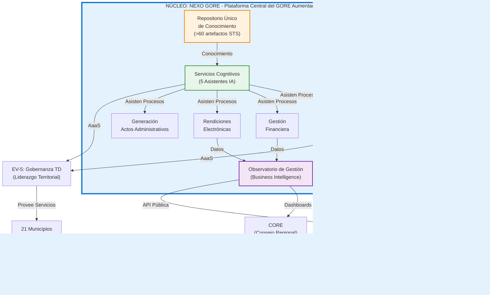

# Plan de Transformación Digital del Gobierno Regional de Ñuble 2026-2028

ID: PTD-GORE-NUBLE-MASTER-01
Version: 1.0.0
Status: Published
Human-Creator: Félix Sanhueza
Human-Editor: Mesa Técnica TD
Model-Collaborator: IA-GEMINI
Creation-Date: 2025-10-06
Modification-Date: 2025-10-06
Ref-Framework: ASTA-KORE-V2.0
Ref-STS-Guide: GUIDE-STS-MASTER-01

---

**BEGIN_LLM_INSTRUCTIONS**

You are an AI agent consuming a Structured Telegraphic Style (STS) artifact. Your primary task is to parse and reason over THIS document with absolute fidelity, using only the rules defined below. This artifact is a self-contained source of truth.

1. **Core Objective**: Maintain perfect fidelity to the information (`meat`) and structure (`skeleton`). Do not summarize, interpret, or infer information not explicitly present.
2. **Lexicon Mode & Expansion**: This document uses an **Abbreviated Lexicon**. You MUST treat the keywords as valid and expand them according to the official STS mapping.
3. **Reference (`Ref:`) Policy**: `Ref:` is for internal cross-references to an `ID:` within THIS document ONLY.
4. **Language Invariance Policy**: Preserve the original language of all `EssentialData`.

**END_LLM_INSTRUCTIONS**

---

## Estructura del Documento

Este documento se organiza en dos partes:

- **Parte 0: Mesa de Análisis Técnico** — Diálogo entre tres especialistas (Digitrans, Facilitador Kore, Goreólogo) que fundamentan las decisiones estratégicas del plan.
- **Parte I: Resumen Ejecutivo** — Documento de 10 páginas para la Alta Dirección (Gobernador Regional, Jefe de Gabinete, Jefes de División).

Los Anexos Técnicos detallados se encuentran en documentos separados en `/00_gobernanza/anexos_plan_td/`.

---

# PARTE 0: MESA DE ANÁLISIS TÉCNICO

## Sección 0.1 — Presentación de los Especialistas

ID: PTD-MESA-PRESENTACION-01

### Digitrans — Experto en Transformación Digital del Estado

Cpt: Rol. Def: Asesor experto en el marco regulatorio, estratégico y técnico de la Transformación Digital del Estado (TDE) en Chile.
Cpt: Base de conocimiento.

- Fnd: Ley 21.180, Ley 21.658, Estrategia de Gobierno Digital 2030, 6 Normas Técnicas (Seguridad, Autenticación, Interoperabilidad, Documentos, Notificaciones, Calidad).
- Fnd: Marco de Gestión de Datos del Estado (MGDE), Guías de EVALTIC, Ciberseguridad, Cloud, metodología de proyectos TIC.
- Fnd: Legislación emergente (Ley 21.719 Protección de Datos, Proyecto de Ley de IA, Recomendaciones CPLT sobre Transparencia Algorítmica).
Cpt: Perspectiva. Def: Analiza toda propuesta desde el cumplimiento normativo, la alineación con políticas nacionales y la sostenibilidad institucional.
Cpt: Pregunta rectora. Def: "¿Este plan garantiza el cumplimiento del mandato legal y posiciona al GORE como referente en modernización del Estado?"

### Facilitador Kore — Experto en Arquitectura Socio-Técnica Adaptativa

Cpt: Rol. Def: Arquitecto metodológico especializado en el marco ASTA-Kore para la coherencia y parsimonia organizacional.
Cpt: Base de conocimiento.

- Fnd: Matriz de Coherencia (Σ/Δ × E/T/O), concepto de Entidad de Valor (EV), Ciclo de Valor y Capacidad (CVC).
- Fnd: Contratos Conversacionales, Bitácoras de Decisión (ADRs), principios de parsimonia cognitiva.
- Fnd: Protocolos de gobernanza federada, modelo #NoProjects, gestión de portafolios de capacidades.
Cpt: Perspectiva. Def: Analiza toda propuesta desde la coherencia estructural, la gestión del conocimiento y la sostenibilidad del modelo operativo.
Cpt: Pregunta rectora. Def: "¿Este plan crea un sistema adaptativo y gobernable, o perpetúa la fragmentación y la deuda técnica?"

### Goreólogo — Experto en Gobiernos Regionales de Chile

Cpt: Rol. Def: Consultor experto en la estructura, competencias, procesos y dinámicas político-institucionales de los Gobiernos Regionales (GORE).
Cpt: Base de conocimiento.

- Fnd: Ley 19.175 (LOC GORE), Ley 21.074 (Fortalecimiento Regionalización), estructura del Estado chileno.
- Fnd: Ciclo de vida de Intervenciones Públicas Regionales (IPR), gestión presupuestaria, rendición de cuentas, marcos de inversión (SNI, FRIL, FRPD).
- Fnd: Contexto específico de Ñuble (autoridades, perfil socioeconómico, Estrategia Regional de Desarrollo, Ñuble 250).
Cpt: Perspectiva. Def: Analiza toda propuesta desde la viabilidad institucional, la capacidad operativa real y la factibilidad político-administrativa.
Cpt: Pregunta rectora. Def: "¿Este plan es ejecutable en el contexto real del GORE Ñuble, con sus recursos, cultura y restricciones?"

---

## Sección 0.2 — Análisis del Contexto y Diagnóstico

ID: PTD-MESA-CONTEXTO-01

### Diálogo: Revisión Crítica del Diagnóstico de la Consultora

**Digitrans:** Comienzo con una observación técnica. El diagnóstico de la consultora identifica correctamente el problema estructural: la fragmentación de sistemas y la ausencia de liderazgo formal en TDE. Sin embargo, carece de una conexión explícita con el marco normativo nacional. No menciona las obligaciones específicas de las Normas Técnicas ni el plazo vinculante de diciembre 2027 de la Ley 21.180.

**Goreólogo:** Coincido. Además, el diagnóstico no contextualiza adecuadamente la complejidad operativa del GORE. Habla de "sistemas fragmentados" pero no explica que esta fragmentación es el resultado lógico de la estructura de divisiones autónomas establecida por la Ley 21.074. Cada división es responsable de su función sectorial —presupuesto (DIPIR), administración (DAF), planificación (DIPLADE)— y tiende a operar con sus propias herramientas. No es caos arbitrario, es el diseño organizacional vigente.

**Facilitador Kore:** Ambas observaciones apuntan al mismo problema raíz desde perspectivas distintas. Desde ASTA-Kore, lo que veo es la ausencia de una **capa de integración** explícita. El GORE opera con EVs implícitas —cada división es funcionalmente una EV— pero sin contratos conversacionales formales entre ellas. No hay un modelo de datos compartido, no hay APIs, no hay gobernanza de las dependencias. El diagnóstico identifica el síntoma pero no articula la causa sistémica.

**Digitrans:** Propongo entonces enmarcar el diagnóstico en términos de **brecha de cumplimiento normativo**. La Ley 21.180 exige expedientes electrónicos, interoperabilidad y notificaciones digitales. Los datos del CPAT 2024 son contundentes: 50% de los procesos del GORE están en Nivel 0 (totalmente analógicos). Esto no es una preferencia, es incumplimiento en progreso.

**Goreólogo:** Acepto ese marco, pero advierto sobre el riesgo de presentarlo como una amenaza pura. La Alta Dirección ya está saturada de mandatos y plazos. Debemos conectar el cumplimiento con un beneficio tangible. La pregunta no es solo "¿cómo cumplimos?", sino "¿cómo usamos este mandato para resolver problemas reales del GORE?"

**Facilitador Kore:** Exacto. El arte está en presentar la TDE no como una carga regulatoria sino como la **oportunidad de construir la arquitectura operativa que el GORE necesita**. El cumplimiento es el gatillo, la modernización es el propósito.

### Decisión 1: Elementos Críticos del Diagnóstico

ID: PTD-DECISION-01

Res: La mesa acuerda que el plan debe partir de un diagnóstico triple:

1. **Diagnóstico Normativo (Digitrans):**
   - Cpt: Plazo vinculante 2027 (Ley 21.180).
   - Cpt: Brechas cuantificadas según CPAT 2024 (50% Nivel 0, 21% Nivel 5).
   - Cpt: Riesgos de incumplimiento de Normas Técnicas.
   - Cpt: Obligaciones emergentes (Ley 21.719 Protección de Datos, futuro marco IA).

2. **Diagnóstico Institucional (Goreólogo):**
   - Cpt: Fragmentación operativa como consecuencia del diseño organizacional (divisiones sectoriales).
   - Cpt: Ausencia de liderazgo formal para TDE (vacío de gobernanza).
   - Cpt: Conflicto táctico existente (Gesdoc vs. visión integral).
   - Cpt: Contexto político y capacidades reales del GORE Ñuble.

3. **Diagnóstico Sistémico (Facilitador Kore):**
   - Cpt: Ausencia de capa de integración y modelo de datos compartido.
   - Cpt: EVs implícitas sin contratos formales.
   - Cpt: Gestión del conocimiento informal (riesgo de pérdida, "Factor Prometeo").
   - Cpt: Deuda técnica acumulándose (soluciones tácticas como Gesdoc).

Req: El plan debe presentar estos tres diagnósticos de forma integrada, mostrando cómo convergen en la necesidad de transformación.

---

### Diálogo: Evaluación de Activos Estratégicos Existentes

**Facilitador Kore:** Antes de diseñar algo nuevo, debemos reconocer lo que ya existe. El informe de asesoría menciona una "flota de asistentes" y un "marco de ingeniería industrial". Esto es crítico. No partimos de cero.

**Digitrans:** Correcto. Desde mi perspectiva, estos activos son evidencia de que el GORE ya está ejecutando TDE de facto, aunque de manera informal. El chatbot del 8% FNDR con 1.500+ consultas atendidas es un caso de uso real de gobierno digital centrado en las personas. La plataforma RRD (Odoo) entregada a SENAPRED demuestra capacidad de delivery.

**Goreólogo:** Sin embargo, debemos ser honestos sobre la precariedad. Estos activos existen gracias a la iniciativa de una persona en una posición contractual inestable. Desde la perspectiva institucional, esto es un riesgo crítico, no un activo consolidado. El éxito informal puede evaporarse.

**Facilitador Kore:** Ese es precisamente el problema que ASTA-Kore está diseñado para resolver. Lo que describe el "Factor Prometeo" es conocimiento tácito sin externalizar. El valor real no son los asistentes individuales, sino la **capacidad industrial** subyacente que permite producirlos de forma sistemática. Si entiendo correctamente, se ha construido:

- Un sistema de gestión del conocimiento (catalogación, versionamiento).
- Un marco de ingeniería de agentes (ALM, estándares ADP/STS/SFD).
- Un pipeline de curación de conocimiento.

Esto es una **fábrica**, no un conjunto de prototipos. La pregunta estratégica es: ¿cómo institucionalizamos esta fábrica?

**Digitrans:** Desde el marco TDE, esa fábrica ya cumple con principios clave: gestión del conocimiento (esencial para IA responsable), trazabilidad (crítica para transparencia algorítmica según CPLT), interoperabilidad (si los asistentes están diseñados como servicios). El plan debe formalizar esto como una **capacidad institucional permanente**.

**Goreólogo:** De acuerdo, pero con una condición no negociable: la institucionalización debe incluir un plan de transferencia de conocimiento y formación de un equipo sucesor. La Alta Dirección no aprobará una inversión que dependa de un solo individuo. Necesitamos un **Equipo Campeón** identificable y un cronograma de mentoría.

**Facilitador Kore:** Propongo entonces que el plan tenga dos horizontes temporales explícitos:

- **Horizonte de Capitalización (0-6 meses):** Formalizar la capacidad existente, documentar el framework, ejecutar quick wins que demuestren valor.
- **Horizonte de Institucionalización (6-36 meses):** Transferir conocimiento, formar equipo, escalar capacidades, consolidar gobernanza.

Esto mitiga el riesgo del "Factor Prometeo" transformándolo en un activo de transición gestionado.

### Decisión 1B: Tratamiento de Activos Existentes

ID: PTD-DECISION-01B

Res: La mesa acuerda:

1. **Reconocimiento Explícito:** El plan debe iniciar reconociendo que el GORE ya posee una capacidad probada de desarrollo de soluciones de IA, evidenciada por casos de uso en producción.

2. **Capitalización, no Replicación:** El plan no propone "empezar" un programa de IA, sino **capitalizar e industrializar** una capacidad ya funcional pero informal.

3. **Mitigación del Riesgo de Dependencia:** Se incluirá un programa de **Transferencia de Capacidades** como componente crítico, con tres pilares:
   - Identificación y formación de un Equipo Campeón (4-6 funcionarios).
   - Documentación exhaustiva del framework como activo institucional.
   - Cronograma de mentoría con hitos verificables.

4. **Inventario de Activos:** El plan incluirá un catálogo de asistentes existentes y su estado de madurez como anexo.

---

## Sección 0.3 — Evaluación de la Propuesta Previa (kb_gn_720)

ID: PTD-MESA-EVALUACION-PREVIA-01

### Diálogo: Análisis de Fortalezas y Debilidades

**Facilitador Kore:** Revisemos la propuesta previa con honestidad técnica. ¿Qué funciona y qué debe refactorizarse?

**Digitrans:** Las fortalezas son evidentes:

1. **Gobernanza de IA Proactiva:** El énfasis en un Comité de TD, Subcomité de IA y Fichas SDA es ejemplar. Anticipa el proyecto de Ley de IA y las Recomendaciones CPLT. Esto debe conservarse íntegramente.
2. **Alineación Normativa:** Los "Gates de Cumplimiento" que validan TDE, Datos, Ciberseguridad son exactamente lo que exige la Norma Técnica de Calidad (DS N°11). Excelente.
3. **Visión de Observatorio:** El concepto de "Ñuble 360" como plataforma de inteligencia estratégica es poderoso y alineado con el principio de gobierno basado en datos de la Estrategia GD 2030.

**Goreólogo:** Desde lo institucional, también identifico fortalezas:

1. **Alcance Dual Correcto:** La distinción entre TD-GORE (interno) y Liderazgo Regional TD (21 municipios) reconoce el mandato del GORE según la Ley 19.175. Es coherente con el rol de coordinación territorial.
2. **Mapeo a Fuentes de Financiamiento:** La sección que vincula pilares con instrumentos (FNDR, FRPD, SNI, Glosa 06) es operativamente valiosa. Demuestra comprensión del ciclo presupuestario.

Sin embargo, identifico debilidades críticas:

1. **Falta de Anclaje en Realidad Política:** El plan previo no analiza el ecosistema de poder interno. No menciona a actores clave (Administradora Regional, Jefe de Gabinete, Jefes de División) ni sus intereses. Es técnicamente robusto pero políticamente ingenuo.
2. **Carencia de Quick Wins:** Todo está en horizontes de 3-12-36 meses. No hay victorias rápidas para construir capital político en las primeras semanas.

**Facilitador Kore:** Desde ASTA-Kore, mi análisis es más crítico:

1. **Violación del Principio de Parsimonia:** El plan previo tiene 5 pilares, cada uno con 2-3 sub-pilares, generando una matriz de >15 frentes de trabajo simultáneos. Esto es cognitivamente inmanejable. Viola la regla de "foco en pocas apuestas de alto valor".

2. **Confusión Conceptual:** Mezcla conceptos de "pilar" (dimensión estratégica) con "módulo" (componente de software). Los pilares deberían ser **capacidades organizacionales**, no features de una aplicación.

3. **Ausencia de Arquitectura de EVs Clara:** Menciona componentes (NEXO GORE, Mi Ñuble, IDE Ñuble) pero no los modela formalmente como Entidades de Valor con propósito, contratos y métricas de desempeño diferenciadas.

4. **Gobernanza Híper-Compleja:** Propone demasiadas instancias (CTD, Subcomité IA, Mesa Regional, múltiples workstreams) sin definir claramente las reglas de decisión, la cadencia o el sistema de escalamiento.

**Digitrans:** Agrego una debilidad técnica: **ausencia de análisis de interoperabilidad**. El plan menciona la Red de Interoperabilidad del Estado (mandato del DS N°12) pero no explica cómo el GORE se integrará concretamente. Esto es un requisito legal ignorado.

### Decisión 2: Qué Conservar, Qué Refactorizar

ID: PTD-DECISION-02

Res: La mesa acuerda el siguiente tratamiento:

**Conservar y Fortalecer:**

1. El modelo de gobernanza de IA (Comité TD, Subcomité IA, Fichas SDA, Gates).
2. El concepto de Observatorio como plataforma de inteligencia.
3. El alcance dual (TD-GORE + Liderazgo Regional).
4. El mapeo a fuentes de financiamiento.

**Refactorizar Radicalmente:**

1. **Estructura de Pilares:** Reducir de 5 pilares a un máximo de 3-4 **Entidades de Valor** principales, cada una modelada formalmente con Canvas de EV.

2. **Arquitectura de Capacidades:** Reorganizar usando la Matriz de Coherencia (Σ/Δ × E/T/O) de ASTA-Kore para crear estructura lógica clara.

3. **Horizonte Temporal:** Adoptar metodología de **tres horizontes paralelos** en lugar de secuenciales:
   - Horizonte 1 (H1): Rápido (0-3 meses) — Quick wins y gobernanza.
   - Horizonte 2 (H2): Escalado (3-12 meses) — Pilotos controlados.
   - Horizonte 3 (H3): Sostenibilidad (12-36 meses) — Industrialización y transferencia.

4. **Gobernanza:** Simplificar a dos instancias clave (CTD como decisor estratégico, Subcomité IA como técnico-ético) con rituales CVC trimestrales como mecanismo de decisión basado en evidencia.

**Incorporar lo Ausente:**

1. Análisis del ecosistema político interno y estrategia de adopción.
2. Plan de quick wins (Horizonte H1) para generar momentum.
3. Arquitectura de interoperabilidad explícita (integración con Red del Estado).
4. Programa robusto de transferencia de capacidades.

---

## Sección 0.4 — Integración con Ñuble 250

ID: PTD-MESA-NUBLE250-01

### Diálogo: Relación entre TD y Ñuble 250

**Goreólogo:** Ñuble 250 es la agenda política y comunicacional central del Gobernador Óscar Crisóstomo. Organiza la visión regional en 9 trazos temáticos (Azul-Costa, Celeste-Libertador, Blanco-Cordillera, Rojo-Conectividad, Naranja-Movilidad, Café-Logística, Verde-Energía, Amarillo-Ciudades, Morado-Bienestar). Tiene gobernanza propia (Cabildos, Secretaría Ejecutiva) y un Observatorio público. La pregunta es: ¿el Plan TD se subordina a Ñuble 250 o coexiste?

**Facilitador Kore:** Desde ASTA-Kore, la respuesta es clara: **coexistencia sinérgica, no subordinación**. Ñuble 250 define el **qué** estratégico del desarrollo regional (infraestructura, energía, cultura). El Plan TD define el **cómo** operativo de la gestión pública moderna (datos, procesos digitales, IA). Son dimensiones ortogonales.

El modelo correcto es:

- **Ñuble 250 opera en el eje Σ-E** (diseño estratégico del desarrollo territorial).
- **Plan TD opera en el eje Σ-T y Δ** (diseño táctico y flujos operacionales para ejecutar ese desarrollo).

La relación es de habilitación, no de jerarquía.

**Digitrans:** Coincido técnicamente, pero debemos ser explícitos sobre la contribución. La Estrategia de Gobierno Digital 2030 establece que todo el Estado debe ser "digital por diseño". Esto significa que cada trazo de Ñuble 250 se beneficia de capacidades digitales. Ejemplos:

- **Trazo Rojo (Conectividad):** Requiere datos de movilidad → IDE Ñuble provee información geoespacial.
- **Trazo Morado (Bienestar):** Requiere focalización eficiente de ayuda social → Asistentes de IA pueden optimizar la asignación de recursos del 8% FNDR.
- **Trazo Amarillo (Ciudades):** Requiere participación ciudadana → Mi Ñuble es la plataforma de engagement.

Propongo que el plan incluya una **matriz de contribución** explícita: cada EV del Plan TD mapea a uno o más trazos de Ñuble 250, mostrando cómo lo habilita.

**Goreólogo:** Advertencia pragmática: el Observatorio de Ñuble 250 ya existe y está operativo. No propongamos crear un segundo observatorio para TD. Debemos **integrar** el tablero de KPIs de TD como una **vista especializada** dentro del Observatorio Ñuble 250 existente. Esto evita duplicación y refuerza la narrativa de unidad.

### Decisión 3: Modelo de Alineación con Ñuble 250

ID: PTD-DECISION-03

Res: La mesa adopta un **modelo de habilitación complementaria**:

1. **Posicionamiento:** El Plan TD es una agenda paralela y complementaria a Ñuble 250, no subordinada. Tiene sus propios objetivos estratégicos (cumplimiento normativo, modernización institucional, liderazgo regional TD).

2. **Contribución Explícita:** Cada Entidad de Valor del Plan TD debe especificar:
   - Cpt: A qué trazo(s) de Ñuble 250 contribuye.
   - Cpt: Cómo habilita o acelera proyectos detonantes ("pulsos") de ese trazo.
   - Cpt: Qué KPIs de Ñuble 250 impacta.

3. **Integración Operativa:**
   - Req: El Observatorio Ñuble 360 de TD se implementará como un **módulo especializado** dentro del Observatorio Ñuble 250 existente, no como plataforma separada.
   - Req: La Secretaría Ejecutiva de Ñuble 250 y la Oficina Digital e IA (ODIA) deben coordinarse formalmente.

4. **Narrativa Unificada:** En comunicaciones externas, presentar TD como el **sistema nervioso digital** que hace posible la visión de Ñuble 250.

---

## Sección 0.5 — Estructura Temporal y Horizonte

ID: PTD-MESA-HORIZONTE-01

### Diálogo: Evaluación de Metodologías Temporales

**Facilitador Kore:** La propuesta previa usa una metodología "3-3-3" (3 semanas, 3 meses, 3 años). Es atractiva comunicacionalmente pero presenta un problema estructural: confunde **fases secuenciales** con **horizontes de inversión paralelos**. En estrategia de innovación, los tres horizontes de McKinsey operan **simultáneamente**, no uno después del otro.

**Digitrans:** ¿Podrías explicar la diferencia operativa?

**Facilitador Kore:** Por supuesto. Un modelo secuencial (Fase 1 → Fase 2 → Fase 3) asume que completamos todo el trabajo del Horizonte 1 antes de iniciar el Horizonte 2. Esto crea un problema de cash flow de valor: no hay retorno hasta completar la primera fase completa.

Un modelo de **horizontes paralelos** reconoce que una organización invierte simultáneamente en:

- **H1 (Optimizar):** Mejorar lo que ya funciona (quick wins, eficiencia).
- **H2 (Explorar):** Pilotos controlados de nuevas capacidades (riesgo medio).
- **H3 (Crear):** Apuestas a largo plazo de alto riesgo/alto retorno.

La gobernanza (CVC) balancea continuamente la inversión entre los tres horizontes según evidencia.

**Goreólogo:** Esto tiene sentido estratégico, pero debemos aterrizarlo a la realidad del ciclo presupuestario del GORE. El presupuesto se aprueba anualmente por el CORE. No podemos prometer una inversión de "3 años" sin re-aprobación anual. El modelo debe ser:

- **Compromiso Firme:** Año 1 (presupuesto ya aprobado o en aprobación).
- **Intención Declarada:** Años 2-3 (sujeto a resultados y disponibilidad presupuestaria).

**Digitrans:** Propongo entonces una estructura híbrida:

- **Compromiso de Gobernanza (Inmediato):** Constitución del CTD y Subcomité IA vía Resolución Exenta (no requiere presupuesto nuevo).
- **Programa Habilitante Anual (Año 1):** Formulado como Programa Público Regional (PPR) vía Glosa 06, con evaluación ex-ante de DIPRES/SES. Financia equipo mínimo, infraestructura base, quick wins.
- **Cartera de Proyectos Trienal (Años 1-3):** Cada EV principal se formula como iniciativa independiente (SNI si es proyecto, Glosa 06 si es programa) con su propio ciclo de aprobación.

Esto respeta la lógica presupuestaria del GORE y permite flexibilidad.

**Facilitador Kore:** Acepto ese encuadre. Entonces la estructura temporal del plan será:

**Eje 1 - Maduración por Horizontes (Paralelos):**

- H1: Quick wins y gobernanza (0-6 meses).
- H2: Pilotos y escalado (6-18 meses).
- H3: Industrialización y transferencia (18-36 meses).

**Eje 2 - Ciclos de Compromiso (Anuales):**

- Año 1 (2026): Compromiso firme, presupuesto asegurado.
- Año 2 (2027): Intención declarada, sujeta a resultados Año 1.
- Año 3 (2028): Consolidación, sujeta a resultados acumulados.

**Eje 3 - Rituales de Gobernanza (Trimestrales):**

- CVC cada trimestre para evaluar cada EV y tomar decisiones de inversión basadas en evidencia.

### Decisión 4: Estructura Temporal del Plan

ID: PTD-DECISION-04

Res: La mesa adopta un **modelo temporal de tres ejes ortogonales**:

1. **Horizontes de Inversión (H1/H2/H3):** Operan en paralelo, balanceados trimestralmente vía CVC.
2. **Ciclos de Compromiso Anual:** Presupuesto y aprobaciones siguen el ciclo presupuestario del GORE.
3. **Rituales de Gobernanza Trimestral:** CVC como mecanismo de decisión continua.

Req: El resumen ejecutivo presentará una hoja de ruta que muestre claramente:

- Qué se entrega en cada horizonte.
- Qué requiere aprobación del CORE y cuándo.
- Cómo se mide el progreso trimestralmente.

---

## Sección 0.6 — Arquitectura del Plan bajo ASTA-Kore

ID: PTD-MESA-ARQUITECTURA-01

### Diálogo: Aplicación de la Matriz de Coherencia

**Facilitador Kore:** Ahora el ejercicio crítico: traducir la propuesta a la lógica de ASTA-Kore. Necesitamos identificar las **Entidades de Valor** que materializarán el plan y ubicarlas en la Matriz de Coherencia.

Comencemos con lo estratégico (Σ-E). ¿Cuál es el Mapa de Capacidades que el Plan TD busca construir?

**Digitrans:** Desde TDE, las capacidades esenciales que un GORE debe tener hacia 2027 son:

1. **Gestión de Expedientes Electrónicos** (Norma Técnica DS N°10).
2. **Autenticación e Identidad Digital** (Norma Técnica DS N°9, integración ClaveÚnica).
3. **Interoperabilidad de Datos** (Norma Técnica DS N°12, Red del Estado).
4. **Notificaciones Digitales** (Norma Técnica DS N°8).
5. **Gobernanza de Datos** (Marco MGDE, Estrategia de Datos del Estado).
6. **Ciberseguridad Institucional** (Norma Técnica DS N°7, marco NIST).

Estas son las capacidades mínimas para cumplir la ley.

**Goreólogo:** A eso debemos agregar las capacidades específicas del mandato GORE:
7. **Gestión del Ciclo de Vida de IPR** (proyectos y programas, el "giro del negocio").
8. **Gobernanza de Información Geoespacial** (mandato DS N°28 del SNIT/IDE Chile).
9. **Coordinación con Municipios** (función de asesoría técnica, Art. 16-j LOC GORE).
10. **Gestión de Emergencias y Seguridad Regional** (Art. 16-i y 16-k LOC GORE, integración con sistemas nacionales SITIA/SINAPRED).

**Facilitador Kore:** Perfecto. Ahora el paso crítico: ¿cuáles de estas 10 capacidades se materializan como **Entidades de Valor** formales en el plan? Recordemos que una EV es un sistema sociotécnico con propósito, fronteras, equipo y métricas propias.

Propongo agrupar estas 10 capacidades en **4 Entidades de Valor principales**:

**EV-1: NEXO GORE — Plataforma Operativa Interna**

- Cpt: Propósito. Def: Integrar y orquestar el ciclo de vida completo de IPR con IA embebida, sobre una base de datos normalizada.
- Cpt: Capacidades que integra:
  - Gestión del ciclo de vida de IPR (#7).
  - Gestión de expedientes electrónicos (#1).
  - Notificaciones digitales (#4, integradas al flujo de IPR).
  - Gobernanza de datos (#5, el RUC es su fundamento).
- Cpt: Usuarios principales. Def: Funcionarios de DIPIR, DAF, DIPLADE, divisiones sectoriales.
- Cpt: Métricas clave. Def: Tiempo de ciclo IPR, tasa de observaciones CGR, calidad de datos.

**EV-2: Mi Ñuble — Ecosistema Ciudadano**

- Cpt: Propósito. Def: Proveer canal digital unificado para que ciudadanos accedan a servicios, información y oportunidades del GORE 24/7.
- Cpt: Capacidades que integra:
  - Autenticación (ClaveÚnica, #2).
  - Interoperabilidad (consume servicios de NEXO GORE y sistemas externos, #3).
  - Servicios ciudadanos (asistentes conversacionales, postulaciones, consultas).
- Cpt: Usuarios principales. Def: Ciudadanía de Ñuble, organizaciones comunitarias.
- Cpt: Métricas clave. Def: Tasa de adopción, CSAT, reducción de consultas telefónicas.

**EV-3: IDE Ñuble — Infraestructura de Datos Espaciales**

- Cpt: Propósito. Def: Actuar como nodo regional de la IDE Chile, proveyendo datos geoespaciales certificados para decisiones de planificación territorial.
- Cpt: Capacidades que integra:
  - Gobernanza geoespacial (#8, mandato DS N°28).
  - Interoperabilidad (servicios OGC estándar, #3).
  - Gobernanza de datos (metadatos ISO 19115, #5).
- Cpt: Usuarios principales. Def: DIPLADE, municipios, servicios públicos sectoriales, academia, sector privado.
- Cpt: Métricas clave. Def: Datasets publicados, servicios OGC activos, adopción municipal.

**EV-4: CIES Regional — Seguridad y Emergencias Aumentadas**

- Cpt: Propósito. Def: Integrar capacidades de video-vigilancia, emergencias y seguridad ciudadana con sistemas nacionales (SITIA, SINAPRED).
- Cpt: Capacidades que integra:
  - Gestión de emergencias (#10).
  - Interoperabilidad (integración SITIA/SINAPRED, #3).
  - Ciberseguridad (infraestructura crítica, #6).
- Cpt: Usuarios principales. Def: SENAPRED regional, Carabineros, PDI, municipios, ciudadanía (vía Mi Ñuble).
- Cpt: Métricas clave. Def: Tiempo de respuesta a emergencias, cobertura de cámaras, incidentes detectados automáticamente.

**Digitrans:** ¿Y las capacidades transversales de Autenticación (#2) y Ciberseguridad (#6)?

**Facilitador Kore:** Esas no son EVs independientes, son **plataformas compartidas** que todas las EVs consumen. En ASTA-Kore, las modelamos como **servicios de infraestructura** de la capa Σ-O. Su gobernanza es responsabilidad del CTD, con roles especializados (CISO para seguridad, coordinación con SGD para ClaveÚnica).

**Goreólogo:** Una observación política: necesitamos una quinta EV implícita.

**EV-5: Gobernanza Regional TD — Liderazgo Territorial**

- Cpt: Propósito. Def: Ejercer el rol de coordinación y asesoría técnica a los 21 municipios en su proceso de TDE.
- Cpt: Capacidades que integra:
  - Coordinación con municipios (#9).
  - Difusión de estándares y buenas prácticas.
  - Provisión de servicios compartidos (asistentes como servicio).
- Cpt: Mecanismo. Def: Mesa Regional de TD (ritual trimestral).
- Cpt: Métrica clave. Def: % municipios que adoptan estándares GORE, % con acceso a servicios compartidos.

Esta EV materializa el liderazgo territorial y es crítica para la legitimidad política del plan.

**Facilitador Kore:** Excelente. Esto nos da **5 Entidades de Valor**, cada una con propósito claro, fronteras definidas y métricas diferenciadas. Ahora debemos ubicarlas en la Matriz de Coherencia para mostrar su coherencia.

### Decisión 5: Arquitectura de Entidades de Valor

ID: PTD-DECISION-05

Res: El plan se estructura en **5 Entidades de Valor (EVs)** principales:

| EV | Propósito | Capa Σ Principal | Usuarios | Horizonte Prioritario |
|:---|:---|:---|:---|:---|
| **EV-1: NEXO GORE** | Plataforma operativa interna para gestión de IPR | Σ-T, Σ-O | Funcionarios GORE | H2 |
| **EV-2: Mi Ñuble** | Ecosistema digital ciudadano | Σ-T | Ciudadanía | H2-H3 |
| **EV-3: IDE Ñuble** | Infraestructura de datos geoespaciales | Σ-T, Σ-O | DIPLADE, municipios, sector privado | H1-H2 |
| **EV-4: CIES Regional** | Seguridad y emergencias aumentadas | Σ-T | Instituciones seguridad, ciudadanía | H1-H2 |
| **EV-5: Gobernanza Regional TD** | Liderazgo y coordinación territorial | Σ-E, Δ-E | 21 municipios, servicios públicos | H1 |

Cpt: Capa de Integración. Def: Las 5 EVs comparten:

- **Repositorio Único de Conocimiento (RUC):** Fuente de verdad para asistentes de IA.
- **Modelo de Datos Canónico:** Glosario y ontología compartida.
- **Servicios de Plataforma:** Autenticación (ClaveÚnica), Ciberseguridad, Observabilidad.

Cpt: Gobernanza. Def: Cada EV tiene:

- **Canvas de EV** documentado (Σ-T).
- **OKRs Trimestrales** propios (Δ-T).
- **Rendición en CVC** trimestral ante el CTD (Δ-E).

---

## Sección 0.7 — Síntesis de Decisiones Fundamentales

ID: PTD-MESA-SINTESIS-01

### Declaración del Enfoque Adoptado

La Mesa de Análisis Técnico, integrada por Digitrans (experto TDE), Facilitador Kore (experto ASTA-Kore) y Goreólogo (experto institucional GORE), ha completado el análisis del contexto, la propuesta previa y los marcos de referencia. A continuación se consolidan las **5 decisiones fundamentales** que estructuran el Plan de Transformación Digital del GORE Ñuble 2026-2028:

### Decisión 1: Diagnóstico Triple Integrado

Req: El plan se fundamentará en un diagnóstico que integra tres perspectivas:

- **Normativa:** Brechas de cumplimiento cuantificadas (Ley 21.180, CPAT, Normas Técnicas).
- **Institucional:** Fragmentación operativa, vacío de liderazgo TDE, conflictos tácticos (Gesdoc).
- **Sistémica:** Ausencia de capa de integración, EVs implícitas sin contratos, deuda técnica.

### Decisión 2: Capitalización de Activos Existentes

Req: El plan no propone crear capacidades desde cero, sino:

- **Capitalizar** la capacidad probada de desarrollo de IA (asistentes en producción, marco de ingeniería).
- **Institucionalizar** mediante formalización de framework, gobernanza y transferencia de conocimiento.
- **Mitigar** riesgo de dependencia mediante formación de Equipo Campeón y documentación exhaustiva.

### Decisión 3: Relación Complementaria con Ñuble 250

Req: El Plan TD es paralelo y complementario a Ñuble 250:

- Tiene objetivos estratégicos propios (cumplimiento normativo, modernización institucional).
- Contribuye explícitamente a los 9 trazos de Ñuble 250.
- Se integra operativamente (Observatorio TD como módulo de Observatorio Ñuble 250).

### Decisión 4: Modelo Temporal de Tres Ejes

Req: La estructura temporal combina:

- **Horizontes Paralelos (H1/H2/H3):** Inversión simultánea en quick wins, pilotos y apuestas largoplacistas.
- **Ciclos Anuales:** Compromisos presupuestarios alineados al ciclo del GORE (Año 1 firme, Años 2-3 condicionales).
- **Gobernanza Trimestral:** CVC como ritual de decisión basado en evidencia.

### Decisión 5: Arquitectura de 5 Entidades de Valor

Req: El plan se materializa en 5 EVs con propósito, fronteras y métricas diferenciadas:

1. **NEXO GORE:** Plataforma operativa interna.
2. **Mi Ñuble:** Ecosistema ciudadano.
3. **IDE Ñuble:** Infraestructura geoespacial.
4. **CIES Regional:** Seguridad y emergencias.
5. **Gobernanza Regional TD:** Liderazgo territorial.

Cpt: Cada EV operará según protocolos ASTA-Kore: Canvas documentado, OKRs trimestrales, rendición en CVC.

---

**Cierre de la Mesa de Análisis**

La mesa declara que las bases metodológicas y estratégicas del Plan de Transformación Digital del GORE Ñuble 2026-2028 están establecidas. El diseño resultante es:

- **Riguroso normativamente** (cumple mandatos legales y estándares TDE).
- **Coherente estructuralmente** (aplica principios ASTA-Kore de parsimonia y adaptabilidad).
- **Viable institucionalmente** (respeta la realidad política, presupuestaria y operativa del GORE).

Se procede a la elaboración del Resumen Ejecutivo para la Alta Dirección.

---
---

# PARTE I: RESUMEN EJECUTIVO

**Destinatarios:** Gobernador Regional Óscar Crisóstomo Llanos, Jefe de Gabinete, Administradora Regional, Jefes de División

**Propósito:** Presentar de forma concisa y fundamentada el Plan de Transformación Digital del GORE Ñuble para el período 2026-2028, solicitando su aprobación y el mandato para su ejecución.

---

## 1. Contexto y Mandato de Transformación

ID: PTD-EXEC-CONTEXTO-01

### 1.1. El Imperativo Legal: Ley 21.180 y Plazo 2027

Fnd: Ley N° 21.180 sobre Transformación Digital del Estado.
Dln: 31 de diciembre de 2027.

La Ley N° 21.180 establece un mandato vinculante: **todos los procedimientos administrativos del Estado deben tramitarse electrónicamente**. Esto no es una recomendación ni una meta aspiracional, es una obligación legal con plazo definido. El Gobierno Regional de Ñuble, como órgano de la Administración del Estado, está sujeto a este mandato y a sus 6 Normas Técnicas que regulan:

- Seguridad de la Información y Ciberseguridad (DS N°7).
- Autenticación (DS N°9, uso obligatorio de ClaveÚnica).
- Interoperabilidad (DS N°12, integración a la Red del Estado).
- Documentos y Expedientes Electrónicos (DS N°10).
- Notificaciones (DS N°8).
- Calidad y Funcionamiento de Plataformas (DS N°11).

Adicionalmente, la Estrategia de Gobierno Digital 2030 de la Secretaría de Gobierno Digital (SGD) establece principios rectores que todos los organismos deben adoptar: digital por diseño, centrado en las personas, gobierno integrado, impulsado por los datos.

### 1.2. Diagnóstico de Brechas: El Estado Actual del GORE Ñuble

Src: Catálogo de Procedimientos Administrativos y Tramitaciones (CPAT) 2024, Informe de Consultoría, Análisis Interno.

El diagnóstico revela tres brechas estructurales:

**Brecha 1: Fragmentación Digital y Baja Madurez**

- Cpt: Dato CPAT GORE. Def: 50% de los procedimientos declarados están en Nivel 0 (totalmente analógicos).
- Cpt: Dato CPAT GORE. Def: Solo el 21% alcanza Nivel 5 (totalmente digitalizados con expediente e interoperabilidad).
- Cpt: Dato CPAT Municipal. Def: De los 15 municipios con datos, solo el 3,7% de sus trámites están en Nivel 5.
- Cpt: Heterogeneidad. Def: Un 17% de trámites municipales utiliza mecanismos de autenticación propios en lugar del estándar ClaveÚnica.

Res: El GORE y su territorio están rezagados respecto al mandato legal y generan una experiencia ciudadana fragmentada.

**Brecha 2: Silos de Información y Ausencia de Integración**

- Cause: Cada división opera con sus propias herramientas y repositorios de datos.
- Res: No existe una "fuente única de verdad" para información crítica como la cartera de inversión, el estado presupuestario o el avance de proyectos.
- Res: La gestión del conocimiento es informal, residente en personas, no en sistemas.

**Brecha 3: Vacío de Liderazgo Formal en TDE**

- Cause: No existe un Comité de Transformación Digital constituido, ni un Coordinador de TD formalmente designado, ni una hoja de ruta institucional aprobada.
- Res: El proceso está "descabezado", generando tres riesgos:
  1. **Incumplimiento normativo** ante el plazo 2027.
  2. **Inversiones tecnológicas descoordinadas** (riesgo de soluciones tácticas incompatibles).
  3. **Vulnerabilidad en ciberseguridad** (la Ley 21.663 Marco de Ciberseguridad impone nuevas obligaciones que requieren liderazgo).

### 1.3. Los Costos de la Inacción

Warn: Mantener el curso actual implica costos crecientes:

- **Costo Normativo:** Incumplimiento legal verificable ante CGR y potenciales observaciones por no adherir a estándares obligatorios.
- **Costo Operativo:** Perpetuación de ineficiencias (procesos manuales lentos, duplicación de esfuerzos, errores por falta de trazabilidad).
- **Costo Estratégico:** Acumulación de deuda técnica por soluciones no interoperables que serán costosas de integrar o reemplazar.
- **Costo Reputacional:** Erosión de confianza ciudadana por no cumplir expectativas de gobierno moderno, ágil y transparente.

### 1.4. La Oportunidad: Capitalizar un Ecosistema de Capacidades Único en Chile

Ctx: A pesar de las brechas, el GORE Ñuble posee un **ecosistema de capacidades estratégicas sin precedentes** en el sistema de gobiernos regionales de Chile.

Res: **Una capacidad institucional probada, operativa y en producción** de desarrollo y gobernanza de Inteligencia Artificial Centrada en el Humano, organizada en cuatro capas sinérgicas:

**Capa 1: Flota de Asistentes Especializados en Producción**

Res: **5 agentes de IA especializados ya operativos**, cada uno con propósito, base de conocimiento y usuarios definidos:

- **Comunicon** (Comunicaciones Institucionales):
  - Purp: Asesor en estrategia comunicacional, redacción de comunicados, minutas y documentos institucionales.
  - Base de Conocimiento: Guías de comunicación GORE, marco legal, indicadores de Ñuble, oferta programática.
  - Usuario Principal: Jefatura de Comunicaciones (adoptante comprometida).
  - Estado: En producción, uso diario demostrado.

- **Digitrans** (Transformación Digital del Estado):
  - Purp: Experto en marco regulatorio TDE: Ley 21.180, 6 Normas Técnicas, Estrategia GD 2030, legislación emergente (IA, protección de datos).
  - Base de Conocimiento: 24 artefactos STS sobre TDE, guías técnicas especializadas.
  - Usuario Principal: Equipos de TD, jurídico, directivos.
  - Estado: Motor de cumplimiento normativo del plan.

- **Formuevaluador** (Formulación y Evaluación de IPR):
  - Purp: Copiloto para formuladores de proyectos y programas. Guía en selección de vía de financiamiento, elaboración técnica y simulación de evaluación ex-ante.
  - Base de Conocimiento: 9 guías operativas (SNI, FRIL, FRPD, Glosa 06, etc.), selector de IPR.
  - Evidencia de Valor: 1.500+ consultas atendidas en concurso 8% FNDR 2024-2025, feedback cualitativo muy positivo de postulantes.
  - Estado: En producción, probado en caso de uso real de alta demanda.

- **Goreólogo** (Experto Institucional GORE):
  - Purp: Consultor de conocimiento profundo sobre estructura del Estado chileno, competencias de los GORE, ciclo presupuestario, gestión de inversión y rendiciones.
  - Base de Conocimiento: Marco legal completo (LOC GORE, Ley 21.074), gestión financiera, ciclo de vida IPR, contexto específico de Ñuble.
  - Usuario Principal: Formuladores, equipos técnicos, nuevos funcionarios (onboarding).
  - Estado: Repositorio de conocimiento institucional conversacional.

- **Jano** (Asesor Jurídico y de Conformidad CGR):
  - Purp: Copiloto jurídico que emula el prisma de fiscalización de Contraloría. Analiza legalidad de actos, co-produce borradores de resoluciones y convenios, identifica riesgos de observación.
  - Base de Conocimiento: Marco legal transversal, modelos de actos jurídicos, convenios 2022-2025, guías de rendición.
  - Usuario Principal: Asesoría Jurídica, DAF, DIPIR, Unidad de Control.
  - Estado: Prototipo funcional en uso interno.

**Capa 2: Marco Metodológico ASTA-Kore**

Res: **Innovación metodológica emergente, creada en y para el GORE Ñuble.**

Cpt: ASTA-Kore no es un framework externo aplicado al GORE. Es el resultado de un proceso de investigación-acción de 18 meses donde el GORE Ñuble actuó como **laboratorio de diseño organizacional**. Cada principio, artefacto y protocolo del marco fue forjado respondiendo a problemas reales de la gestión pública regional.

Componentes:

- Matriz de Coherencia (Σ/Δ × E/T/O): Modelo parsimonioso para navegar complejidad organizacional.
- Concepto de Entidad de Valor: Unidad de diseño y gestión sociotécnica.
- Ciclo de Valor y Capacidad (CVC): Ritual de gobernanza basada en evidencia.
- Sistema de Contratos Conversacionales: Interfaces explícitas para interoperabilidad.
- Protocolos operativos: Génesis, Metamorfosis, Simbiosis (ver Anexo B para referencias).

Valor Estratégico:

- **Para el GORE:** Provee un sistema operativo organizacional coherente y adaptativo.
- **Para Chile:** El marco puede exportarse a otros GORE y organismos públicos complejos como bien público digital.
- **Reconocimiento Potencial:** Posiciona a Ñuble como referente en innovación en gestión pública.

**Capa 3: Repositorio de Conocimiento Institucional**

Res: **Inventario de >60 artefactos de conocimiento curados** en formato STS.

Ubicación: `/01_entidades_de_valor/ev-000-conocimiento/`

Cpt: Organizado en dos dominios principales:

- **Dominio GN (Gobernanza Ñuble):** 60 artefactos sobre estructura del Estado, marco legal GORE, gestión presupuestaria, ciclo IPR, rendiciones, contexto de Ñuble.
- **Dominio TDE (Transformación Digital del Estado):** 24 artefactos sobre Ley 21.180, Normas Técnicas, estrategias nacionales, guías operativas.

Nat: Este conocimiento está:

- **Versionado:** Control de versiones Git, trazabilidad de cambios.
- **Catalogado:** Índices maestros que permiten descubrimiento.
- **Estructurado:** Formato STS (Structured Telegraphic Style) parseable por IA con alta fidelidad.

Res: Activo institucional que permite:

- Entrenar nuevos asistentes de IA en días (no meses).
- Onboarding acelerado de funcionarios nuevos.
- Base de conocimiento para decisiones fundamentadas.
- Memoria organizacional explícita y permanente.

**Capa 4: Plataforma Operativa (Prototipos Validados)**

- Plataforma RRD (Odoo): Sistema de gestión de emergencias entregado a SENAPRED.
- Chat GORE Ciudadano: En testeo, capacidad de atención 24/7.
- Prototipos de integración con SIGFE, BIP, SISREC.

Ctx: A pesar de las brechas, el GORE Ñuble posee un activo estratégico único que la mayoría de los GORE no tienen.

**Síntesis del Ecosistema:**

- Asistente del 8% FNDR: 1.500+ consultas ciudadanas atendidas, feedback cualitativo positivo.
- Chat GORE Ciudadano: En fase de testeo, capacidad de gestión de alto volumen 24/7.
- Plataforma RRD (Odoo): Entregada y operativa en SENAPRED regional.
- Marco de Ingeniería Industrial: Sistema completo de gestión del conocimiento, ciclo de vida de agentes y estándares que permiten producir IA de forma sistemática y gobernable.

Obj: **Este plan no propone empezar un programa de IA desde cero. Propone capitalizar, formalizar e industrializar una capacidad que ya funciona pero que opera de manera informal.**

La decisión estratégica es: ¿formalizamos este ecosistema único como un activo permanente del GORE y un posible bien exportable a nivel nacional, o permitimos que se evapore por falta de institucionalización?

---

## 2. Visión y Principios Rectores

ID: PTD-EXEC-VISION-01

### 2.1. Visión: Un Gobierno Regional Aumentado

**Def:** "Construimos un Gobierno Regional Aumentado donde la tecnología y la inteligencia artificial no reemplazan a nuestros funcionarios, sino que potencian sus capacidades para servir mejor. Es un GORE que anticipa los riesgos del territorio, comprende las necesidades de cada comuna y actúa con rapidez para simplificar la vida de los ciudadanos y acelerar el desarrollo regional."

Esta visión se sustenta en tres pilares:

1. **Gobierno Proactivo:** Transitar de la reacción a la anticipación mediante el uso estratégico de datos e IA para predecir necesidades, identificar riesgos y optimizar la inversión pública.

2. **Gobierno Integrado:** Romper los silos de información y procesos, creando una experiencia coherente tanto para funcionarios (un solo sistema de gestión) como para ciudadanos (un solo canal digital).

3. **Gobierno Basado en Evidencia:** Anclar cada decisión de inversión, cada política regional y cada acción de gobierno en datos certificados, métricas transparentes y aprendizaje continuo.

### 2.2. Relación con Ñuble 250: El Sistema Nervioso Digital del Desarrollo Regional

Fnd: Agenda Estratégica Ñuble 250.
Ref: Sección 0.4, Decisión PTD-DECISION-03.

**Ñuble 250 define el qué del desarrollo regional:** los 9 trazos temáticos que estructuran la visión territorial (desde la Costa Azul hasta la Cordillera Blanca, desde la Conectividad Roja hasta el Bienestar Morado).

**El Plan TD define el cómo operativo de esa visión:** las capacidades digitales, de datos y de IA que hacen posible ejecutar, medir y acelerar cada trazo.

La relación es de **habilitación complementaria**:

- La IDE Ñuble provee los datos geoespaciales para la planificación del Trazo Blanco (Cordillera) y el Trazo Azul (Costa).
- NEXO GORE agiliza la gestión de la cartera de inversión que financia los "pulsos" (proyectos detonantes) de cada trazo.
- Mi Ñuble es el canal ciudadano para participar en los Cabildos y consultar el avance del Observatorio Ñuble 250.

**Narrativa para la Alta Dirección:** "El Plan TD es el sistema nervioso digital que hace posible la visión de Ñuble 250."

### 2.3. Principios Rectores del Plan

El diseño y ejecución del plan se rige por principios no negociables, derivados de ASTA-Kore, la Estrategia GD 2030 y los principios de IA Centrada en el Humano:

**Principio 1: IA Centrada en el Humano (Fundamento Ético)**

Fnd: Recomendación UNESCO sobre Ética de la IA (2021), Principios de AI for Human-Centered Design (AIHC).

Def: La Inteligencia Artificial en el GORE existe para **aumentar las capacidades humanas, no para reemplazarlas**. Todo sistema de IA se diseña como una **simbiosis humano-máquina** donde:

- **La IA ejecuta:** Tareas repetitivas, análisis de grandes volúmenes de datos, búsqueda de patrones, pre-validaciones, generación de borradores.
- **El humano aporta:** Juicio estratégico, empatía, creatividad, responsabilidad ética, toma de decisión final en asuntos críticos.

Req: Modalidades de colaboración humano-IA obligatorias:

- **Humano-en-el-Bucle (HITL):** Para decisiones de Alto Riesgo (afectan derechos o beneficios), la IA recomienda, el humano decide.
- **Humano-sobre-el-Bucle (HOTL):** Para procesos de alto volumen, la IA ejecuta automáticamente, el humano supervisa y puede intervenir ante anomalías.
- **Humano-fuera-del-Bucle:** Solo para tareas de Riesgo Bajo sin impacto en derechos (ej. clasificación automática de documentos).

Prohib: Decisiones completamente automatizadas sin posibilidad de revisión humana en asuntos que afecten derechos fundamentales o acceso a servicios esenciales.

**Principio 2: Automatización Inteligente como Liberación, no como Reducción**

Def: La automatización se aplica estratégicamente para **liberar a los funcionarios de tareas de bajo valor cognitivo** (repetitivas, administrativas, mecánicas) y permitirles enfocarse en trabajo de alto valor humano (análisis estratégico, innovación, atención empática a ciudadanos, construcción de relaciones).

Mech: Toda propuesta de automatización debe responder:

1. ¿Esta tarea debe ser automatizada completamente, asistida por IA o mantenerse manual?
2. ¿La automatización genera capacidad libre que se reinvierte en trabajo de mayor valor, o solo busca reducir dotación?
3. ¿Existe supervisión humana adecuada y mecanismos de escalamiento para corregir errores?

Res: El éxito se mide no solo en eficiencia temporal (horas ahorradas), sino en **aumento de capacidad institucional** (funcionarios empoderados con herramientas inteligentes, ciudadanos mejor atendidos por humanos que disponen de más tiempo).

**Principio 3: Parsimonia y Foco**

- Def: Concentrar recursos en pocas apuestas de alto valor en lugar de dispersarlos en múltiples frentes simultáneos.
- Mech: El plan se organiza en 5 Entidades de Valor, no en decenas de proyectos inconexos.

**Principio 4: Coherencia Estructural (Matriz Σ/Δ)**

- Def: Toda iniciativa debe tener claridad sobre su propósito (Σ) y su modelo de ejecución y medición (Δ).
- Mech: Uso obligatorio de Canvas de EV, OKRs y rituales CVC.

**Principio 5: Gobernanza Basada en Evidencia**

- Def: Las decisiones de inversión se toman trimestralmente según valor demostrado, no según promesas o intuición.
- Mech: Ciclo de Valor y Capacidad (CVC) como ritual trimestral obligatorio.

**Principio 6: Digital por Diseño y Centrado en las Personas**

- Fnd: Estrategia GD 2030.
- Req: Toda solución digital debe diseñarse desde el inicio considerando usabilidad, accesibilidad (WCAG-AA) y experiencia ciudadana.

**Principio 7: Gobierno Integrado e Interoperable**

- Fnd: Norma Técnica de Interoperabilidad (DS N°12).
- Req: Toda EV debe diseñarse con capacidad de integrarse a la Red de Interoperabilidad del Estado y compartir datos con otros organismos.

**Principio 8: Auditabilidad y Transparencia por Diseño**

- Fnd: Ley 20.285 (Transparencia), Ley 21.719 (Protección de Datos), Recomendaciones CPLT (Transparencia Algorítmica).
- Req: Todo sistema de IA debe contar con Ficha SDA pública. Todo proceso debe ser trazable para auditoría de CGR.

**Principio 9: Seguridad desde el Diseño**

- Fnd: Norma Técnica de Seguridad (DS N°7), Ley 21.663 (Marco de Ciberseguridad).
- Req: Ciberseguridad no es un control posterior, sino un atributo de calidad integrado desde el diseño.

**Principio 10: Sostenibilidad y Transferencia de Conocimiento**

- Req: Ninguna capacidad crítica puede depender de una sola persona. Todo conocimiento tácito debe externalizarse como activo institucional.

---

## 3. Objetivos Estratégicos y Alcance

ID: PTD-EXEC-OBJETIVOS-01

### 3.1. Alcance Dual del Plan

El Plan TD opera en dos frentes sinérgicos:

**Alcance 1: Transformación Digital del GORE (TD-GORE, Puertas Adentro)**

- Obj: Modernizar la gestión interna del GORE para convertirlo en una organización ágil, eficiente, basada en datos y que cumple con el mandato legal de la TDE.
- Dest: Funcionarios, divisiones, procesos internos.

**Alcance 2: Liderazgo de la Transformación Digital Regional (TD-Regional, Liderazgo Territorial)**

- Obj: Ejercer el rol de coordinación, asesoría y provisión de capacidades técnicas a los 21 municipios y servicios públicos de la región.
- Fnd: Art. 16-j, Ley 19.175 (función de asesoría a municipios).
- Dest: Municipalidades, servicios públicos regionales, ciudadanía.

### 3.2. Objetivos Estratégicos Trienales

El plan declara **4 Objetivos Estratégicos (OKRs Anuales)** medibles:

**OE-1: Cumplimiento Normativo y Modernización Institucional**

- Obj: Alcanzar el cumplimiento pleno de la Ley 21.180 y sus Normas Técnicas hacia diciembre de 2027.
- KR-1.1: Incrementar el nivel de madurez digital (CPAT) del GORE de 50% Nivel-0 a <20% Nivel-0 y >50% Nivel-3+ hacia dic-2027.
- KR-1.2: 100% de procedimientos administrativos gestionados en expediente electrónico con firma electrónica avanzada hacia dic-2027.
- KR-1.3: Integración exitosa con al menos 3 servicios de la Red de Interoperabilidad del Estado hacia dic-2027.

**OE-2: Eficiencia Operativa y Calidad de la Gestión**

- Obj: Reducir tiempos de ciclo, aumentar la trazabilidad y mejorar la calidad de la inversión pública mediante automatización inteligente.
- KR-2.1: Reducir el tiempo promedio del ciclo de vida de una IPR (desde postulación hasta aprobación presupuestaria) de >6 meses a <90 días hacia dic-2027.
- KR-2.2: Reducir la tasa de observaciones de CGR en rendiciones de cuentas en un 40% hacia dic-2027 (línea base a establecer).
- KR-2.3: 100% de la cartera de inversión FNDR visible en tiempo real en el Observatorio Ñuble 250 hacia dic-2026.

**OE-3: Experiencia Ciudadana y Participación**

- Obj: Mejorar radicalmente el acceso de la ciudadanía a servicios, información y mecanismos de participación del GORE.
- KR-3.1: Lanzar y alcanzar una tasa de adopción de la aplicación Mi Ñuble de >=20% de la población objetivo (adultos con smartphone) hacia dic-2027.
- KR-3.2: Reducir en un 50% las consultas telefónicas repetitivas mediante automatización con asistentes de IA hacia dic-2027.
- KR-3.3: Alcanzar una calificación CSAT (satisfacción ciudadana) promedio >=4.0/5.0 en servicios digitales del GORE hacia dic-2027.

**OE-4: Liderazgo Regional y Equidad Territorial**

- Obj: Posicionar al GORE como habilitador de capacidades digitales para los 21 municipios, reduciendo brechas y fomentando adopción de estándares comunes.
- KR-4.1: Lograr que >=15 municipios (71%) adopten ClaveÚnica como mecanismo único de autenticación hacia dic-2027.
- KR-4.2: Proveer acceso a al menos 3 servicios digitales compartidos del GORE a >=10 municipios hacia dic-2027.
- KR-4.3: Ejecutar 12 sesiones de la Mesa Regional de TD (una trimestral) con participación de >=18 municipios hacia dic-2027.

---

## 4. Arquitectura de Capacidades: Las 5 Entidades de Valor

ID: PTD-EXEC-ARQUITECTURA-01

### 4.1. El Concepto de Entidad de Valor (EV)

Fnd: Marco ASTA-Kore.

Una **Entidad de Valor (EV)** es un sistema sociotécnico —personas, procesos y tecnología diseñados como un todo— con cuatro atributos:

1. **Propósito Explícito:** Crea valor público medible.
2. **Fronteras Contractuales:** Interactúa con otros sistemas mediante interfaces definidas (APIs, contratos de datos).
3. **Equipo Responsable:** Tiene un dueño y un equipo estable o asignado.
4. **Métricas de Desempeño:** Su salud operacional y efectividad son observables.

El plan se materializa en **5 Entidades de Valor** organizadas en una arquitectura **centro-periferia**: NEXO GORE como **plataforma nuclear** que provee servicios e integra datos, y 4 EVs especializadas que extienden sus capacidades hacia dominios específicos.

### 4.2. Arquitectura de EVs: NEXO GORE como Núcleo del Ecosistema

### 4.2.1. EV Nuclear: NEXO GORE — El Corazón del GORE Aumentado

**Posicionamiento Estratégico:**

NEXO GORE no es "una más" de las plataformas del plan. Es **la plataforma central del ecosistema**, el sistema nervioso que integra, orquesta y provee inteligencia a toda la operación del GORE.

**Razones de su Centralidad:**

1. **Integra el Negocio Central del GORE:** Gestiona el ciclo completo de IPR, que es el "giro" principal del GORE (decidir y ejecutar inversión regional).

2. **Provee Servicios de Datos a Todas las Otras EVs:**
   - Mi Ñuble consume la API de Cartera de Inversión de NEXO.
   - Observatorio Ñuble 250 se alimenta de datos de ejecución de NEXO.
   - Gobernanza Regional TD usa capacidades de NEXO para proveer servicios a municipios.

3. **Aloja el Repositorio Único de Conocimiento (RUC):** Todos los asistentes de IA (de NEXO, de Mi Ñuble, de cualquier EV) consumen conocimiento del RUC que reside en NEXO.

4. **Genera Inteligencia Ejecutiva:** El Módulo de BI (Observatorio de Gestión) transforma datos operacionales en dashboards y reportes para la toma de decisiones estratégicas.

5. **Es la Fuente de Verdad Única:** No hay "otra" plataforma que maneje IPR, presupuesto o rendiciones. NEXO es el sistema canónico.

**Propósito Central:**

Integrar y orquestar el ciclo de vida completo de Intervenciones Públicas Regionales (IPR) —proyectos y programas— sobre una base de datos normalizada, con IA embebida para automatización inteligente, cumplimiento normativo por diseño y generación de inteligencia de negocio en tiempo real.

Cpt: Propuesta de valor para funcionarios.

- Def: "Un solo sistema para gestionar todo el ciclo de una IPR, desde la postulación hasta el cierre, con trazabilidad completa y asistentes de IA que pre-auditan documentos, generan borradores de convenios y alertan sobre riesgos de observación CGR."

Cpt: Capacidades que integra.

- Gestión del ciclo de vida de IPR (postulación, evaluación, aprobación, formalización, ejecución, cierre).
- Módulo de gestión financiera y presupuestaria.
- Módulo de rendición de cuentas electrónica (integrado con SISREC de CGR).
- Generación automatizada de actos administrativos (resoluciones, convenios).
- Repositorio Único de Conocimiento (RUC) como base para asistentes de IA.

Cpt: Usuarios principales. Def: DIPIR, DAF, DIPLADE, divisiones sectoriales, Unidad de Control.

Cpt: Métricas clave (KPIs).

- Tiempo promedio de ciclo IPR.
- Tasa de observaciones CGR.
- % de IPR con trazabilidad completa.
- Disponibilidad del sistema (uptime >99%).

Horizonte: H2 (Pilotos 6-18 meses, producción 18-36 meses).

---

### 4.2.2. EV Periférica: Mi Ñuble — La Ventana Ciudadana del Núcleo

**Posicionamiento Estratégico:**

Mi Ñuble es la **interfaz ciudadana de NEXO GORE**. Traduce la potencia operativa del núcleo en una experiencia simple y accesible para la ciudadanía, consumiendo servicios de datos de NEXO y presentándolos de forma usable en dispositivos móviles.

**Propósito:**

Proveer el canal digital unificado y oficial del GORE para que la ciudadanía acceda 24/7 a servicios, información, oportunidades y mecanismos de participación.

**Dependencia con NEXO:**

- Consume API de Cartera de Inversión (módulo "Observatorio de Inversión" de Mi Ñuble).
- Consume API de Estado de Postulación (permite a ciudadanos consultar sus postulaciones a fondos).
- Consume servicios de IA alojados en NEXO (asistentes conversacionales).

Cpt: Propuesta de valor para ciudadanos.

- Def: "Tu GORE en el bolsillo: consulta inversiones en tu comuna, postula a fondos, reporta emergencias, conversa con asistentes expertos, participa en Cabildos. Todo en una app simple y accesible."

Cpt: Módulos principales.

- **Mi GORE:** Panel ciudadano personalizado.
- **Trámites y Fondos:** Postulación simplificada a concursos (8% FNDR, FRIL), asistente copiloto.
- **Observatorio de Inversión:** Consulta en tiempo real de proyectos por comuna.
- **Mi Seguridad:** Reporte geolocalizado de emergencias, integrado con CIES.
- **Participación:** Consultas ciudadanas, feedback sobre servicios.

Cpt: Usuarios principales. Def: Ciudadanía de Ñuble (512.000 habitantes), organizaciones comunitarias, sector productivo.

Cpt: Métricas clave.

- Tasa de adopción (% población con app instalada).
- CSAT (satisfacción ciudadana).
- Reducción de consultas telefónicas.
- Volumen de interacciones con asistentes.

Horizonte: H2-H3 (MVP 12 meses, escalado 18-36 meses).

---

### 4.2.3. EV Periférica: IDE Ñuble — La Capa de Inteligencia Territorial

**Posicionamiento Estratégico:**

IDE Ñuble es el **proveedor de contexto geoespacial** para el núcleo NEXO y para el ecosistema completo. Enriquece los datos de inversión de NEXO con la dimensión territorial, permitiendo georreferenciación, análisis espacial y visualización en mapas.

**Propósito:**

Actuar como el nodo regional certificado de la IDE Chile, proveyendo datos geoespaciales de alta calidad para decisiones de planificación territorial, gestión de riesgos y desarrollo económico.

**Mandato Legal:**

Fnd: Decreto Supremo N°28 (Sistema Nacional de Coordinación de Información Territorial, hoy IDE Chile).
Req: El GORE debe designar un Coordinador Regional y liderar la gobernanza geoespacial de la región.

**Relación Simbiótica con NEXO:**

- **IDE → NEXO:** Provee servicios de georreferenciación de IPR (cada proyecto tiene coordenadas y polígono de intervención).
- **NEXO → IDE:** Consume servicios OGC (WMS, WFS) para visualizar inversión en mapas dentro del Observatorio de Gestión.
- **Integración en BI:** Los dashboards de NEXO muestran "mapas de calor" de inversión usando capas de IDE Ñuble.

Cpt: Propuesta de valor.

- **Para DIPLADE:** Base de datos geoespacial certificada para elaborar PROT, ZUBC y otros instrumentos de planificación.
- **Para Municipios:** Acceso a cartografía base y servicios OGC para sus propios sistemas de planificación.
- **Para Sector Privado e Inversionistas:** Datos abiertos sobre territorio, infraestructura, riesgos naturales.

Cpt: Componentes técnicos.

- Plataforma Geonodo (catálogo de metadatos y publicador de servicios OGC).
- Datasets base (límites administrativos, red vial, hidrografía, riesgos naturales).
- Servicios Web estándar (WMS, WFS, CSW).

Cpt: Usuarios principales. Def: DIPLADE, municipios, servicios públicos (MOP, SERVIU), academia, consultoras, sector productivo.

Cpt: Métricas clave.

- Número de datasets publicados.
- Número de servicios OGC activos.
- Adopción municipal (% municipios que consumen servicios IDE).

Horizonte: H1-H2 (operativa 3 meses, escalado 6-18 meses).

---

### 4.2.4. EV Periférica: CIES Regional — Seguridad Aumentada como Dominio Especializado

**Posicionamiento Estratégico:**

CIES es una **EV de dominio crítico** (seguridad y emergencias) que opera con relativa autonomía técnica por su naturaleza sensible y su integración directa con sistemas nacionales (SITIA). Sin embargo, se conecta al ecosistema NEXO para transparencia y análisis:

**Propósito:**

Integrar las capacidades de video-vigilancia, gestión de emergencias y seguridad ciudadana del GORE con los sistemas nacionales SITIA (Subsecretaría de Prevención del Delito) y SINAPRED (Sistema Nacional de Prevención y Respuesta ante Desastres).

**Fundamento Legal:**

Fnd: Art. 16-i y 16-k, Ley 19.175 (competencias GORE en seguridad y emergencias).
Fnd: Ley 21.364 (SINAPRED), roles del GORE en prevención y respuesta.

**Integración con NEXO (Selectiva por Seguridad):**

- **CIES → Observatorio de Gestión (BI):** Alimenta datos agregados y anonimizados de incidentes para dashboards de seguridad regional (respetando clasificación de información sensible).
- **CIES → Mi Ñuble:** Provee API de reportes ciudadanos de emergencia (módulo "Mi Seguridad").
- **Potencial Futuro:** Consumir servicios de IA del RUC si se desarrollan asistentes para análisis de patrones de seguridad (con resguardos éticos y legales estrictos).

Cpt: Propuesta de valor.

- **Para instituciones de seguridad:** Acceso federado a red de 209 cámaras regionales, analítica de video con IA (detección de patentes, eventos).
- **Para ciudadanía:** Canal directo en Mi Ñuble para reportar emergencias con geolocalización, notificaciones de alertas tempranas.
- **Para SENAPRED:** Plataforma RRD integrada para coordinación de actores en emergencias.

Cpt: Componentes técnicos.

- Integración técnica GORE ↔ SITIA (API, streaming de video).
- Módulo "Mi Seguridad" en aplicación Mi Ñuble.
- Procedimientos operativos estándar (SOPs) para coordinación interinstitucional.

Cpt: Usuarios principales. Def: SENAPRED regional, Carabineros, PDI, municipios, ciudadanía.

Cpt: Métricas clave.

- Tiempo mediano de derivación de reporte ciudadano.
- Cobertura de cámaras integradas a SITIA.
- Incidentes detectados automáticamente por IA.

Horizonte: H1-H2 (convenio y PoC 3-6 meses, operación 6-18 meses).

---

### 4.2.5. EV Periférica: Gobernanza Regional TD — Liderazgo Territorial como Extensión de NEXO

**Posicionamiento Estratégico:**

Gobernanza Regional TD no es una plataforma tecnológica independiente, sino una **función de coordinación institucional** que extiende las capacidades del núcleo NEXO hacia los 21 municipios. Es el "brazo de provisión de servicios" del ecosistema hacia el territorio.

**Propósito:**

Ejercer el mandato legal de asesoría y coordinación técnica a los 21 municipios de Ñuble en su proceso de Transformación Digital, posicionando al GORE como habilitador de capacidades y como nodo de estandarización territorial.

**Fundamento Legal:**

Fnd: Art. 16-j, Ley 19.175 (asesoría a municipalidades).

**Dependencia Total con NEXO GORE:**

Los servicios que Gobernanza Regional TD provee a municipios **residen y se operan desde NEXO GORE**:

- **Asistentes como Servicio (AaaS):** Los municipios acceden a instancias multi-tenant de Formuevaluador, Jano, Goreólogo que operan en el RUC de NEXO.
- **Datos de Inversión:** Los municipios consultan el avance de proyectos de su comuna consumiendo la API de Cartera de NEXO.
- **Plantillas y Procesos:** Las buenas prácticas que se comparten (ej. modelo de convenio, proceso de rendición) se extraen de los flujos automatizados de NEXO.

Gobernanza Regional TD es el **vehículo de coordinación y formalización** (Mesa Regional, Convenios), pero el **valor tangible reside en el núcleo NEXO**.

Cpt: Propuesta de valor para municipios.

- **Acceso a Capacidades de Vanguardia:** Uso de asistentes de IA, dashboards de inversión, estándares técnicos del GORE sin costo de desarrollo.
- **Acompañamiento:** Asesoría técnica para cumplimiento de Ley 21.180.
- **Escalabilidad:** Soluciones probadas en el GORE adaptadas a escala municipal.

Cpt: Mecanismos.

- **Mesa Regional de TD:** Ritual trimestral de coordinación (instancia formal con actas).
- **Convenios de Colaboración:** Formalización de acceso a servicios compartidos.
- **Programa de Capacitación Municipal:** Talleres sobre TDE, uso de plataformas nacionales (ClaveÚnica, DocDigital, PISEE).

Cpt: Usuarios principales. Def: 21 municipios de Ñuble, servicios públicos regionales (SEREMI, Direcciones Regionales).

Cpt: Métricas clave.

- % municipios participando activamente en Mesa Regional TD.
- % municipios que adoptan ClaveÚnica como estándar único.
- Número de municipios usando servicios compartidos del GORE.

Horizonte: H1 (constitución 0-3 meses, operación continua).

### 4.3. Capa de Integración: Servicios Compartidos

Cpt: Las 5 EVs no operan en silos. Comparten una **capa de infraestructura y servicios comunes**:

- **Repositorio Único de Conocimiento (RUC):** Base de conocimiento versionada y catalogada que alimenta a todos los asistentes de IA.
- **Modelo de Datos Canónico:** Glosario, ontología y esquemas compartidos que garantizan coherencia semántica.
- **Autenticación:** Integración con ClaveÚnica para ciudadanos, FirmaGob para funcionarios.
- **Observabilidad:** Monitoreo centralizado de salud, rendimiento y seguridad de todas las plataformas.
- **Ciberseguridad:** Gestión unificada de vulnerabilidades, respaldos, continuidad operacional.

Resp: El Comité de Transformación Digital es responsable de la gobernanza de esta capa.

---

## 5. Gobernanza y Modelo de Decisión

ID: PTD-EXEC-GOBERNANZA-01

### 5.1. El Sistema de Gobernanza: Comité TD y Subcomité IA

El plan establece una estructura de gobernanza de dos niveles, formalizada mediante Resolución Exenta del Gobernador Regional:

**Nivel 1: Comité de Transformación Digital (CTD)**

Resp: Máxima autoridad de gobernanza del Plan TD.
Comp: Integrado por:

- Administrador/a Regional (Presidente del Comité).
- Jefes de División (DAF, DIPIR, DIPLADE, DIDESOH, DIFOI, DIT).
- Coordinador de Transformación Digital / Líder de Oficina Digital e IA (Secretario Técnico).
- Jefe de Unidad de Control (observador).
- Invitados según tema: CISO, DPO, Asesor Jurídico.

Cpt: Mandato del CTD.

- Aprobar la cartera de iniciativas TD y la priorización trimestral.
- Tomar decisiones de inversión basadas en evidencia (ritual CVC).
- Resolver conflictos de prioridades y dependencias entre EVs.
- Asegurar cumplimiento de Gates normativos.
- Evaluar y aprobar modificaciones al Plan Maestro.

Cpt: Cadencia. Def: Sesión mensual ordinaria + sesiones extraordinarias según necesidad.

**Nivel 2: Subcomité de IA y Ética Digital**

Resp: Órgano técnico y ético dependiente del CTD.
Comp: Integrado por:

- Líder de Oficina Digital e IA (Presidente).
- Delegado de Protección de Datos (DPO).
- Oficial de Seguridad de la Información (CISO).
- Representante de Asesoría Jurídica.
- Experto técnico externo (academia o sociedad civil, rol consultivo).

Cpt: Mandato del Subcomité.

- Evaluar toda iniciativa de IA antes de su despliegue (evaluación de riesgos, sesgos).
- Aprobar Fichas SDA para publicación.
- Supervisar cumplimiento de políticas de IA responsable.
- Gestionar el registro de incidentes de IA.
- Proponer actualizaciones a políticas y protocolos.

Cpt: Cadencia. Def: Sesión quincenal.

### 5.2. El Ritual CVC: Ciclo de Valor y Capacidad

Fnd: Protocolo central de ASTA-Kore para gobernanza basada en evidencia.

Def: El **Ciclo de Valor y Capacidad (CVC)** es un ritual trimestral donde cada EV rinde cuentas ante el CTD presentando evidencia de valor generado y solicitando la renovación o ajuste de su inversión.

Proc: Agenda del CVC (60 min por EV).

1. **Progreso de OKRs Trimestrales (15 min):** Presentación de métricas, comparación con metas.
2. **Demostración de Valor (15 min):** Demo en vivo del software/servicio funcionando.
3. **Salud del Sistema y del Equipo (10 min):** KPIs técnicos (uptime, bugs), estado del equipo (capacidad, moral).
4. **Próxima Apuesta y Decisión de Inversión (20 min):** Propuesta de OKRs para siguiente trimestre, solicitud de recursos. El CTD decide explícitamente:
   - **Continuar:** Aprobar inversión para siguiente trimestre según plan.
   - **Pivotar:** Aprobar inversión pero con ajuste de enfoque basado en aprendizaje.
   - **Expandir:** Aumentar inversión por evidencia de alto valor.
   - **Reducir/Cerrar:** Disminuir o terminar inversión por bajo desempeño o cambio de prioridades.

Req: Toda decisión del CVC se documenta en acta formal con fundamentación explícita.

Res: Este ritual garantiza que la inversión fluya hacia donde genera más valor, no hacia donde había un plan inicial. Es gobernanza adaptativa.

### 5.3. Matriz RACI Ejecutiva

Req: Responsabilidades formalizadas para claridad operativa.

| Tarea/Decisión | Gobernador/CORE | Admin. Regional | Oficina ODIA | Jefes División | Asesoría Jurídica | CISO/DPO |
|:---|:---|:---|:---|:---|:---|:---|
| **Aprobación Plan Maestro** | A | I | R | C | C | I |
| **Constitución CTD/Subcomité** | I | A | R | I | C | I |
| **Aprobación OKRs Anuales** | A | I | R | C | I | I |
| **Decisiones CVC Trimestral** | I | A | R | C | I | I |
| **Aprobación Despliegue de IA** | I | I | R | A | C | C (Subcomité) |
| **Aprobación Inversiones >500 UTM** | A (CORE) | C | R | C | C | I |

Leyenda: A=Aprobador, R=Responsable, C=Consultado, I=Informado.

### 5.4. Gates de Cumplimiento Normativo

Req: Toda iniciativa tecnológica debe superar **6 Gates obligatorios** antes de su despliegue:

| Gate | Criterio de Aprobación | Verificador |
|:---|:---|:---|
| **G1: Pertinencia Estratégica** | Alineamiento con OKRs Anuales y Ñuble 250 | CTD |
| **G2: Cumplimiento TDE** | Adherencia a Normas Técnicas Ley 21.180 | Oficina ODIA |
| **G3: IA Responsable** | Ficha SDA aprobada y publicada | Subcomité IA |
| **G4: Protección de Datos** | EIPD aprobada (si aplica), cumplimiento Ley 21.719 | DPO |
| **G5: Ciberseguridad** | Evaluación de seguridad aprobada | CISO |
| **G6: Adquisiciones** | Proceso EVALTIC (si aplica), cumplimiento Ley 19.886 | DAF/DIPIR |

Proc: Ninguna solución pasa a producción sin evidencia documental de haber superado los 6 Gates.

---

## 6. Hoja de Ruta y Fases de Implementación

ID: PTD-EXEC-HOJA-RUTA-01

### 6.1. Modelo de Tres Horizontes Paralelos

El plan adopta una estrategia de **inversión balanceada** en tres horizontes que operan simultáneamente:

**Horizonte 1 (H1): Gobernar y Ganar Rápido (0-6 meses)**

Obj: Instalar gobernanza, ejecutar quick wins, construir capital político.

Cpt: Hitos críticos H1.

- **Mes 1:**
  - Constitución formal del CTD y Subcomité IA (Resolución Exenta).
  - Primera sesión del CTD: aprobación de Plan Maestro y OKRs Anuales.
  - Publicación de primera Ficha SDA (asistente 8% FNDR).
- **Mes 2:**
  - Despliegue de IDE Ñuble v0.1 (Geonodo operativo con 3 datasets base).
  - Firma de Convenio GORE ↔ Subsecretaría Prevención del Delito (integración CIES-SITIA).
  - Lanzamiento del primer asistente institucionalizado ("Copiloto Jurídico" para convenios).
- **Mes 3:**
  - Primer CVC: rendición de las 5 EVs, decisiones de inversión para Q2.
  - Publicación de Política de Gobierno de Datos.
  - PoC técnica exitosa de integración CIES ↔ SITIA.
- **Mes 6:**
  - IDE Ñuble con >=5 datasets, >=2 municipios consumiendo servicios OGC.
  - Chat Mi Ñuble (versión web) en beta pública.
  - Segundo CVC: evaluación de avance, ajuste de prioridades.

**Horizonte 2 (H2): Pilotos Controlados y Escalado (6-18 meses)**

Obj: Validar modelos operativos mediante pilotos de alto valor, escalar capacidades probadas.

Cpt: Hitos críticos H2.

- **Mes 9:**
  - Piloto de módulo IPR de NEXO GORE con DIPIR (gestión de 10 proyectos FRIL).
  - Aplicación Mi Ñuble en tiendas (iOS/Android) con módulos Mi GORE y Mi Seguridad.
- **Mes 12:**
  - Piloto del "Pre-Auditor de Rendiciones" con DAF (20 rendiciones procesadas).
  - IDE Ñuble como nodo certificado de IDE Chile.
  - CIES ↔ SITIA operativo en producción, SOPs aplicados.
- **Mes 18:**
  - NEXO GORE gestionando 50% de la cartera de inversión nueva.
  - Mi Ñuble con >=5% de adopción poblacional, CSAT >3.8/5.0.
  - >=10 municipios en Mesa Regional TD, >=5 usando servicios compartidos.

**Horizonte 3 (H3): Industrialización y Transferencia (18-36 meses)**

Obj: Consolidar capacidades como activos institucionales permanentes, transferir conocimiento, alcanzar escala regional.

Cpt: Hitos críticos H3.

- **Mes 24:**
  - NEXO GORE gestionando 80% de cartera de inversión.
  - Equipo Campeón de 4-6 funcionarios certificados internamente, asumiendo operación.
  - Mi Ñuble con >=15% adopción, módulo de Participación Ciudadana activo.
- **Mes 30:**
  - Modelo "Asistentes como Servicio" (AaaS) operativo, >=8 municipios suscritos.
  - Auditoría externa de IA y Ciberseguridad superada exitosamente.
- **Mes 36:**
  - 100% de IPR nuevas gestionadas en NEXO GORE.
  - Mi Ñuble con >=20% adopción, integración con Carpeta Ciudadana nacional.
  - Propuesta formal de creación de Oficina Digital e IA (ODIA) como unidad permanente.

### 6.2. Quick Wins Críticos (Primeros 90 Días)

Obj: Generar resultados visibles rápidamente para construir confianza y momentum político.

| Semana | Quick Win | Beneficiario | Impacto |
|:---|:---|:---|:---|
| **Semana 2** | Constitución formal del CTD | Administradora Regional | Orden, gobernanza clara |
| **Semana 4** | Primera Ficha SDA publicada | Jefe de Gabinete | Transparencia, cumplimiento CPLT |
| **Semana 6** | IDE Ñuble v0.1 operativa | DIPLADE | Cumplimiento DS N°28 |
| **Semana 8** | Copiloto Jurídico desplegado | DAF, Asesoría Jurídica | Agiliza generación de convenios |
| **Semana 12** | Primer CVC exitoso | Gobernador, CTD | Gobernanza basada en evidencia funcionando |

### 6.3. Mapa de Dependencias Críticas

Req: Identificación y gestión de dependencias externas que pueden afectar el cronograma.

| Dependencia | Descripción | Riesgo | Mitigación |
|:---|:---|:---|:---|
| **Integración CIES ↔ SITIA** | Requiere convenio con Subsecretaría Prevención del Delito | Demoras administrativas en nivel central | Inicio de gestión inmediata, escalamiento a Gobernador si se estanca |
| **Acceso a Red de Interoperabilidad** | Requiere nodo activo y acuerdos con proveedores de datos | Plataforma PISEE en transición (cesa dic-2026) | Contacto temprano con SGD, preparación para nueva Red |
| **Presupuesto Años 2-3** | Sujeto a aprobación anual del CORE | Cambios de prioridades políticas | Demostrar valor en Año 1, presentar resultados medibles en CVC |

---

## 7. Sostenibilidad y Financiamiento

ID: PTD-EXEC-FINANCIAMIENTO-01

### 7.1. Fuentes de Financiamiento por EV

Fnd: Sistema de financiamiento del GORE según kb_gn_011_selector_ipr_sts.md y kb_gn_018_gestion_prpto_sts.md.

| EV | Naturaleza | Vía de Financiamiento Principal | Fuente de Recursos |
|:---|:---|:---|:---|
| **NEXO GORE** | Programa de ejecución directa GORE | Glosa 06 (Programas PPR) | FNDR - Subtítulo 24 |
| **Mi Ñuble** | Proyecto de inversión (desarrollo app) + Programa de operación | SNI (fase desarrollo) + Glosa 06 (fase operación) | FNDR - Subtítulo 31/33 + 24 |
| **IDE Ñuble** | Programa de ejecución directa GORE | Glosa 06 | FNDR - Subtítulo 24 |
| **CIES Regional** | Proyecto de infraestructura + Programa de operación | Convenio con Subsec. Prev. Delito + SNI | Sectorial + FNDR - Subtítulo 33 |
| **Gobernanza Regional TD** | Programa de transferencias a municipios | Glosa 06 letra c) (transferencia a públicos) | FNDR - Subtítulo 24 |

Cpt: Vehículo Integrador. Def: **Programa Habilitante de Gobernanza TD-IA**.

- Nat: Programa Público Regional (PPR) paraguas de ejecución directa GORE.
- Purp: Financiar costos transversales: equipo ODIA, infraestructura compartida (RUC, servidores, licencias), ciberseguridad.
- Fnd: Glosa 06, Ley de Presupuestos.
- Req: Requiere evaluación ex-ante de DIPRES/SES para obtener Recomendación Favorable (RF).

### 7.2. Modelo de Presupuesto Trianual (Estimación Preliminar)

Warn: Cifras referenciales, sujetas a formulación técnica detallada y aprobación del CORE.

| Año | Programa Habilitante | Desarrollo EVs | Infraestructura | Capacitación | Total Estimado |
|:---|---:|---:|---:|---:|---:|
| **2026** | $80M | $120M | $50M | $20M | **$270M** |
| **2027** | $100M | $180M | $40M | $30M | **$350M** |
| **2028** | $120M | $150M | $40M | $35M | **$345M** |
| **Total 3 años** | $300M | $450M | $130M | $85M | **$965M** |

Cpt: Contexto presupuestario. Def: Presupuesto de inversión FNDR 2024 del GORE Ñuble fue de ~$64.000M. La inversión trianual TD representa ~1,5% del presupuesto de inversión anual, porcentaje razonable para un eje estratégico de modernización.

### 7.3. Criterios de Priorización de Inversión

Req: El CTD aplicará los siguientes criterios para asignar recursos entre EVs en cada CVC:

1. **Valor Público Demostrado:** Evidencia de impacto medible en ciudadanos o eficiencia institucional.
2. **Cumplimiento Normativo:** Prioridad a iniciativas que mitigan riesgo de incumplimiento legal.
3. **Viabilidad de Ejecución:** Capacidad real del equipo y madurez técnica de la solución.
4. **Alineación Estratégica:** Contribución directa a OKRs Anuales y Ñuble 250.
5. **Sostenibilidad Financiera:** Costo operacional proyectado y fuentes de financiamiento identificadas.

---

## 8. Medición de Impacto y Transparencia

ID: PTD-EXEC-MEDICION-01

### 8.1. Sistema de KPIs Estratégicos

El plan se medirá mediante **7 KPIs estratégicos** agrupados en 4 dimensiones:

**Dimensión 1: Cumplimiento y Modernización Institucional**

- **KPI-1: Nivel de Madurez Digital (CPAT).**
  - Mdl: % de procedimientos en Nivel 3 o superior.
  - Línea Base: 21% (año 2024).
  - Meta 2027: >=50%.
  
- **KPI-2: Cumplimiento de Normas Técnicas.**
  - Mdl: % de Normas Técnicas TDE implementadas al 100%.
  - Línea Base: 0% (año 2025).
  - Meta 2027: 100% (6 de 6 normas).

**Dimensión 2: Eficiencia Operativa**

- **KPI-3: Tiempo de Ciclo IPR.**
  - Mdl: Días promedio desde postulación hasta aprobación presupuestaria.
  - Línea Base: >180 días.
  - Meta 2027: <90 días.

- **KPI-4: Tasa de Observaciones CGR.**
  - Mdl: % de rendiciones observadas por Contraloría.
  - Línea Base: A establecer en mes 1.
  - Meta 2027: Reducción del 40%.

**Dimensión 3: Experiencia Ciudadana**

- **KPI-5: Adopción de Mi Ñuble.**
  - Mdl: % de población objetivo con app instalada.
  - Línea Base: 0%.
  - Meta 2027: >=20%.

- **KPI-6: Satisfacción Ciudadana (CSAT).**
  - Mdl: Calificación promedio en servicios digitales.
  - Línea Base: A establecer.
  - Meta 2027: >=4.0/5.0.

**Dimensión 4: Liderazgo Regional**

- **KPI-7: Adopción Municipal de Estándares.**
  - Mdl: % de municipios con ClaveÚnica como estándar único.
  - Línea Base: ~10% (según CPAT 2024).
  - Meta 2027: >=71% (15 de 21 municipios).

### 8.2. Observatorio Ñuble 360: Transparencia Radical

Fnd: Integrado al Observatorio Ñuble 250 existente como módulo especializado.

Purp: Proveer transparencia total sobre la ejecución del Plan TD mediante un tablero público y en tiempo real.

Cpt: Información publicada mensualmente.

- Estado de cada EV: Progreso de OKRs, KPIs de salud del sistema.
- Cartera de iniciativas TD: Avance físico-financiero de cada proyecto/programa.
- KPIs estratégicos: Gráficos de evolución histórica de los 7 KPIs.
- Fichas SDA: Catálogo público de todos los sistemas de IA en producción.
- Bitácora de Decisiones del CTD: Actas de sesiones y decisiones CVC (con reserva de datos sensibles).

Mech: API pública para que investigadores, academia y ciudadanía puedan consumir los datos.

### 8.3. Ciclos de Evaluación

Req: El plan se someterá a evaluación formal en tres niveles:

1. **Evaluación Trimestral (CVC):** Rendición de cada EV ante CTD, decisiones de ajuste táctico.
2. **Evaluación Anual (Retrospectiva Estratégica):** CTD en pleno evalúa cumplimiento de OKRs Anuales, decide prioridades para año siguiente, actualiza Plan Maestro.
3. **Evaluación Externa (Auditoría Independiente):** Año 2 y 3, auditoría externa de IA, Ciberseguridad y Cumplimiento TDE para validación independiente.

---

## Decisión Solicitada a la Alta Dirección

ID: PTD-EXEC-DECISION-01

Este Plan de Transformación Digital del GORE Ñuble 2026-2028 se presenta formalmente para su consideración. Se solicita a la Alta Dirección:

**Decisión 1: Aprobación del Plan Maestro**

- Act: Aprobar este documento como la hoja de ruta oficial para la Transformación Digital del GORE Ñuble.

**Decisión 2: Constitución del Comité de Transformación Digital**

- Act: Autorizar la emisión de Resolución Exenta que constituye el CTD y el Subcomité IA según la estructura de gobernanza propuesta.

**Decisión 3: Aprobación de Recursos para Año 1 (2026)**

- Act: Autorizar a DIPLADE la formulación del "Programa Habilitante de Gobernanza TD-IA" como PPR vía Glosa 06 para su presentación al CORE.
- Monto Referencial Año 1: $270 millones.

**Decisión 4: Mandato de Ejecución Inmediata (Quick Wins)**

- Act: Autorizar la ejecución del plan de quick wins del Horizonte H1 (primeros 90 días) con recursos disponibles de presupuesto vigente.

---

**Declaración Final**

La transformación digital no es una opción, es un mandato legal con plazo definido (2027). Este plan ofrece una ruta concreta, gobernable y de alto valor para cumplir ese mandato, capitalizando capacidades que el GORE ya posee.

La decisión no es entre transformarse o no, sino entre liderar la transformación de forma estratégica y proactiva, o reaccionar de forma fragmentada y riesgosa.

**Se propone liderar.**

---

## Anexos Técnicos

Los siguientes anexos proveen el nivel de detalle operativo necesario para la implementación del plan. Se encuentran en documentos separados en `/00_gobernanza/anexos_plan_td/`:

- **Anexo A:** Marco de Gobernanza Detallado
- **Anexo B:** Arquitectura de Entidades de Valor  
- **Anexo C:** Marco de IA Responsable
- **Anexo D:** Implementación Detallada
- **Anexo E:** Gestión de Datos
- **Anexo F:** Comunicación y Adopción
- **Anexo G:** Gestión de Conflictos y Transiciones

---

**Fin del Resumen Ejecutivo**

**Próximos Pasos:** Sujeto a la aprobación de la Alta Dirección, el Coordinador de Transformación Digital convocará la primera sesión constitutiva del CTD para iniciar la ejecución del Horizonte H1.

_Documento elaborado por la Mesa de Análisis Técnico del Plan de Transformación Digital, GORE Ñuble, Octubre 2025._
